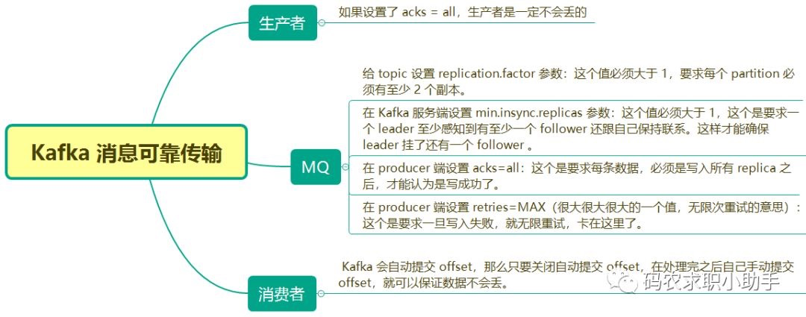

# 1. Kafka Interview 面经

<!-- @import "[TOC]" {cmd="toc" depthFrom=1 depthTo=6 orderedList=false} -->

<!-- code_chunk_output -->

- [1. Kafka Interview 面经](#1-kafka-interview-面经)
  - [1.1. Progress and Goal](#11-progress-and-goal)
      - [1.1.0.1. kafka 架构](#1101-kafka-架构)
      - [1.1.0.2. Kafka 是什么？主要应用场景有哪些？](#1102-kafka-是什么主要应用场景有哪些)
      - [1.1.0.3. 应用场景](#1103-应用场景)
      - [1.1.0.4. 消息队列的优缺点有哪些？](#1104-消息队列的优缺点有哪些)
      - [1.1.0.5. 消息从产生到消费的整体流程](#1105-消息从产生到消费的整体流程)
  - [1.2. 主题、分区、消费组](#12-主题分区消费组)
      - [1.2.0.1. 基本概念：ISR, OSR, HW](#1201-基本概念 isr-osr-hw)
      - [1.2.0.2. 分区器、序列化器、拦截器](#1202-分区器序列化器拦截器)
      - [1.2.0.3. 拦截器应用场景](#1203-拦截器应用场景)
      - [1.2.0.4. 主题分区](#1204-主题分区)
      - [1.2.0.5. 分区策略 (org.apache.kafka.clients.producer.Partitioner.Partition)：](#1205-分区策略-orgapachekafkaclientsproducerpartitionerpartition)
      - [1.2.0.6. 消费组与重平衡：](#1206-消费组与重平衡)
      - [1.2.0.7. 多线程消费消费模型](#1207-多线程消费消费模型)
      - [1.2.0.8. broker 上下线引起的重平衡（分区重分配）](#1208-broker-上下线引起的重平衡分区重分配)
      - [1.2.0.9. 重平衡 Rebalance 发生的时机有三个：（这里指的时消费组变化带来的重平衡）](#1209-重平衡-rebalance-发生的时机有三个这里指的时消费组变化带来的重平衡)
  - [1.3. 消息传递可靠性](#13-消息传递可靠性)
      - [1.3.0.1. 位移提交的最佳实践](#1301-位移提交的最佳实践)
      - [1.3.0.2. 如何保证消息的顺序性？](#1302-如何保证消息的顺序性)
      - [1.3.0.3. 大量消息在 MQ 里长时间积压，该如何解决？](#1303-大量消息在-mq-里长时间积压该如何解决)
      - [1.3.0.4. Kafka 有几种数据保留的策略？](#1304-kafka-有几种数据保留的策略)
      - [1.3.0.5. Kafka 如何保证消息不丢失（可靠传输）](#1305-kafka-如何保证消息不丢失可靠传输)
      - [1.3.0.6. Kafka 如何保证消息不重复消费](#1306-kafka-如何保证消息不重复消费)
  - [1.4. 高可用](#14-高可用)
      - [1.4.0.1. 如何保证消息队列的高可用？](#1401-如何保证消息队列的高可用)
      - [1.4.0.2. Kafka 可以脱离 zookeeper 单独使用吗？为什么？](#1402-kafka-可以脱离-zookeeper-单独使用吗为什么)
      - [1.4.0.3. Kafka 有几种数据保留的策略？](#1403-kafka-有几种数据保留的策略)
      - [1.4.0.4. 谈下你对 Zookeeper 的认识？](#1404-谈下你对-zookeeper-的认识)
      - [1.4.0.5. 集群中为什么要有主节点？](#1405-集群中为什么要有主节点)
  - [1.5. 内部实现](#15-内部实现)
      - [1.5.0.1. 集群成员关系（zookeeper 如何起作用）](#1501-集群成员关系 zookeeper-如何起作用)
      - [1.5.0.2. Controller 控制器的作用](#1502-controller-控制器的作用)
      - [1.5.0.3. 数据复制](#1503-数据复制)
      - [1.5.0.4. 主从同步逻辑](#1504-主从同步逻辑)
      - [1.5.0.5. leader 选举策略（为啥不用法定人数的规则）](#1505-leader-选举策略为啥不用法定人数的规则)
  - [1.6. 高性能](#16-高性能)
      - [1.6.0.1. kafka 为什么性能这么好](#1601-kafka-为什么性能这么好)

<!-- /code_chunk_output -->

## 1.1. Progress and Goal

1. resume at 2023.02.26 16:23
2. resume at 2023/03/05 17:18
3. resume at 2023/03/05 22:39, finished 
4. start at 10:27, 

4. 一个问题一次过 答完，再来重新回答。

- [ ] 1. Kafka Interview 面经
  - [x] 1.1. Progress and Goal
      - [ ] 1.1.0.1. kafka 架构
      - [ ] 1.1.0.2. Kafka 是什么？主要应用场景有哪些？
      - [ ] 1.1.0.3. 应用场景
      - [ ] 1.1.0.4. 消息队列的优缺点有哪些？
      - [ ] 1.1.0.5. 消息从产生到消费的整体流程
  - [x] 1.2. 主题、分区、消费组
      - [ ] 1.2.0.1. 基本概念：ISR, OSR, HW
      - [ ] 1.2.0.2. 分区器、序列化器、拦截器
      - [ ] 1.2.0.3. 拦截器应用场景
      - [ ] 1.2.0.4. 主题分区
      - [ ] 1.2.0.5. 分区策略 
      - [ ] 1.2.0.6. 消费组与重平衡：
      - [ ] 1.2.0.7. 多线程消费消费模型
      - [ ] 1.2.0.8. broker 上下线引起的重平衡（分区重分配）
      - [ ] 1.2.0.9. 重平衡 Rebalance 发生的时机有三个：（这里指的时消费组变化带来的重平衡）
  - [x] 1.3. 消息传递可靠性
      - [ ] 1.3.0.1. 位移提交的最佳实践
      - [x] 1.3.0.2. 如何保证消息的顺序性？
      - [ ] 1.3.0.3. 大量消息在 MQ 里长时间积压，该如何解决？
      - [ ] 1.3.0.4. Kafka 有几种数据保留的策略？
      - [ ] 1.3.0.5. Kafka 如何保证消息不丢失（可靠传输）
      - [ ] 1.3.0.6. Kafka 如何保证消息不重复消费
  - [ ] 1.4. 高可用
      - [ ] 1.4.0.1. 如何保证消息队列的高可用？
      - [ ] 1.4.0.2. Kafka 可以脱离 zookeeper 单独使用吗？为什么？
      - [ ] 1.4.0.3. Kafka 有几种数据保留的策略？
      - [ ] 1.4.0.4. 谈下你对 Zookeeper 的认识？
      - [ ] 1.4.0.5. 集群中为什么要有主节点？
      - [ ] 1.4.0.6. 说一下两阶段提交和三阶段提交的过程？分别有什么问题？
  - [x] 1.5. 内部实现
      - [ ] 1.5.0.1. 集群成员关系（zookeeper 如何起作用）
      - [x] 1.5.0.2. Controller 控制器的作用
      - [ ] 1.5.0.3. 数据复制
      - [ ] 1.5.0.4. 主从同步逻辑
      - [x] 1.5.0.5. leader 选举策略（为啥不用法定人数的规则）
  - [ ] 1.6. 高性能
      - [ ] 1.6.0.1. kafka 为什么性能这么好

面向失败面试；
2. 小公司练手，大公司收获，问到就是赚到。

有时候缺乏思考，好像是背书，也的确是背书。

isr osr ar hw leo 都代表着什么，kafka 的整体架构大概说一下。分区的作用，分区的实现是怎么实现的？分区器、序列化器、拦截器了解不？重复消费和漏消费，客户端和服务端都是怎么解决的？kafka 为什么性能这么好，怎么实现的，大概说说。

然后关于八股文的事，没有固定的背哪家的面试题，就是面试一家，然后问到的不会的内容就去搜就去看

比如问 kafka，基本就是 集群基本结构、Topic 、Partition 、Segment 、Broker 、Consumer 、Consumer Group 和 Zookeeper 之间是什么关系，怎么组织和交互的，数据是怎么存储的，然后扩容缩容的基本过程，消息从产生到消费的整体流程，消息的复制逻辑，主从同步逻辑这些，都是通过面试总结出来的，可能 a 公司问一方面，b 公司问另一方面，问到不会的再去看就行了，先拿小公司练手试错，再到大公司收获。

然后就是 点赞、朋友圈 /信息流、秒杀，抢红包，支付，拼团 /砍价这种场景设计题，看看基本结构，然后和面试官天马行空的聊就行了

#### 1.1.0.1. kafka 架构

|  |
|:--:|
| *caption* |

一个分布式、分区的、多副本的、多生产者、多订阅者，基于 zookeeper 协 调的分布式日志系统  

如上图所示，一个典型的 Kafka 集群中包含若干 Producer（可以是 web 前端产生的
Page View，或者是服务器日志，系统 CPU、Memory 等），若干 broker（Kafka
支持水平扩展，一般 broker 数量越多，集群吞吐率越高），若干 Consumer
Group，以及一个 Zookeeper 集群。Kafka 通过 Zookeeper 管理集群配置，选举
leader，以及在 Consumer Group 发生变化时进行 rebalance。Producer 使用 push
模式将消息发布到 broker，Consumer 使用 pull 模式从 broker 订阅并消费消息。

#### 1.1.0.2. Kafka 是什么？主要应用场景有哪些？

流平台具有三个关键功能：
1. **消息队列**：**发布和订阅消息流**，这个功能类似于消息队列，这也是 Kafka 也被
   归类为消息队列的原因。
   1. **解耦** (A 系统只负责生产数据，不需要考虑消息被哪个系统来消费，因为消息持
      久化和发布订阅的方式，解耦了代码逻辑、时序逻辑）、**削峰**（消息高峰，消息
      队列缓冲一下，平滑消息的消费）、**异步通讯**（在时序上，生产者和消费者不需
      要同步进行）。
1. **容错的持久方式存储记录消息流**： Kafka 会把消息持久化到磁盘，有效**避免了消
   息丢失的风险**。
1. **流式处理平台**： 在消息发布的时候进行处理，Kafka 提供了一个完整的流式处理类
   库。

Kafka 主要有两大应用场景：
1. **消息队列（通信）** ：建立实时流数据管道，以可靠地在系统或应用程序之间获取数据。
1. **数据处理（流平台）**： 构建实时的流数据处理程序来转换或处理数据流。

#### 1.1.0.3. 应用场景

- **日志收集**：一个公司可以用 afka 可以收集各种服务的 Log, 通过 Kafka 以统
  一接口服务的方式开放给各种 Consumer;
- **消息系统**：解耦生产者和消费者、缓存消息等；
- **用户活动跟踪**：Kafka 经常被用来记录 Web 用户或者 App 用户的各种活动，如
  浏览网页、搜索、点击等活动，这些活动信息被各个服务器发布到 afkal 的 Topic
  中，然后消费者通过订阅这些 Topicz 来做实时的监控分析，亦可保存到 数据库；
- **运营指标**：Kafka
  也经常用来记录运营监控数据。包括收集各种分布式应用的数据，生产各种操作的集中反馈，比如报警和报告；
- **流式处理**：比如 Spark Streaming 和 Storm

#### 1.1.0.4. 消息队列的优缺点有哪些？

1. **优点**：
   1. **非功能性**：高可用方案；可靠性；高性能高吞吐；消息传递的可靠性、不丢失、不重复；
   3. **功能性的**：**发布订阅、点对点**；主题**分区**，提供负载均衡；持久化数据
      和**消费位移**以给予消费者自主决定消息消费的逻辑；**分区有序**可以提供一些
      使用场景对消息顺序性的要求；具体使用上有**解耦、异步、削峰**的功能。

消息队列作为一种基于消息的通信方式应用于分布式系统中，会因为分布式系统中网络和机
器故障而出现以下几种问题：

1. **系统复杂度提高**：使用 MQ 后可能需要保证消息没有被**重复消费**、处理消息丢
   失的情况、保证**消息传递的顺序性**等等问题；部署复杂度提高，需要额外的组件，
   zookeeper.
2. **数据一致性问题**：基于消息通信的多个系统，执行一系列的任务，有点像数据库的
   事务，存在**数据一致性的问题（分布式事务）**. OLAP, 和 OLTP 都存在着数据一致
   性问题。如分布式事务，和多数据副本（衍生副本和原始副本的一致性问题）. 例如线上
   系统将一些数据库分别存到 MySQL 作为永久存储和通过 kafka 传递到 多个批处理系统
   中（Online analytical processing (OLAP)）进行数据的聚合计算，此时会有原生数据
   和衍生数据多个数据副本，数据副本的一致性也是个问题，依赖于 Kafka 和应用代码实
   现。
1. **降低系统的可用性**: 系统引入的外部依赖越多，越容易挂掉；

####  1.1.0.5. 消息从产生到消费的整体流程

1. 生产者生产消息，通过 分区器/拦截器/序列化器 的处理后，依照主题分区发往对应的 broker 节点上
   1. 客户端失败重试，broker 幂等处理，保证只存储唯一一个消息副本。
2. 分区副本中的 leader 副本接受到消息，存到 pagecache 中再由操作系统刷盘到磁盘上，同时开始数据同步。
   1. 由其他的分区副本过来拉取消息，并保存
   2. 拉取消息的过程中，会有 `LEO, HW` 等状态的传递和更新
   3. leader 计算 `HW=min(LEO)`，即消费者能够拉取的消息。
3. 订阅某个主题的消费者拉取消息，先消费再提交位移。

## 1.2. 主题、分区、消费组

#### 1.2.0.1. 基本概念：ISR, OSR, HW

- **副本**： AR ( Assigned Replicas)
- **ISR**:  (In-Sync Replicas) 
- **OSR** (Out-of-Sync Replicas ）
- **AR** = ISR + OSR
- **HW(High Watermark)**: （相当于 Raft 的 commited index, 就是集群内大多数已经同步好
  了的 index) 高水位，它标识个特定的消息偏移量（ offset ），消费者只能拉取到这个
  offset 前的消息
- **LSO**(Log Start Offset): 日志文件第一条消息
- **LEO**(Log End Offset): 它标识当前日志文件中下一条待写入消息 offset

|  |
|:--------------------------------------:|
|               *caption*                |

####  1.2.0.2. 分区器、序列化器、拦截器

消息在通过 send() 方法发往 broker 的过程中，有可能需要经过拦截器 (Interceptor)、
序列化器 (Serializer). 和分区器 (Partitioner). 的一系列作用之后才能被真正地发往
broker。拦截器

1. **分区器的 partition()**: 类似于 MapReduce 中的分区。 partition（）方法中的参
   数分别表示**主题、键、序列化后的键、值、序列 后的值，以及集群的元数据信息**，
   通过这些信息可以实现功能丰富的分区器。
2. **拦截器**：基本思想就是允许应用程序在不修改逻辑的情况下，动态地实现一组可插拔的
   事件处理逻辑链。

kafka 拦截器分为生产者拦截器和消费者拦截器。
- 生产者拦截器允许你在发送消息前以及消息提交成功后植入你的拦截器逻辑
- 消费者拦截器支持在消费消息前以及提交位移后编写特定逻辑

参数 interceptor.classes: 指定拦截器类时要指定它们的全限定名

#### 1.2.0.3. 拦截器应用场景

Kafka 拦截器可以应用于包括客户端监控、端到端系统性能检测、消息审计等多种功能在内的场景。

#### 1.2.0.4. 主题分区

topic - partition - 

partition: 
- 负载均衡 => scailibility, sharding, 水平扩展
- 分区有序：将有 causality consistency 的消息封装特定的 key, 然后被分到同一个分
  区，实现有序消费。

#### 1.2.0.5. 分区策略 (org.apache.kafka.clients.producer.Partitioner.Partition)：

所谓分区策略就是决定生产者将消息发送到哪个分区的算法。
1. **轮询策略**：默认的分区策略，非常优秀的负载均衡表现，它总是能保证消息最大限
   度地被平均分配到所有分区上；
1. **随机策略**：实现随机策略版的 partition 方法；
1. **按消息键保序策略**：也称 Key-Ordering 策略，可以保证同一个 Key 的所有消息都
   进入到相同的分区里，由于每个分区下的消息处理是有顺序的，所以称之为消息键保序
   策略；
1. **自定义分区策略**：在编写生产者程序时，你可以编写一个具体的类实现
   org.apache.kafka.clients.producer.Partitioner 接口。这个接口也很简单，只定义
   了两个方法：partition() 和 close()，通常只用实现 partition() 方法即可。同时还
   需要设置 partitioner.class 参数为你自己实现类的全限定类名

#### 1.2.0.6. 消费组与重平衡：

- **分区、消费者和消费组**：一个分区只能被一个消费组里的一个消费者消费
- **点对点**：如果所有的消费者都隶属手同一个消费组，那么所有的消息都会被均衡地投递给
  每一个消费者，即每条消息只会被一个消费者处理，这就相当于点对点模式的应用。
- **发布订阅**：如果所有的消费者都隶属于不同的消费组，一那么所有的消息都会被广播给所有的消费者，
  即每条消息会被所有的消费者处理，这就相当于发布/订阅模式的应用。
  
**发布订阅：消息广播给多个消费组**

|  |
|:--------------------------------------:|
|              *发布/订阅*               |

**点对点模式：增加消费者的个数增加消费能力**

|  |
|:--------------------------------------:|
|                *点对点*                |

|  |
|:--------------------------------------:|
|                *点对点*                |
  
#### 1.2.0.7. 多线程消费消费模型

 
|  |
|:--------------------------------------:|
|            *多线程方案比较*            |

比较四个方向：

单分区对应单线程：
1. 优点：
   1. **实现难度**：简单
   2. **线程安全**：无并发问题的考虑。
   3. **分区有序**：
2. 缺点：
   1. **伸缩性**：受制于分区数量，吞吐性有限
   2. **资源开销**：每个分区一个线程维持链接，开销大。

拉消息和处理消息解耦，多线程模式：
1. 优点：
   1. **伸缩性**：高，可独立依据
   2. 线程安全，有
2. 缺点：
   1. 位移提交混乱：
   2. 没办法保持分区有序。

系统资源开销；伸缩性；实现难度；分区有序保证；位移提交混乱。

1. **一个线程对应一个 KafkaConsumer 实例**.
   1. 优点：
      1. **实现起来简单**，因为它比较符合目前我们使用 Consumer API 的习惯。我们在写
         代码的时候，使用多个线程并在每个线程中创建专属的 KafkaConsumer 实例就可以
         了。
      2. **线程独立消费，无线程安全考虑。**
      3. **分区内有序消费**
   2. 缺点
      1. **每个线程都维护自己的 KafkaConsumer 实例，必然会占用更多的系统资源，比如
         内存、TCP 连接等**。在资源紧张的系统环境中，方案 1 的这个劣势会表现得更加
         明显。
      2. **吞吐量受制于分区总数**：这个方案能使用的线程数受限于 Consumer 订阅主题的
         总分区数。我们知道，在一个消费者组中，每个订阅分区都只能被组内的一个消费者
         实例所消费。假设一个消费者组订阅了 100 个分区，那么方案 1 最多只能扩展到
         100 个线程，多余的线程无法分配到任何分区，只会白白消耗系统资源。当然了，这
         种扩展性方面的局限可以被多机架构所缓解。除了在一台机器上启用 100 个线程消
         费数据，我们也可以选择在 100 台机器上分别创建 1 个线程，效果是一样的。因此，
         如果你的机器资源很丰富，这个劣势就不足为虑了。
      3. **每个线程有肯能会有重复的消息处理逻辑**。每个线程完整地执行消息获取和消息处理
         逻辑。一旦消息处理逻辑很重，造成消息处理速度慢，就很容易出现不必要的
         Rebalance，从而引发整个消费者组的消费停滞。这个劣势你一定要注意。我们之前
         讨论过如何避免 Rebalance，如果你不记得的话，可以回到专栏第 17 讲复习一下。
  
    |  |
    |:--------------------------------------:|
    |               *caption*                |
    

2. **多个消费线程消费同一个分区**：多线程（一个或者多个线程拉取消息，多个 worker
   线程负责处理消息）拉取消息和处理消息，**复杂的位移提交和顺序控制的处理逻辑**。

   1. **优点**：
       1. 与方案 1 的粗粒度不同，方案 2 **将任务切分成了消息获取和消息处理两个部分
          **，分别由不同的线程处理它们。比起方案 1，方案 2 的最大优势就在于它的**高
          伸缩性**，就是说我们可以独立地调节消息获取的线程数，以及消息处理的线程数，
          而不必考虑两者之间是否相互影响。如果你的消费获取速度慢，那么增加消费获取
          的线程数即可；如果是消息的处理速度慢，那么增加 Worker 线程池线程数即可。
   
   2. 缺点：
      1. 它的**实现难度要比方案 1 大得多**，毕竟它有两组线程，你需要分别管理它们。
      2. **无法保证分区有序消费消息**。因为该方案将消息获取和消息处理分开了，也就是
         说获取某条消息的线程不是处理该消息的线程，因此无法保证分区内的消费顺序。举
         个例子，比如在某个分区中，消息 1 在消息 2 之前被保存，那么 Consumer 获取消
         息的顺序必然是消息 1 在前，消息 2 在后，但是，后面的 Worker 线程却有可能先
         处理消息 2，再处理消息 1，这就破坏了消息在分区中的顺序。还是那句话，如果你
         在意 Kafka 中消息的先后顺序，方案 2 的这个劣势是致命的。
      3. 方案 2 引入了多组线程，使得整个消息消费链路被拉长，**最终导致正确位移提交
         会变得异常困难，结果就是可能会出现消息的重复消费**。如果你在意这一点，那么
         我不推荐你使用方案 2。

   - 注意：首先，我们要明确的是，KafkaConsumer 类不是线程安全的 (thread-safe)。
     所有的网络 I/O 处理都是发生在用户主线程中，因此，你在使用过程中必须要确保线
     程安全。简单来说，就是你不能在多个线程中共享同一个 KafkaConsumer 实例，否则
     程序会抛出 ConcurrentModificationException 异常。
     
     |  |
     |:--------------------------------------:|
     |               *caption*                |

3. **Handler 部分采用多线程**：单线程拉取消息，多线程处理消息，offset 提交和顺序
   控制不还得搞吗，搞一个 TCP 滑动窗口
   
   |              |
   |:--------------------------------------------------:|
   | *多线程处理事件：其中单线程拉取，多线程处理 records* |
   
   |  |
   |:--------------------------------------:|
   |               *caption*                |
   
#### 1.2.0.8. broker 上下线引起的重平衡（分区重分配）
   

1. **容灾安全性**：不同的副本分分配到不同的节点上，甚至需要不同的机架上；
2. **负载均衡**：**优先副本**指 AR 集合列表中的第一个副本， 也是 preferred leader.
   需要保证优先副本的负载均衡（即**每个 borker 的流量相似**）; 不过实际上
   

注意：会带来业务有损， 避免在业务高峰期执行

上线新的 broker, 老的分区不会迁移过来；下线
首先创建需要一个包含主题清单的 JSON 文件，其次根据主题清单和 broker
节点清单生成一份重分配方案，最后根据这份方案执 行具体的重分配动作。

#### 1.2.0.9. 重平衡 Rebalance 发生的时机有三个：（这里指的时消费组变化带来的重平衡）

再均衡

Rebalance 本质上是一种协议，规定了一个 Consumer Group 下的所有 Consumer 如何达成一致，来分配订阅 Topic 的每个分区。比如某个 Group 下有 20 个 Consumer 实例，它订阅了一个具有 100 个分区的 Topic。正常情况下，Kafka 平均会为每个 Consumer 分配 5 个分区。这个分配的过程就叫 Rebalance。

1. **消费组成员数量**发生变化：
   1. 计划内：consumer 增加
   2. 计划外：consumer 减少
      1. coordinator(zookeeper) 通过心跳检测 consumer 发现他挂了，踢出
      2. coordinator(zookeeper) 发现两次消费拉取间隔过长，即消费能力不足，踢出
      3. 解决方法：依据业务需要，修改参数。session.timeout.ms = 6s,
         heartbeat.interval.ms = 2s, 要保证 Consumer 实例在被判定为“dead”之前，
         能够发送至少 3 轮的心跳请求，即 session.timeout.ms >= 3 *
         heartbeat.interval.ms; 针对后者：max.poll.interval.ms 参数值的设置显得
         尤为关键
2. 订阅**主题数量**发生变化
   1. 运维主动发出
3. 订阅主题的**分区数**发生变化
   1. 运维主动发出

缺点：
  1. **Rebalance 停止服务 影响 Consumer 端
     TPS**。这个之前也反复提到了，这里就不再具体讲 了。总之就是，在 Rebalance
     期间，Consumer 会停下手头的事情，什么也干不了。
  1. **Rebalance 很慢**。如果你的 Group
     下成员很多，就一定会有这样的痛点。还记得
     我曾经举过的那个国外用户的例子吧？他的 Group 下有几百个 Consumer 实例，
     Rebalance 一次要几个小时。在那种场景下，Consumer Group 的 Rebalance 已经完
     全失控了。
  1. **Rebalance
     低性能，忽略局部性原理，就是所有的消费者和分区重新分配一遍（相当于重新洗牌）**。当前
     Kafka 的设计机制决定了每次 Rebalance 时，Group
     下的所有成员都要参与进来，而且通常不会考虑局部性原理，但局部性原理对提升系
     统性能是特别重要的。

## 1.3. 消息传递可靠性

要在业务层，即应用代码层面实现

(1) 生产者能正确地将消息记录到 broker 上

(2) 消费者能不重不漏地从 broker 拉取消息消费

工作流
1. rebalance
2. 消费和提交

出现问题：
1. rebalance

消费消息的关键在于提交：
1. 先消费后提交，或先提交后消费
1. 自动/手动
3. 同步/异步

#### 1.3.0.1. 位移提交的最佳实践

1. **先提交后消费，会丢数据**。例如提交位移了，消费消息的过程中，机器崩溃并恢复
   拉取从位移后的下一批数据，
   则丢失了一部分的数据；**先消费后提交，则重复消费**
1. **自动提交会导致重复消费/（或者是丢消息，原因是多线程的模型，一个负责拉，一个负责处理，处理得比较慢，提交了一个较后的位移，又发生崩溃了就丢失了，例子见《深入理解》）**。自动提交
   Kafka 会保证在开始调用 poll 方法时，提交 上次 poll
   返回的所有消息。即先提交上一批，在消费下一批，因此不会丢失消息。但
   是会导致**重复消费**; 另外**在把控位移提交的时机和频率上，不够灵活**

   >在默认情况下，Consumer 每 5 秒自动提交一次位移。现在，我们假设提交位移之后的
   >3 秒发生了 Rebalance 操作。在 Rebalance 之后，所有 Consumer 从上一次提交的位
   >移处继续消费，但该位移已经是 3 秒前的位移数据了，故在 Rebalance 发生前 3 秒
   >消费的所有数据都要重新再消费一次。虽然你能够通过减少 auto.commit.interval.ms
   >的值来提高提交频率，但这么做只能缩小重复消费的时间窗口，不可能完全消除它。这
   >是自动提交机制的一个缺陷。
   
   **手动提交**：**在把控位移提交的时机和频率上灵活**, 分为同步和异步两种方式

3. **`commitSync()`** 此网络调用**会阻塞**，**等待 broker
   返回结果**，**影响**整 个应用程序的 **TPS**. 
4. **`commitAsync()`** 会立即返回，**不会阻塞**，因此**不 **会**影响** Consumer
   应用的 **TPS**, **但是不会自动重试，且异步地重试无意义，
   因为过了一段时间后重试提交，实际上消费的位移会增长**。
    - **解决方法**：维护一个单调递增的序号，每次位移提交之后就增加序号相对应的
      值。在遇到位移提交失败需要重试的时候，可以检查所提交的位移和序号的值的大
      小，如果前者小于后者，则说明有更大的位移己经提交了，不需要再进行本次重试：
      如果两者相同，则说明可以进行重试提交。
   
5. **组合使用**（一般情况下，针对偶尔出现的提交失败，不进行重试不会有太大问题，因为如果提交失败
   是因为临时问题导致的，那么后续的提交总会有成功的。但如果这是发生在关闭消费者或
   再均衡前的最后一次提交，就要确保能够提交成功）: 

      - 我们可以利用 commitSync 的自动重试来规避那些瞬时错误，比如网络的瞬时抖动，
        Broker 端 GC 等。因为这些问题都是短暂的，自动重试通常都会成功，因此，我
        们不想自己重试，而是希望 Kafka Consumer 帮我们做这件事。
      - 我们不希望程序总处于阻塞状态，影响 TPS。

      ```java
       try {
          while (true) {
                      ConsumerRecords<String, String> records = 
                                  consumer.poll(Duration.ofSeconds(1));
                      process(records); // 处理消息
                      commitAysnc(); // 使用异步提交规避阻塞
                  }
      } catch (Exception e) {
                  handle(e); // 处理异常
      } finally {
                  try {
                              consumer.commitSync(); // 最后一次提交使用同步阻塞式提交
      	} finally {
      	     consumer.close();
      }
      ```

#### 1.3.0.2. 如何保证消息的顺序性？

参考：
1. kafka 分布式的情况下，如何保证消息的顺序？
: https://www.zhihu.com/question/266390197
2. 有序性的思考：https://learn.lianglianglee.com/%E4%B8%93%E6%A0%8F/%E5%88%86%E5%B8%83%E5%BC%8F%E6%8A%80%E6%9C%AF%E5%8E%9F%E7%90%86%E4%B8%8E%E5%AE%9E%E6%88%9845%E8%AE%B2-%E5%AE%8C/32%20%E4%B8%9A%E5%8A%A1%E4%B8%8A%E9%9C%80%E8%A6%81%E9%A1%BA%E5%BA%8F%E6%B6%88%E8%B4%B9%EF%BC%8C%E6%80%8E%E4%B9%88%E4%BF%9D%E8%AF%81%E6%97%B6%E5%BA%8F%E6%80%A7%EF%BC%9F.md

分布式系统中，消息的传递必然是偏序的，参考 leslie lamport 的文章

1. **分区有序**。所以通过制定的分发策略，将同一类消息分发到同一个 Partition 中。
   例如，电商系统中的订单流转信息，我们在写入 Kafka 时通过订单 ID 进行分发，保证
   同一个订单 ID 的消息都会被发送到同一个 Partition 中，这样消费端在消费的时候，
   可以保证取出数据时是有序的。
2. **失败重传带来的乱序**: 一个比较特殊的情况是消息失败重发的场景，比如同一个订
   单下的消息 1 和 2，如果 1 发送失败了，重发的时候可能会出现在 2 的后边，这种情
   况可以通过设置 **max.in.flight.requests.per.connection** 参数来解决，该参数可
   以限制客户端能够发送的未响应请求的个数，还可以在一定程度上避免这种消息乱序。

####  1.3.0.3. 大量消息在 MQ 里长时间积压，该如何解决？

在使用消息队列的系统中，对于性能的优化，主要体现在生产者和消费者这一收一发两部分
的业务逻辑中。消息队列本身的处理能力要远大于业务系统的处理能力。主流消息队列的单
个节点，消息收发的性能可以达到每秒钟处理几万至几十万条消息的水平，还可以通过水平
扩展 Broker 的实例数成倍地提升处理能力。

- **发送端性能优化**：你的代码发送消息的性能上不去，你需要优先检查一下，是不是发
  消息之前的业务逻辑耗时太多导致的。微服务在线系统，主要接受 RPC 请求处理在线业
  务，服务在处理每次请求的时候，就在当前线程直接发送消息就可以了，因为所有 RPC
  框架都是多线程支持多并发的，自然也就实现了并行发送消息；离线分析系统则批量发送。
- **消费端性能优化**：如果消费的速度跟不上发送端生产消息的速度，就会造成消息积压。
  如果这种性能倒挂的问题只是暂时的，那问题不大。一定要保证消费端的消费性能要高于
  生产端的发送性能，这样的系统才能健康的持续运行。**在扩容 Consumer 的实例数量的
  同时，必须同步扩容主题中的分区（也叫队列）数量，确保 Consumer 的实例数和分区数
  量是相等的。**
- **消息积压了该如何处理**：通过监控观察是否需要扩容消费端的实例数 => 短时间内没
  有办法则降级 => 无论是发送消息的速度还是消费消息的速度和原来都没什么变化，这时
  候你需要检查一下你的消费端，是不是消费失败导致的一条消息反复消费这种情况比较多，
  这种情况也会拖慢整个系统的消费速度。

8.  MQ 中的消息过期失效了怎么办？

9.  RabbitMQ 有哪些重要的角色？
10. RabbitMQ 有哪些重要的组件？
11. RabbitMQ 有几种广播类型？

#### 1.3.0.4. Kafka 有几种数据保留的策略？

Kafka 有两种数据保存策略：按照过期时间保留和按照存储的消息大小保留。

#### 1.3.0.5. Kafka 如何保证消息不丢失（可靠传输）

1. **模型**：生产者 => 消息队列 => 消费者
2. **high level 理解**：需要做到 生产者 发送消息到 broker 可靠，broker 再来 共识
   算法一套 并返回确认消息给生产者，消费者可靠地拉取消息并消费。
3. **深入细节（生产者端）**：其实这个本质上跟 Raft 共识算法是一致的。例如 生产者
   要发送消息给 broker 去做持久化，就涉及到 失败重传 (retries =
   Integer.MAX_VALUE)、幂等处理而达到 精确一次的语义 (enable.idempotence=true)，
   此外 broker 要做到高可用呢 就需要 采用副本机制 (replication.factor >= 3)，
   消息需要同步到超过半数的节点上 (acks = all, 设置 min.insync.replicas > 1 同步到多少个副本才算提交），
   才能返 回给 client 确认（有回调机制的 send)。
3. **深入细节（消费者端）**：消费者消费消息不漏：先消费后手动提交位移的方式
6. 当 broker 已经提交了之后，持久化数据了

参考 极客时间《kafka 核心技术与实战：幂等生产者和事务生产者是一回事吗？》

其中对于第二点 生产者发送消息，要做到**可靠地从客户端传到 broker 端**，类似 Raft
的一套处理，**重传+幂等，以达到 精确一次 的语义**, 有两个场景。使用上前者估计是
自动重传，同时配置参数` props.put(“enable.idempotence”, ture)`; 后者的话呢
1. 幂等发送：失败会重传，重复会通过 fencing token 来去重： 实现单会话上的幂等性；
   不能实现跨会话的幂等性。
2. 幂等性 Producer 和事务型 Producer 都是 Kafka 社区力图为 Kafka 实现精确一次处
   理语义所提供的工具，只是它们的作用范围是不同的，性能有异。

   幂等性：Producer 只能保证单分区、单会话上的消息幂等性；而事务能够保证跨分
   区、跨会话间的幂等性。从交付语义上来看，自然是事务型 Producer 能做的更多。

   缺点：性能差。

|  |
|:--------------------------------------:|
|                 *数据*                 |

最佳实践
- 不要使用 **producer.send(msg)，而要使用 producer.send(msg, callback)**。记住，一定
  要使用带有回调通知的 send 方法。
- 设置 **acks = all**。acks 是 Producer 的一个参数，代表了你对“已提交”消息的定义。如
  果设置成 all，则表明所有副本 Broker 都要接收到消息，该消息才算是“已提交”。这是
  最高等级的“已提交”定义。
- **设置 retries 为一个较大的值**。这里的 retries 同样是 Producer 的参数，对应前面提
  到的 Producer 自动重试。当出现网络的瞬时抖动时，消息发送可能会失败，此时配置了
  retries > 0 的 Producer 能够自动重试消息发送，避免消息丢失。
- 设置 **unclean.leader.election.enable = false**。这是 Broker 端的参数，它控制的是
  哪些 Broker 有资格竞选分区的 Leader。如果一个 Broker 落后原先的 Leader 太多，
  那么它一旦成为新的 Leader，必然会造成消息的丢失。故一般都要将该参数设置成
  false，即不允许这种情况的发生。
- 设置 **replication.factor >= 3**。这也是 Broker 端的参数。其实这里想表述的是，最好
  将消息多保存几份，毕竟目前防止消息丢失的主要机制就是冗余。
- 设置 **min.insync.replicas > 1**。这依然是 Broker 端参数，控制的是消息至少要被写入
  到多少个副本才算是“已提交”。设置成大于 1 可以提升消息持久性。在实际环境中千万
  不要使用默认值 1。
- 确保 **replication.factor > min.insync.replicas**。如果两者相等，那么只要有一个副
  本挂机，整个分区就无法正常工作了。我们不仅要改善消息的持久性，防止数据丢失，还
  要在不降低可用性的基础上完成。推荐设置成 replication.factor =
  min.insync.replicas + 1。
- **确保消息消费完成再提交**。Consumer 端有个参数 enable.auto.commit，最好把它设置成
  false，并采用手动提交位移的方式。就像前面说的，这对于单 Consumer 多线程处理的
  场景而言是至关重要的。

#### 1.3.0.6. Kafka 如何保证消息不重复消费

只能应用代码层面解决这个问题：
- **重复消费的必然性**：**消息队列底层不负责生产者到消费者的可靠传输**，只能应用
  代码解决，消息队列只负责生产者到消费者这一段路程可靠，消费者拉到消息后可能因为
  各种原因发生故障，再重新拉取消息，上次拉了 100 条消费一半崩溃重新拉，所以就重
  复了。
- **解决思路**：**校验 fencing token**: 对执行的结果做个缓存，fencing token 是个
  全局唯一的 ID, 将结果返回过去；利用数据库进行去重消费消息服务做幂等校验，比如
  Redis 的 set、MySQL 的主键等天然的幂等功能。

## 1.4. 高可用

副本：
1. 提供数据冗余
2. 支持横向扩展
3. 改善数据局部性

kafka 中只有 leader 提供服务，所以数据局部性，横向扩展没用

一些参数：
1. Unclean Leader Election： 允许数据丢失，CAP 中要 P, A
2. ISR(In-sync Replicas) 依据 replica.lag.time.max.ms 这个参数的含义是 Follower
   副本能够落后 Leader 副本的最长时间间隔，当前默认值是 10 秒。

  消息队列和 Zookeeper
3. 消息队列和 Zookeeper 面试题阅读指南
4. 消息队列的基本作用？

#### 1.4.0.1. 如何保证消息队列的高可用？

一个 topic 可以划分为**多个 partition 以实现 伸缩性**。**每个 partition 再采用多
副本机制来实现高可用**。partition 多副本机制（设计主从结构，数据同步，领导选举）
采用 zookeeper 分布式协调服务 来实现，最新的 kafka 版本采用 Raft 来实现。

#### 1.4.0.2. Kafka 可以脱离 zookeeper 单独使用吗？为什么？

Kafka 不能脱离 zookeeper 单独使用，因为 Kafka 使用 zookeeper 管理和协调 Kafka 的节点服务器。
补充：最新版本的 Kafka 2.8.0 版本实现了 Raft 分布式一致性机制，意味着可以脱离 ZooKeeper 独立运行

#### 1.4.0.3. Kafka 有几种数据保留的策略？

Kafka 有两种数据保存策略：**按照过期时间保留和按照存储的消息大小保留。**

#### 1.4.0.4. 谈下你对 Zookeeper 的认识？

ZooKeeper 是一个分布式的，开放源码的分布式应用程序协调服务。它是一个为分布式应用提供一致性服务的软件，提供的功能包括：配置维护、域名服务、分布式同步、组服务等。

ZooKeeper 的目标就是封装好复杂易出错的关键服务，将简单易用的接口和性能高效、功能稳定的系统提供给用户。

16. Zookeeper 都有哪些功能？
17. 谈下你对 ZAB 协议的了解？
18. Zookeeper 怎么保证主从节点的状态同步？
19. Zookeeper 有几种部署模式？

20. 说一下 Zookeeper 的通知机制？

#### 1.4.0.5. 集群中为什么要有主节点？

22. 集群中有 3 台服务器，其中一个节点宕机，这个时候 Zookeeper 还可以使用吗？

## 1.5. 内部实现

#### 1.5.0.1. 集群成员关系（zookeeper 如何起作用）

Kafka 主要使用 ZooKeeper 来保存它的元数据、监控 Broker 和分区的存活状态，并利用
ZooKeeper 来进行选举。

zookeeper 是一个分布式协调服务，基于强一致性的分布式存储系统（树形）/watch
机制等提供 服务发现/leader 选举/节点健康监控 等功能。 

1. **维护了哪些元数据**：Kafka 使用 Zookeeper 来维护集群成员的信息，保存
   **brokers** 于/brokers/ids 中（节点名称就是 BrokerID，节点内保存了包括 Broker
   的地址、版本号、启动时间等等一些 Broker 的基本信息） 和 **主题分区**的信息于形如
   /topics/topic-x/partitions/0 的路径中（个分区节点下面是一个名为 state
   的临时节点，节点中保存着分区当前的 leader 和所有 的 ISR 的 BrokerID。); **ISR 信息**；
3. **管理集群成员的进进出出：服务发现 和健康监控**：broker 上线与下线，会在
   zookeeper 上 创建对应节点，和由 zookeeper
   监控节点的心跳从而给死机器删除对应的节点，通过 **watch** 机制通知监听
   某个对象的 kafka 客户端。
1. **控制器：自身的选举与管理分区 leader 的选举**：任意一个 broker 先于 `/controller`
   路径下成功创建节点即为 `controller`, 其余的 broker 通过 watch 对象监控何时
   controller 死掉需要换届，新当选的 controller 会获得**单调递增的 epoch（纪元）
   防止脑裂**。controller 通过 zookeeper 发现某个 broker 下线，即确定有些 分区的
   leader 下线了， 这些 leader 都栖息于该 broker 上，于是为他们**选举新
   leader**（遍历，再根据一定规则选取），然后发送新领导和跟随者信息**通知**对应的
   brokers, 随后 **新 leader 开始处理请求**。
2. **（服务发现）客户端怎么找到对应的 broker 再拉取和发送消息**:
   根据主题和队列，在右边的树中找 到分区对应的 state
   临时节点，我们刚刚说过，state 节点中保存了这个分区 Leader 的
   BrokerID。拿到这个 Leader 的 BrokerID 后，再去左侧的树中，找到 BrokerID
   对应的临 时节点，就可以获取到 Broker 真正的访问地址了


#### 1.5.0.2. Controller 控制器的作用

1. **分区的领导选举**
2. **ISR 集合发生变化时 控制器通知 broker 更新元数据**
   更新其元数据信息。
3. **分区数变化时的消息重新分配**：当使用 kafka-topics.sh 脚本为某个 topic
   增加分区数量时，同样还是由控制器负责分区的重新分配

参考：
1. 《kafka 权威指南》
2. 《极客时间 消息队列高手课》

#### 1.5.0.3. 数据复制

可靠性
- **ISR 的副本条件**：
   - 与 Zookeeper 之间有一个活跃的会话，也就是说，它在过去的 6s（可配置）内向
     Zookeeper 发送过心跳。
   - 在过去的 10s 内（可配置）从首领那里获取过消息。
   - 在过去的 10s 内从首领那里获取过最新的消息。
- **复制系数 (1,3,5)**
  - 权衡：可用性和性能之间的权衡，还要考虑存储硬件之间作出权衡（例如 kafka
    存储于同一个组件当中）。
- **unclean.leader.election**（不完全的首领选举）（允许不同步的副本当选为
  leader)： 可用性于可靠性的权衡。
- **在主题级别和 broker 级别上，这个参数最少同步副本叫 `min.insync.replicas`**
  。（如果 min.insync.replicas 被设为 2，那么至少要存
  在两个同步副本才能向分区写入数据，不够数则拒绝生产者的需求）
- **acks** 生产者的配置，acks= 0, 1, all
- **生产者的重试参数**（出错重试） 和 幂等参数（“只被保存一次”）。
- **消费者的可靠性配置**（先消费后提交唯一防数据丢失，幂等处理）

#### 1.5.0.4. 主从同步逻辑

1. LEO, LSO, HW, Leader Epoch, ISR, OSR, AR 相关概念
- 副本是相对于分区而言的，即副本是特定分区的副本。
- 一个分区中包含一个或多个副本，其中一个为 leader 副本，其余为 follower
  副本，各 个副本位于不同的 broker 节点中。只有 leader
  副本对外提供服务，follower 副本只负 责数据同步。
- 分区中的所有副本统称为 AR，而 ISR 是指与 leader 副本保持同步状态的副本集合，
  当然 leader 副本本身也是这个集合中的一员。
- LEO 标识每个分区中最后一条消息的下一个位置，分区的每个副本都有自己的 LEO，
  ISR 中最小的 LEO 即为 HW，俗称高水位，消费者只能拉取到 HW 之前的消息。

1. LEO, LSO, HW, Leader Epoch, ISR, OSR, AR 这几个索引在同步时怎么变化的。

**可用性和一致性**
1. **冗余性和高可用**：每个分区有多个数据副本，这样实现冗余性和高可用；
2. **命令的有序性 单一 leader**：leader
   负责提供读写的服务，保证命令的顺序性；follower 副本拉取数据进行同步；
3. **leader 的选举从 ISR 中挑一个**: kafka 维护着 ISR, OSR，每个数据副本有 LSO,
   LEO, HW, leader Epoch 等状态信息，在拉取消息过程中
4. **ISR，OSR 的维护/ Epoch**: ISR 要满足（数据新鲜度保证：follower 拉取 leader
   最新数据的时刻与现在的时间差异是否小于 `replica.lag.time.max.ms`，具体算法是
   follower 同步上了 `LEO`之前的所有消息，则更新`lastCaughtUpTimeMs`， `now -
   lastCaughtUpTimeMs < replica.lag.time.max.ms` 则表示继续是 ISR)；Epoch
   防止脑裂（领导任期）, 旧领导必须承认新领导。
5. **数据的一致性**: follower 会向 leader 一直发送请求 Req 拉取数据，而 leader
   则会发送响应 Resp 将消息返回给 follower。每次 follower 发送 Req
   会携带上自己的 LEO, leader 因此拥有全局的 `LEO` 信息，`HW of leader =
   min(LEO)`, 在 leader 发送给 follower 的 Resp 中包含了 `HW`, `HW(follower) =
   min(HW(leader), LEO(follower))`, HW 代表了 commited index.

#### 1.5.0.5. leader 选举策略（为啥不用法定人数的规则）

1. Kafka 是会在 ZooKeeper 上针对每一个 topic 维护一个称为 **ISR**
   （In-Sync Replicas）的集合，当分区副本数据同步跟得上 leader， 就会加入到 ISR, 跟不少就会被踢掉
2. 选新 leader 的时候会从 ISR 中选择一个，并赋予新的单调递增的 Epoch,
   在同步数据的时候只接更大的 Epoch 的 leader， 避免脑裂。 
3. **相对法定人数的好处**: 容忍度更高，可以容忍 N-1 个副本出故障，而非一半。
5. **如果 ISR 副本都失败了怎么办？**
   1. 等待 ISR 集合中的副本复活， 该方法可能耗时较长
   2. 选择任何一个立即可用的副本，而这个副本不一定是在 ISR 集合中。需要设 置
      unclean.leader.election.enable=true。

## 1.6. 高性能

#### 1.6.0.1. kafka 为什么性能这么好

- **架构**：多分区负载均衡。
- **批量消息处理**：借鉴缓存的 block 处理。消息成批处理，发生在网络传输，包括
  生产者 => broker， broker replica => broker replica, broker => 消费者，
- **顺序写消息**：active log segment. 对于每个分区，它把从 Producer
  收到的消息，顺序地写入活跃的 log segment 中
- **页缓存**：同一数据对象可能有 java 应用虚拟机内存的缓存 和 页缓存
  两个备份，使用页缓存提高效率；消息都是先被
  写入页缓存，然后由操作系统负责具体的刷盘任务的。
- **ZeroCopy 零拷贝技术**:
  减少拷贝的次数。从磁盘读消息并发送给客户端时，`read(data), send(data)`
  会经历：(a) read() 读数据到内核模式下的 read buffer => (b) CPU
  控制将内核模式数据复制到用户模式下；(c) 调用 `write()` 会将
  数据从用户态拷贝到内核态中的 `socket buffer`; (d) 最终将内核模式下的 Socket
  Buffer 的数据复制到网卡设备中传送。零拷贝技术通过 DMA（Direct Memory
  Access）技术将文件内容复制到内核模式下的 Read Buffer 中。DMA
  引擎直接将数据从内核模式中传递到网卡设备（协议 引擎）
