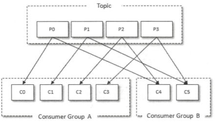

# 1. 深入理解 Kafka（应该看权威指南才对）

[toc]

参考来源：*kafka 官网*，*深入理解 kafka*，*权威指南*

kafka 是个消息队列基础设施，因为以下三个特点而在现代生产环境中受到青睐 
- **消息系统**： Kafka 和传统的消息系统（也称作消息中间件〉都具备==系统解稿、冗
  余存储、流量削峰、缓冲、异步通信、扩展性、 可恢复性==等功能。与此同时， Kafka
  还提 供了大多数消息系统难以实现的==消息顺序性保障及回溯消费的功能==。
- **存储系统**： Kafka 把消息==持久化==到磁盘，相比于其他基于内存存储的系统而言，有
  效地降低了数据丢失的风险。 也正是得益于 Kafka 的消息持久化功能和多副本机制，我
  们可以把 Kafka 作为长期的数据存储系统来使用，只需要把对应的数据保留策略设置为
  “永久”或启用主题的日志压缩功能即可。
- **流式处理平台**：Kafka 不仅为每个流行的流式处理框架提供了可靠的数据来源，还提
  供了一个==完整的流式处理类库，比如窗口、连接、变换和聚合==等各类操作。1.1 基本概念
  
消息队列的概念并不陌生，利用其构建的通信模型也十分常见，如订阅发布，周期性请求回
复等等。kafka 不同于传统消息队列的地方在于，其服务对象（通信对象）是分布式的，因
此 kafka 自然而然也是分布式的，也就引入了所有分布式系统都会面临的挑战与要求：在
non-strictly asynchronously environment 条件下提供高可用、高性能、以扩展、易维护
的服务。  

此外消息队列模型与事件流模型在本质上是一致的，因此其可作为流式处理平台。

基于上述讨论可以推断出 kafka 的抽象 big picture.

|  |
|:--:|
| caption |

基于二八原则，kafka 有什么是新的呢，需要重点关注，有两点：消息顺序性保障及回溯
消费的功能及流式处理平台的功能？其他的请酌情略过，留待实践打磨

*深入理解*本书的章节组织如下述进度列表所示，按照传统的 client/server 模型、
producer/consumer 模型去划分，除了 $\S 8$ $\S 10$ $\S 11$ $\S 12$ 外，其他章节从
标题上看没有突出 Kafka 的核心内容，而 *The Definitive Guide* 则比它做的好。可能
是为了点题吧加个“深入理解”前缀。

阅读的过程中，应该时刻思考在高并发的分布式环境下，会遇到哪些挑战，以及可以怎么做？  
问题是，设计的 API 有用户使用就是为了隐藏这些 fault-tolerant 的细节，你还要思考  

进度：
- [x] 第 1 章 初识 Kafka, P~3~, 2022-01-07 08:35:54
- [x] 第 2 章 生产者  
- [ ] 第 3 章 消费者，2022-01-08 14:58:46, P~45~, beginning.
- [x] 第 4 章 主题与分区，2022-01-10 09:10:27, P~97~, beginning,
- [ ] 第 5 章 日志存储  
- [ ] 第 6 章 深入服务端  
- [ ] 第 7 章 深入客户端  
- [ ] 第 8 章 可靠性探究  
- [ ] 第 9 章 Kafka 应用  略
- [ ] 第 10 章 Kafka 监崆  略
- [ ] 第 11 章 高级应用  略
- [ ] 第 12 章 KafKa 与 Spark 集成  略

## 心得与思考

初学者只需要看 《kafka 权威指南即可》

《深入理解 kafka 核心技术与原理》 《源码剖析》 适合
- 实际使用的时候充当案头书（就是一个概念给你解释得很详细，多种不同用法都讲了）
- 八股文背诵者，
- 真正需要深入学习的

那些《深入理解 xxx 核心原理与技术》涉及太多底层的细节了，给出很多代码，可能是真的负责 
kafka 的维护等要把。

## 1.1. 初识 Kafka  

## 1.2. 生产者  

发送消息主要有三种模式： 发后即忘 (fire and forget)、同步 (sync) 及异步 (async)
- 发后即忘：
- 同步：
- 异步：回调函数分区有序被调用，对于同一个分区而言，如果消息 recordl 于 record2
  之前先发送（参考上面的示例代码〉， 那么 KafkaProducer 就可以保证对应的
  callbackl 在 callback2 之前调用
    ```java
    producer . send(recordl , cal lbackl) ;
    producer . send (record2 , callback2);
    ```

## 1.3. 消费者  

### 1.3.1. offset commit

目标：容错，根据业务在不同的时刻以不同的粒度提交

有自动手动：
1. 自动提交
2. 手动：一次性提交；批量拉取，批量处理，批量提交；按分区提交；

其中也有同步异步。

理解没错吧：而无论怎样，都会有 fault 导致的消息重漏问题，因此需要自己在应用层面写重试幂等代码？?

本书中谈到的 `message missing` 主要指的是因为 位移提交时不考虑，前面是否是连续，
是否有洞？所以下次 poll 直接根据最新的 offset 来 poll，中间有洞的就没法搞了。

### 1.3.2. 指定位移消费

从头开始，从尾开始；从指定字面数字的 offset 开始；从某一时间节点开始。

### 1.3.3. rebalance

## 1.4. 主题与分区  

(1) 主题管理 (CLI)

(2) KafkaAdminClient

(3) 分区副本的分配 指的是如何将 tocpic-partition replica 分配到 broker 节点上。
略过，没太看懂其中的算法。, 需要仔细看看，然后动手实践。

- 有机架
- 无机架的分配策略。

(3) 负载均衡是个难题

影响因素：
1. 分区的 leader 副本如何均衡地分配到不同节点；
2. 不同分区的负载可能不一样；
3. 集群的分区分配是否均衡。

:question:Questions:

1. 使用 `describe` 命令时加上 `topics-with-overrides` 等参数可以查看有问题的
   replica, 但是不是很懂输出结果中的 ISR 指标，例如在一个拥有 3 节点的 kafka 集
   群中，创建了主题 `topic-create`, 进行下线和上线 node2 的操作，分别观察
   `describre` 的输出，其中的 `ISR` 指标不懂为啥是这样

   |  |
   |:--:|
   | 针对 3 节点集群 下线和上线其中一个节点时 命令 describe 的输出 |

   >使用 describe 指令查看主题信息时还可以额外指定 topics-with-overrides 、
   under-replicated-partitions 和 unavailable-partitions 这三个参数来增加一些附
   加功能。

## 1.5. 日志存储  
## 1.6. 深入务惴  
## 1.7. 深入客户  

:question:Questions:
1. 消费组都有 leader 吗

## 1.8. 可靠性探究  
## 1.9. Kafka 应用  
## 1.10. Kafka 监崆  
## 1.11. 高级应用  
## 1.12. KafKa 与 Spark 集成  

## 1.13. 心得与思考

书籍评论：
1.

当我们阅读时，假设大脑信息处理速度无穷大，那么性能瓶颈在哪？外部物理操作包括：
1. 眼球移动速度。
2. 屏幕显示带宽（宽屏与窄屏的比较）；最后一个大屏幕，二维矩阵这样显示，
3. 有所想时，需要记笔记：在软件间的导航，在书籍文本与笔记文本内的导航，大脑组织
   语言，组织不同来源的资料片段，通过手与鼠标和键盘的交互记录于电脑中。   

论文与书籍：

此类书籍针对特定技术进行介绍，往往在篇幅上或者重点上，与课程、论文中介绍的有不一
致的地方，因为其在介绍 application/lib 的时候，常常会有很大的笔墨放在
app-specifig details. 而非 abstraction。

内容组织模式：
1. 讲解。代码段演示

基础设施软件的介绍路径：

首先掌握核心概念；
第二软件系统由很多模块组成，很多 object
第三掌握软件系统提供的接口来 manipulate 内部 object, 而这通常涉及到 CRUD, 及基于此构建的更易用的接口

- 思考的重点应该是 怎么利用 常见的 CRUD，management 这些 building block 来构筑上层应用。
- 核心 feature 在底层如何实现。
- 如何优雅地暴露接口。
  
如果单纯地学习 CRUD ，或者说看什么都是 CRUD 的话，那不仅十分枯燥，而且也没学到啥。

基础设施类的软件之所以作为基础设施，就离不开通用化、开放、易扩展等特性。这些特性
使其能够满足不同应用所需，也就需要可配置，所以开放了 API/CLI 来进行交互。该基础设施要能被上层应用充分灵活发挥其特性，就必然能够提供 层次结构的配置，搞起来也是比较复杂。

掌握一项基础设施的几个方向：
1. 运维方向：如果是开发人员则不必十分深入，掌握基本，大概掌握全貌，用到就查询。
   不是救火队，不用熟练掌握 Devops, 自动化运维再说吧，
2. big picture/4H(high performance, avail...): 3. 

listed config 如果不是实际应用的话，有些很可能都用不到也记不住。  
瑞士军刀

要学习和掌握一门工具技术。   
首先看 books and papers.

对于一项技术，优先先看论文，再看所谓 *definitive guide*

## 1.14. 编程技巧

1. 表达特定意义的字符串容易写错，应该使用宏或者方法获得来代替，如 `NO_FOO`, `foo.GetName()`

## 1.15. QUESTIONS

(1) 初识 Kafka  

1. $\S 1.3$ 生产与消费。简单的通过 shell 及代码片段测试消息系统的功能。**略过**

(3) 消费者

1. $\S 3.1 $ 消费者与消费组。P~45~. 下述生产者与消费者的拓扑结构合理吗？消费组 A
   和 B 订阅 同一个 Topic, 却只能各自收到部分分区的消息？

   |  |
   |:--:hhhhhhhh|
   | 消费者与消费组 |

2. $\S 3.2$ 消费者与消费组。P~46~. 同属于一个消费组的消费者，不同消费相同的消息，
   以此实现 P2P; 分属不同的消费组可以收到相同的消息，以此实现“发布/订阅”。依此推
   论：假如 n 个 client 想要订阅 Topic, 就需要构建 n 个消费组吗？P2P 具体怎么搞？
   没懂，看几个例子。
3. partition 的实际逻辑？sharding 是为了横向扩展，而当某个 consumer 订阅 topic
   时，一个常见的逻辑自然是该 topic 下所有的消息都要收到，那么当 consumer client
   拉取消息时，就要轮询所有 partitions 吗？
4. $\S 3.2.2$ 订阅主题与分区。P~54~. 下面这里说得太笼统了，不知道实际是啥？

   > 通过 subscribe（）方法订阅主题具有消费者自动再均衡的功能，在多个消费者的情况
   下可以 根据分区分配策略来自动分配各个消费者与分区的关系。当消费组内的消费者增
   加或减少时， 分区分配关系会自动调整，以实现消费负载均衡及故障自动转移。 而通
   过 assign（）方法订阅分区 时， 是不具备消费者自动均衡的功能的，其实这一点从
   assign（）方法的参数中就可以看出端倪，两种类型的 subscribe（）都有
   ConsumerRebalanceListener 类型参数的方法，而 assign（）方法却没有。

2. 一个消费组订阅一个分区，消费组只能有一个消费者受到信息，broker 该分区的位移是
   面向消费组的？??
6. $\S 3.2.10$ 多线程实现。P~86~。P~87~. 主题，分区，消费线程，offset。在代码清
   单 3-11 中，有分区的影子吗？没看见吗。代码逻辑只是“多个线程消费同一个主题而
   已”。分区是隐含地只能由一个线程去消费吗？

   > 一个线程对应一个 KafkaConsumer 实例，我们可以称之为消费线程。一个消费线程可以
   消 费一个或多个分区中的消息，所有的消费线程都隶属于同一个消费组。这种实现方式
   的并发度 受限于分区的实际个数，根据 3. 1 节中介绍的消费者与分区数的关系，当消
   费线程的个数大于分区数时， 就有部分消费线程一直处于空闲的状态。

   > 上面这种多线程的实现方式和开启多个消费进程的方式没有本质上的区别， 它的优点是
   每 个线程可以按顺序消费各个分区中的消息。缺点也很明显，每个消费线程都要维护一
   个独立的 TCP 连接， 如果分区数和 consumerThreadNum 的值都很大，那么会造成不小
   的系统开销。

   ```java
   // 代码清单 3-11
   public class FirstMultiConsumerThreadDemo {
       public static final String brokerList = "localhost:9092";
       public static final String topic = "topic-demo";
       public static final String groupId = "group.demo";

       public static Properties initConfig() {
           Properties props = new Properties();
           props.put(ConsumerConfig.KEY_DESERIALIZER_CLASS_CONFIG,
                   StringDeserializer.class.getName());
           props.put(ConsumerConfig.VALUE_DESERIALIZER_CLASS_CONFIG,
                   StringDeserializer.class.getName());
           props.put(ConsumerConfig.BOOTSTRAP_SERVERS_CONFIG, brokerList);
           props.put(ConsumerConfig.GROUP_ID_CONFIG, groupId);
           props.put(ConsumerConfig.ENABLE_AUTO_COMMIT_CONFIG, true);
           return props;
       }

       public static void main(String[] args) {
           Properties props = initConfig();
           int consumerThreadNum = 4;
           for (int i = 0; i < consumerThreadNum; i++) {
               new KafkaConsumerThread(props, topic).start();
           }
       }

       public static class KafkaConsumerThread extends Thread {
           private KafkaConsumer<String, String> kafkaConsumer;

           public KafkaConsumerThread(Properties props, String topic) {
               this.kafkaConsumer = new KafkaConsumer<>(props);
               this.kafkaConsumer.subscribe(Arrays.asList(topic));
           }

           @Override
           public void run() {
               try {
                   while (true) {
                       ConsumerRecords<String, String> records =
                               kafkaConsumer.poll(Duration.ofMillis(100));
                       for (ConsumerRecord<String, String> record : records) {
                           //process record.
                           System.out.println(record.value());
                       }
                   }
               } catch (Exception e) {
                   e.printStackTrace();
               } finally {
                   kafkaConsumer.close();
               }
           }
       }
   }
   ```

7. $\S 3.2.10$ 多线程实现。P~90~. 在代码清单 3-12 中，使用线程池的方式来将每次
   poll 到的 records 分配给 Handler. 每次 poll 到 `records`, 取空闲线程，绑定
   Handler. 其中线程池的初始化，`ThreadPoolExecutor` 里的最后一个参数设置的是
   `CallerRunsPolicy()`, 这样可以防止线程池的总体消费能力跟不上 `poll()` 拉取的
   能力，从而导致异常现象的发生。==???, 不懂==
   
   ```java
   // 线程池初始化
   executorService = new ThreadPoolExecutor(threadNumber, threadNumber,
        0L, TimeUnit.MILLISECONDS, new ArrayBlockingQueue<>(1000),
        new ThreadPoolExecutor.CallerRunsPolicy());
   ```
   
   另外该方法并发的粒度是每次 poll 得到的 `recordsBatch`, 假设某一时刻，经过连续几次`poll`
   （poll 很快）得到几个 `records`, 分配给了几个线程处理。由于 poll 得到的 records 是根据
   topic partition offset 来确定范围的，那么只要 `handler` 没有处理完，没更新 offset, 
   继续 `poll` 得到的 `records` 起始点就一致，要得到新的 `records batch`, 就要等 `handler` 完成。==这还怎么叫并发==
   
   推理不下去  
   >所以我猜测这里的并发指的是 不同分区的并发。即假设有两次 `poll1`, `poll2`, 如
   果没有 `commitSync`的话，两者将分别获得同样的 records: {TP~1~:(left~1~,
   right~1~), TP~2~: (left~2~, right~2~)}, 

   而下述关于 消息丢失的问题的讨论 (P~91~)，好像又说明，两次相邻的 poll，即使较早的那个没有 commitSync,
   晚点的那个也能继续获得下一个不重合的 records interval.
   
   >设一个处理线程 RecordHandlerl 正在处理 offset 为 0～99 的 消息，而另一个处理
   线程 RecordHandler2 己经处理完了 offset 为 100～ 1 99 的消息并进行了位移 提交，
   此时如果 RecordHandler 1 发生异常，则之后的消费只能从 200 开始而无法再次消费
   0～99 的消息，从而造成了消息丢失的现象

8. $\S 3.2.10$ 多线程实现。P~90~. 在代码清单 3-12 中
9. $\S 3.2.11$ 重要的消费者参数

(4) 主题与分区

1. P~97~. 如何理解下面这句话中的 “可伸缩性、水平扩展的功能”. 

   >分区的划分不仅为 Kafka 提供了可伸缩性、水平扩展的功能， 还通过多副本机制来为
   Kafka 提供数据冗余以提高数据可靠性。
   
2. $\S 4.1.2$  分区副本的分配。 略，
3. $\S 4.3.1$ 优先副本的选举。优先副本指的是 AR 集合中的第一个节点。是如下这样吗？
   可以通过实验验证。

   
   |  |
   |:--:|
   | 优先副本选举 |
   
   此外，优先副本假如是 staled 副本呢，不过这应该 zookeeper 会处理好的。
4. $4.3.3$ 带有限流的分区重分配的用法。

# 2. kafka 核心技术与实战

## 2.1. 消息引擎系统

1. Apache Kafka 是一款开源的消息引擎系统，
  1. 系统引以为豪的消息传递属性
  2. 消息队列
2. 

深圳湾实验室
- 深圳湾实验室软件工程师招聘：https://www.szbl.ac.cn/careers/recruitment/557.html

## 2.2. fault tolerent

重复消费，消息丢失

# 3. Review

Kafka 不再是一个单纯的消息引擎系统，而是能够实现精确一次（Exactly-once）处理语义的实时流处理平台。

分布式、分区化且带备份功能的提交日志（Commit Log）服务。

- [ ] 第 1 章 初识 Kafka  8
  - page: 18; exp: res (start at 2022-08-07 16:21:59, resume at 2022-08-07 16:51:57, resume at 2022-08-07 17:02:52, resume at 2022-08-07 17:36:40, resume at 2022-08-07 20:52:46, resume at 2022-08-07 21:39:17, resume at 2022-08-07 22:03:57, end at )
- [ ] 第 2 章 生产者  26 
  - page: exp: res (start at 2022-08-08 22:23:43, resume at 2022-08-08 22:55:01, resume at 2022-08-09 11:50:10,  resume at , end at 2022-08-12 09:40:50)
- [ ] 第 3 章 消费者  52
  - page: exp: res (start at 2022-08-12 09:41:10, end at )
- [ ] 第 4 章 主题与分区 104  
  - page: exp: res (start at 2022-08-14 14:55:04, resume at page 113 at 2022-08-14 20:32:20, resume at 2022-08-15 10:32:58, 2022-08-15 14:44:23, resuem at 2022-08-15 16:02:40, end at ) 
- [ ] 第 5 章 日志存储  168 
  - page: 40; exp: 40; res (start at 2022-08-16 15:50:44, end at )
- [ ] 第 6 章 深入服务端  208
  - 
- [ ] 第 7 章 深入客户端  247
  - resume at 2022-08-17 09:26:49, end at 
- [ ] 第 8 章 可靠性探究  291
- [ ] 第 9 章 Kafka 应用  313
- [ ] 第 10 章 Kafka 监控  338
- [ ] 第 11 章 高级应用  368
- [ ] 第 12 章 Kafka 与 Spark 的集成  409

- 功能性需求：传递消息
- 非功能性需求

# 4. Kafka 核心技术与实战（极客时间）
## 4.1. 专业术语/涉及主题

- 消息：Record。Kafka 是消息引擎嘛，这里的消息就是指 Kafka 处理的主要对象。
- 主题：Topic。主题是承载消息的逻辑容器，在实际使用中多用来区分具体的业务。
- 分区：Partition。一个有序不变的消息序列。每个主题下可以有多个分区。
- 消息位移：Offset。表示分区中每条消息的位置信息，是一个单调递增且不变的值。
- 副本：Replica。Kafka 中同一条消息能够被拷贝到多个地方以提供数据冗余，这些地方就是所谓的副本。副本还分为领导者副本和追随者副本，各自有不同的角色划分。副本是在分区层级下的，即每个分区可配置多个副本实现高可用。
- 生产者：Producer。向主题发布新消息的应用程序。
- 消费者：Consumer。从主题订阅新消息的应用程序。
- 消费者位移：Consumer Offset。表征消费者消费进度，每个消费者都有自己的消费者位移。
- 消费者组：Consumer Group。多个消费者实例共同组成的一个组，同时消费多个分区以实现高吞吐。
- 重平衡：Rebalance。消费者组内某个消费者实例挂掉后，其他消费者实例自动重新分配订阅主题分区的过程。Rebalance 是 Kafka 消费者端实现高可用的重要手段。
- 最后我用一张图来展示上面提到的这些概念，希望这张图能够帮助你形象化地理

## 4.2. 高可用

## 4.3. 可靠性

:question:Questions:
1. 消费者协调器和组协调器。

## 4.4. 面经

### 4.4.1. 

#### 4.4.1.1. 消息队列的基本作用？

消息队列的主要作用是：解耦、异步、削峰。

耦合

1. 消息队列的优缺点有哪些？
2. 如何保证消息队列的高可用？
3. 如何保证消息不被重复消费？或者说，如何保证消息消费的幂等性？
4. 如何保证消息的可靠性传输？或者说，如何处理消息丢失的问题？
5. 如何保证消息的顺序性？
6. 大量消息在 MQ 里长时间积压，该如何解决？
7. MQ 中的消息过期失效了怎么办？
8. RabbitMQ 有哪些重要的角色？
9.  RabbitMQ 有哪些重要的组件？
10. RabbitMQ 有几种广播类型？
11. Kafka 可以脱离 zookeeper 单独使用吗？为什么？
12. Kafka 有几种数据保留的策略？
13. Kafka 的分区策略有哪些？
14. 谈下你对 Zookeeper 的认识？
15. Zookeeper 都有哪些功能？
16. 谈下你对 ZAB 协议的了解？
17. Zookeeper 怎么保证主从节点的状态同步？
18. Zookeeper 有几种部署模式？
19. 说一下 Zookeeper 的通知机制？
20. 集群中为什么要有主节点？
21. 集群中有 3 台服务器，其中一个节点宕机，这个时候 Zookeeper 还可以使用吗？
22. 说一下两阶段提交和三阶段提交的过程？分别有什么问题？
23. Zookeeper 宕机如何处理？
24. 说下四种类型的数据节点 Znode？
25. Zookeeper 和 Dubbo 的关系？

09 丨生产者消息分区机制原理剖析。
10 丨生产者压缩算法面面观。
11 丨无消息丢失配置怎么实现？.
12 丨客户端都有哪些不常见但是很高级的功能？.
13 丨 Java 生产者是如何管理 TCP 连接的？.
14 丨幂等生产者和事务生产者是一回事吗？.
15 丨消费者组到底是什么？.
16 丨揭开神秘的“位移主题”面纱。
17 丨消费者组重平衡能避免吗？.
18 丨 Kafka 中位移提交那些事儿。
19 丨 CommitFailedException 异常怎么处理？.
20 丨多线程开发消费者实例。
21 丨 Java 消费者是如何管理 TCP 连接的。
22 丨消费者组消费进度监控都怎么实现？.

## 4.5. 