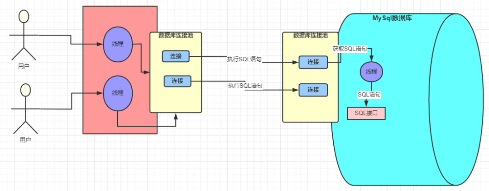

# 1. MySQL 面经

<!-- @import "[TOC]" {cmd="toc" depthFrom=1 depthTo=6 orderedList=false} -->

<!-- code_chunk_output -->

- [1. MySQL 面经](#1-mysql-面经)
  - [1.1. Progress](#11-progress)
  - [1.2. 面试](#12-面试)
  - [1.3. 弱项](#13-弱项)
  - [1.4. 架构](#14-架构)
      - [1.4.0.1. 请说下你对 MySQL 架构的了解？](#1401-请说下你对-mysql-架构的了解)
      - [1.4.0.2. MySQL 的基本架构图 一条 SQL 语句在数据库框架中的执行流程？：](#1402-mysql-的基本架构图-一条-sql-语句在数据库框架中的执行流程)
      - [1.4.0.3. MySQL 的 redo log，undo log，bin log 都是干什么的（底层的存储形式比较复杂，不用管）](#1403-mysql-的-redo-logundo-logbin-log-都是干什么的底层的存储形式比较复杂不用管)
  - [1.5. MySQL 表设计 basics](#15-mysql-表设计-basics)
      - [1.5.0.1. 数据库的三范式是什么？](#1501-数据库的三范式是什么)
      - [1.5.0.2. MySQL 数据类型优化 char 和 varchar 的区别？varchar(10) 和 varchar(20) 的区别？](#1502-mysql-数据类型优化-char-和-varchar-的区别 varchar10-和-varchar20-的区别)
      - [1.5.0.3. ip 存 MySQL](#1503-ip-存-mysql)
  - [1.6. 常见 SQL 场景题 及 查询语句](#16-常见-sql-场景题-及-查询语句)
      - [1.6.0.1. UNION 与 UNION ALL 的区别](#1601-union-与-union-all-的区别)
      - [1.6.0.2. DROP、DELETE 与 TRUNCATE 的区别](#1602-dropdelete-与-truncate-的区别)
      - [1.6.0.3. SQL 语句主要分为哪几类](#1603-sql-语句主要分为哪几类)
      - [1.6.0.4. 超键、候选键、主键、外键分别是什么？](#1604-超键候选键主键外键分别是什么)
      - [1.6.0.5. 六种关联查询](#1605-六种关联查询)
      - [1.6.0.6. int(10) 什么意思？tinyint 和 int 有什么区别](#1606-int10-什么意思 tinyint-和-int-有什么区别)
      - [1.6.0.7. 字符串应该怎么做索引](#1607-字符串应该怎么做索引)
  - [1.7. 存储、索引、查询优化](#17-存储索引查询优化)
      - [1.7.0.1. 索引基本概念](#1701-索引基本概念)
      - [1.7.0.2. 优化总结](#1702-优化总结)
      - [1.7.0.3. mysql 问题排查方面](#1703-mysql-问题排查方面)
      - [1.7.0.4. 慢查询优化](#1704-慢查询优化)
      - [1.7.0.5. 索引内部数据结构](#1705-索引内部数据结构)
      - [1.7.0.6. 谈谈你对 B+ 树的理解？](#1706-谈谈你对-b-树的理解)
      - [1.7.0.7. 为什么 InnoDB 存储引擎选用 B+ 树而不是 B 树呢？](#1707-为什么-innodb-存储引擎选用-b-树而不是-b-树呢)
      - [1.7.0.8. 唯一索引与普通索引的区别是什么？使用索引会有哪些优缺点](#1708-唯一索引与普通索引的区别是什么使用索引会有哪些优缺点)
      - [1.7.0.9. 索引的底层使用的是什么数据结构？](#1709-索引的底层使用的是什么数据结构)
      - [1.7.0.10. 谈谈你对最左前缀原则的理解？](#17010-谈谈你对最左前缀原则的理解)
      - [1.7.0.11. 什么情况下索引会失效？即查询不走索引？](#17011-什么情况下索引会失效即查询不走索引)
      - [1.7.0.12. 查询性能的优化方法？](#17012-查询性能的优化方法)
      - [1.7.0.13. 回表](#17013-回表)
      - [1.7.0.14. 索引下推](#17014-索引下推)
  - [1.8. 事务，ACID，并发控制及隔离级别](#18-事务 acid 并发控制及隔离级别)
      - [1.8.0.1. 请你描述下事务的特性？](#1801-请你描述下事务的特性)
      - [1.8.0.2. 谈谈你对事务隔离级别的理解？](#1802-谈谈你对事务隔离级别的理解)
      - [1.8.0.3. 如何避免小表修改结构时（如加字段）会导致服务有损的情况](#1803-如何避免小表修改结构时如加字段会导致服务有损的情况)
      - [1.8.0.4. MySQL 默认的隔离级别是什么？](#1804-mysql-默认的隔离级别是什么)
      - [1.8.0.5. MySQL 的隔离级别是基于锁实现的吗？](#1805-mysql-的隔离级别是基于锁实现的吗)
      - [1.8.0.6. 谈谈你对 MVCC 的了解？](#1806-谈谈你对-mvcc-的了解)
      - [1.8.0.7. 说一下 MySQL 的行锁和表锁？](#1807-说一下-mysql-的行锁和表锁)
      - [1.8.0.8. InnoDB 存储引擎的锁的种类有哪些？](#1808-innodb-存储引擎的锁的种类有哪些)
      - [1.8.0.9. 间隙锁，Next-Key Lock 及其作用](#1809-间隙锁 next-key-lock-及其作用)
    - [1.8.1. 什么是死锁？如何解决死锁？](#181-什么是死锁如何解决死锁)
      - [1.8.1.1. 什么是乐观锁和悲观锁？如何实现？](#1811-什么是乐观锁和悲观锁如何实现)
  - [1.9. 高可用/可靠性](#19-高可用可靠性)
      - [1.9.0.1. 如何保证数据库数据的可靠性](#1901-如何保证数据库数据的可靠性)
      - [1.9.0.2. 为什么要分库分表](#1902-为什么要分库分表)
      - [1.9.0.3. 分库分表存在哪些问题](#1903-分库分表存在哪些问题)
      - [1.9.0.4. 谈谈你对水平切分和垂直切分的理解？](#1904-谈谈你对水平切分和垂直切分的理解)
      - [1.9.0.5. MySQL 分库分表](#1905-mysql-分库分表)
      - [1.9.0.6. 主从复制中涉及到哪三个线程？](#1906-主从复制中涉及到哪三个线程)
      - [1.9.0.7. MySQL 读写分离](#1907-mysql-读写分离)
      - [1.9.0.8. 主从同步的延迟原因及解决办法？](#1908-主从同步的延迟原因及解决办法)
  - [1.10. MySQL Internal](#110-mysql-internal)
      - [1.10.0.1. InnoDB 和 MyISAM 的比较？](#11001-innodb-和-myisam-的比较)
      - [1.10.0.2. 自增 ID 用完了怎么办](#11002-自增-id-用完了怎么办)
  - [1.11. MySQL 排查](#111-mysql-排查)
      - [1.11.0.1. MySQL 问题排查都有哪些手段？](#11101-mysql-问题排查都有哪些手段)
      - [1.11.0.2. MySQL 数据库 CPU 飙升到 500% 的话他怎么处理？](#11102-mysql-数据库-cpu-飙升到-500-的话他怎么处理)
      - [1.11.0.3. MySQL 运维](#11103-mysql-运维)
      - [1.11.0.4. 一图归纳 Mysql 锁](#11104-一图归纳-mysql-锁)
      - [1.11.0.5. MySQL - 性能优化](#11105-mysql---性能优化)
  - [1.12. 参考](#112-参考)

<!-- /code_chunk_output -->

一部分涉及原理，一部分涉及实践

参考：
1. 以 "database smartkeyerror.oss-cn-shenzhen.aliyuncs" 为关键词可以搜出很多 质
   量很高的知识总结 pdf.
1. [mysql][mysql-interview]
2. [golang interview github][golang-interview-github]
3. 《高性能 MySQL》
4. 《MySQL 技术内幕》
5. 《MySQL 45 讲，极客时间》
6. 《ddia》
7. [浅入浅出 MySQL](https://draveness.me/mysql-innodb/)
8. MySQL 面试题
9. 《数据库系统概念》
10. [MySQL 索引原理及慢查询优化-美团技术团队][meituan-query-optimization]
11. [最全 MySQL 优化方法，从此优化不再难，高性能 MySQL 的总结]
    [mysql-optimization]

[mysql-optimization]: https://zhuanlan.zhihu.com/p/59818056
[meituan-query-optimization]: https://tech.meituan.com/2014/06/30/mysql-index.html

[mysql-interview]: https://manbucoding.com/travel-coding/mysql/%E5%B8%B8%E7%94%A8SQL%E8%AF%AD%E5%8F%A5.html
[golang-interview-github]: https://github.com/lifei6671/interview-go

参考

33. SQL 与 MySQL 有什么区别

从数据存储的角度看，MySQL 这关系型数据库很好地解决了很多问题，适合 E-R 模型的数
据，但同时也有他的缺点

1. 落地优化经验

## 1.1. Progress

- [x] 1.1. 架构
- [x] 1.2. MySQL 表设计 basics
- [x] 1.3. 常见 SQL 场景题 及 查询语句
- [ ] 1.4. 存储、索引、查询优化
- [ ] 1.5. 事务，ACID，并发控制及隔离级别
- [ ] 1.6. 高并发，高可用
- [ ] 1.7. MySQL Internal
- [ ] 1.8. MySQL 排查

process
- [ ] 1. MySQL 面经
  - [ ] 1.1. Progress
  - [ ] 1.2. 面试
  - [ ] 1.3. 弱项
  - [ ] 1.4. 架构
      - [x] 1.4.0.1. 请说下你对 MySQL 架构的了解？
      - [x] 1.4.0.2. MySQL 的基本架构图 一条 SQL 语句在数据库框架中的执行流程？：
      - [ ] 1.4.0.3. MySQL 的 redo log，undo log，bin log 都是干什么的（底层的存储形式比较复杂，不用管）
  - [ ] 1.5. MySQL 表设计 basics
      - [x] 1.5.0.1. 数据库的三范式是什么？
      - [x] 1.5.0.2. MySQL 数据类型优化 char 和 varchar 的区别？varchar
      - [x] 1.5.0.3. ip 存 MySQL
  - [ ] 1.6. 常见 SQL 场景题 及 查询语句
      - [x] 1.6.0.1. UNION 与 UNION ALL 的区别
      - [x] 1.6.0.2. DROP、DELETE 与 TRUNCATE 的区别
      - [ ] 1.6.0.3. SQL 语句主要分为哪几类
      - [ ] 1.6.0.4. 超键、候选键、主键、外键分别是什么？
      - [ ] 1.6.0.5. 六种关联查询
      - [ ] 1.6.0.6. int
      - [x] 1.6.0.7. 字符串应该怎么做索引
  - [ ] 1.7. 存储、索引、查询优化
      - [x] 1.7.0.1. 索引基本概念
      - [x] 1.7.0.2. 优化总结
      - [x] 1.7.0.3. mysql 问题排查方面
      - [x] 1.7.0.4. 慢查询优化
      - [x] 1.7.0.5. 索引内部数据结构
      - [x] 1.7.0.6. 谈谈你对 B+ 树的理解？
      - [x] 1.7.0.7. 为什么 InnoDB 存储引擎选用 B+ 树而不是 B 树呢？
      - [x] 1.7.0.8. 唯一索引与普通索引的区别是什么？使用索引会有哪些优缺点
      - [x] 1.7.0.9. 索引的底层使用的是什么数据结构？
      - [x] 1.7.0.10. 谈谈你对最左前缀原则的理解？
      - [x] 1.7.0.11. 什么情况下索引会失效？即查询不走索引？
      - [ ] 1.7.0.12. 查询性能的优化方法？
      - [x] 1.7.0.13. 回表
      - [ ] 1.7.0.14. 索引下推
  - [ ] 1.8. 事务，ACID，并发控制及隔离级别
      - [x] 1.8.0.1. 请你描述下事务的特性？
      - [x] 1.8.0.2. 谈谈你对事务隔离级别的理解？
      - [ ] 1.8.0.3. 如何避免小表修改结构时（如加字段）会导致服务有损的情况
      - [x] 1.8.0.4. MySQL 默认的隔离级别是什么？
      - [x] 1.8.0.5. MySQL 的隔离级别是基于锁实现的吗？
      - [x] 1.8.0.6. 谈谈你对 MVCC 的了解？
      - [x] 1.8.0.7. 说一下 MySQL 的行锁和表锁？
      - [x] 1.8.0.8. InnoDB 存储引擎的锁的种类有哪些？
      - [x] 1.8.0.9. 间隙锁，Next-Key Lock 及其作用
    - [x] 1.8.1. 什么是死锁？如何解决死锁？
      - [x] 1.8.1.1. 什么是乐观锁和悲观锁？如何实现？
  - [ ] 1.9. 高可用/可靠性
      - [ ] 1.9.0.1. 如何保证数据库数据的可靠性
      - [ ] 1.9.0.2. 为什么要分库分表
      - [ ] 1.9.0.3. 分库分表存在哪些问题
      - [ ] 1.9.0.4. 谈谈你对水平切分和垂直切分的理解？
      - [ ] 1.9.0.5. MySQL 分库分表
      - [ ] 1.9.0.6. 主从复制中涉及到哪三个线程？
      - [ ] 1.9.0.7. MySQL 读写分离
      - [ ] 1.9.0.8. 主从同步的延迟原因及解决办法？
  - [ ] 1.10. MySQL Internal
      - [ ] 1.10.0.1. InnoDB 和 MyISAM 的比较？
      - [ ] 1.10.0.2. 自增 ID 用完了怎么办
  - [ ] 1.11. MySQL 排查
      - [ ] 1.11.0.1. MySQL 问题排查都有哪些手段？
      - [ ] 1.11.0.2. MySQL 数据库 CPU 飙升到 500% 的话他怎么处理？
      - [ ] 1.11.0.3. MySQL 运维
      - [ ] 1.11.0.4. 一图归纳 Mysql 锁
      - [ ] 1.11.0.5. MySQL - [ ] 性能优化
  - [ ] 1.12. 参考

start at 2022-09-27 16:37:44, end at 

## 1.2. 面试

mysql 篇
- mysql 索引（必问）
   - 包括索引的类型，索引的数据结果，b + 树和 hash 的区别，b + 树和 b 树的区别，
     索引创建原则。最左原则，聚簇索引，前缀索引等等。
- mysql 事务 （必问）
   - 包括事务隔离级别，各个隔离界别解决的问题，mvvc 的原理等。
- mysql 锁 （必问）
   - 行锁，表锁，悲观锁啊，乐观锁啊，排它锁，共享锁，间隙锁，范围锁，临键锁，两
     阶段锁，死锁的原因，事务中各个隔离级别用的锁的类型已经怎么用的锁。
- mysql 数据类型 （常问）
   - mysql 有哪些数据类型，varchar 与 char 的区别。int 和 int (11) 区别，tinyint
     与 int 区别等等。
- mysql 日志
   - 这个一般看面试官吧，我就碰到过一次，binlog 日志的类型有几种，各有什么优缺点，
     以及一般怎么设置。undolog，redolog，为什么有 binlog 了还要 redolog，两者有
     什么区别以及两者生成的时机。
- mysql 架构方面
   - mysql 高可用怎么部署，mysql 读写分离原理是什么，主从同步慢怎么解决。如果大
     批量的删除一堆数据，怎么快速释放内存？delete 删除会立刻释放内存吗？truncate
     和 drop 呢？
- mysql 问题排查方面
   - 有没有使用过慢查询，以及怎么解决慢查询，数据量比较大，查询比较慢，你怎么解
     决的，一般看 mysql 的执行计划，都看哪些参数，以及参数的含义是什么。

## 1.3. 弱项

- 实战经验缺乏，例如 SQL 不一定能够很快地灵活运用：mysql 很多实战经验，问题分析，但是太细，
  没这么多时间看。（例如 优化 join, )
- 没完全看懂 `explain` 语句的输出
- 落地场景

expalin 又忘了，看不太懂

## 1.4. 架构

#### 1.4.0.1. 请说下你对 MySQL 架构的了解？

#### 1.4.0.2. MySQL 的基本架构图 一条 SQL 语句在数据库框架中的执行流程？：

(1) 简单版：


1. 首先是个**分层结构**：server 层、存储引擎层。
2. 前者包括 查询缓存 模块 及 解释 SQL
   的一串（分析器，优化器，执行器），该层 涵盖 MySQL 的大多数核心服务功能/所有
   的内置函数（如日期、时间、数学和加密函数等）/跨存储引擎的功能都在这一层实现
3. **存储引擎层**：采用插件式架构，可选如 InnoDB, 和 MyISAM.

当执行一条 SQL 语句时：(MySQL 8.0 没有缓存功能）
1. 应用程序把查询 SQL 语句**发送给服务器端**执行；
2. 如**果缓存**打开，首先查询缓存（不建议使用缓存：查询缓存的失效非常频繁，只要有对
   一个表的更新，这个表上所有的查询缓存都会被清空）
3. 只有缓存不存在时，才会进行下面的操作；**查询优化处理，生成执行计划**。这个阶段主
   要包括解析 SQL、预处理、优化 SQL 执行计划；MySQL 根据相应的执行计划完成整个查
   询；将查询结果返回给客户端。
   1. 此过程就像**编译器**一样了：首先是**词法解析、语法解析；优化器优化查询顺序，**查询
      条件能够使**结果越快收敛的越好**；执行器 首先**校验权限，接着调用存储引擎接口**，
      将满足条件的行组成的记录集返回给客户端。

(2) [详尽版](https://pdai.tech/md/db/sql-mysql/sql-mysql-execute.html)

1. 首先是连接
   - 关键词：连接池管理

|  |
|:--:|
| *SQL 执行的连接池管理* |

2. 到 MySQL 的总体概览
   - 关键词：类似于编译器的一套

|  |
|:--:|
| *MySQL 内部数据流* |

3. 从可靠性的角度去看
   - 关键：
     - undo log 记录数据修改前的样子，用于事务回滚； redo log 记录数据修改后的样
       子，用于事务恢复；bin log 记录整个操作，用于数据库备份/恢复；
     - 主库 (redo log 来负责事务恢复）, 和 备库 (bin log 负责同步） 属于两个数据副本，
       两者要保持数据一致性的话，就需要对一个事务进行两阶段提交，即 redo log, 和
       bin log 都 write ahead 了，才能提交。

准备更新一条 SQL 语句（从执行器开始调用存储引擎接口做了哪些事情呢）
- **缓冲池**：MySQL（innodb）会先去缓冲池（BufferPool）中去查找这条数据，没找到就会去磁盘中
  查找，如果查找到就会将这条数据加载到缓冲池（BufferPool）中
   - buffer pool 起到作用：（弥补 CPU 和磁盘速度的差异）batch processing, 转 random write 为 sequencial write
- **undo log**: 在加载到 Buffer Pool 的同时，会将这条数据的原始记录保存到 undo 日志文件中
- **更新**：innodb 会在 Buffer Pool 中执行更新操作
- **redo log**：更新后的数据会记录在 redo log buffer 中
- : MySQL 提交事务的时候，会将 redo log buffer 中的数据写入到 redo 日志文件中 刷磁
  盘可以通过 innodb_flush_log_at_trx_commit 参数来设置
   - 值为 0 表示不刷入磁盘
   - 值为 1 表示立即刷入磁盘
   - 值为 2 表示先刷到 os cache
- **两阶段提交**： 写 bin log.
- **重启恢复**：mysql 重启的时候会将 redo 日志恢复到缓冲池中

从准备更新一条数据到事务的提交的流程描述

- 首先执行器根据 MySQL 的执行计划来查询数据，先是从缓存池中查询数据，如果没有就会去数据库中查询，如果查询到了就将其放到缓存池中
- 在数据被缓存到缓存池的同时，会写入 undo log 日志文件
- 更新的动作是在 BufferPool 中完成的，同时会将更新后的数据添加到 redo log buffer 中
- 完成以后就可以提交事务，在提交的同时会做以下三件事
   - 将 redo log buffer 中的数据刷入到 redo log 文件中
   - 将本次操作记录写入到 bin log 文件中
   - 将 bin log 文件名字和更新内容在 bin log 中的位置记录到 redo log 中，同时在 redo log 最后添加 commit 标记

|  |
|:--:|
| *执行器和存储引擎的视角（从执行器开始调用存储引擎接口做了哪些事情呢？)* |

1. 重点关注一下 bin log

binlog/ redo log 区别（放弃）
1. **使用场景：恢复/主备**：redo log 适用于 crash-safe（崩溃恢复）; bin log 适用
   于 主从复制和数据恢复。
1. **日志层级：物理/逻辑**: redo log 是物理日志，记录的是“在某个数据页上做了什么
   修改”；binlog 是逻辑日志，记录的是这个语句的原始逻辑，比如“给 D=2 这一行的 c
   字段加 1”
2. **循环写/追加写**：redo log 是循环写的，空间固定会用完；binlog 是可以追加写入
   的。“追加写”是指 binlog 文件写到一定大小后会切换到下一个，并不会覆盖以前的日
   志。
3. **实现归属：InnoDB/Server 层**: redo log 是 InnoDB 引擎特有的；binlog 是
   MySQL 的 Server 层实现的，所有引擎都

刷入 bin log 有以下几种模式
- STATMENT(statement-based replication, SBR): high level, 简单，量小，快，但是有
  undeterminstic 的语句，例如 date, random
- ROW(row-based replication, RBR): low level, deterministic, 但是 量大
- MIXED: deterministic 用 statement, 不确定的用 row-based.

**bin log 和 redo log 合在一起的作用是两阶段提交**，如下图
- 为什么需要 redo log 和 bin log，因为前者用于事务重做 (crash-safe), 后者用于备
  份、恢复，也就是说，又有两个数据副本。两个 redo log 和 bin log 为了保持两个数
  据副本的一致性。

  |  |
  |:--:|
  | *两阶段提交* |

5. 从性能的角度去看

不太懂：
- 基本原理：batch processing, transfer random IO to sequential IO
- 机制：buffer pool, change buffer

#### 1.4.0.3. MySQL 的 redo log，undo log，bin log 都是干什么的（底层的存储形式比较复杂，不用管）

binlog/ redo log 区别
1. **使用场景：恢复/主备**：redo log 适用于 crash-safe（崩溃恢复）; bin log 适用
   于 主从复制和数据恢复。
1. **日志层级：物理/逻辑**: redo log 是物理日志，记录的是“在某个数据页上做了什么
   修改”；binlog 是逻辑日志，记录的是这个语句的原始逻辑，比如“给 D=2 这一行的 c
   字段加 1”
2. **循环写/追加写**：redo log 是循环写的，空间固定会用完；binlog 是可以追加写入
   的。“追加写”是指 binlog 文件写到一定大小后会切换到下一个，并不会覆盖以前的日
   志。
3. **实现归属：InnoDB/Server 层**: redo log 是 InnoDB 引擎特有的；binlog 是
   MySQL 的 Server 层实现的，所有引擎都

到此，关于 Buffer Pool、Redo Log Buffer 和 undo log、redo log、bin log 概念以及关系就基本差不多了。

- Buffer Pool 是 MySQL 的一个非常重要的组件，因为针对数据库的增删改操作都是在 Buffer Pool 中完成的
- Undo log 记录的是数据操作前的样子
- redo log 记录的是数据被操作后的样子（redo log 是 Innodb 存储引擎特有）
- bin log 记录的是整个操作记录（这个对于主从复制具有非常重要的意义）

## 1.5. MySQL 表设计 basics

#### 1.5.0.1. 数据库的三范式是什么？

5. 范式（一二三四范式：[参考 1：知乎某位老师][5]；[某个帖子][6]）
   - **Key Observation:** **对领域知识建立 E-R 模型，尽量做到 解耦、原子化**，具体表
     现为 设计表的时候，消除 子集合（例如地址），消除 非主属性对码的部分函数依赖
     和传递函数依赖，主属性对于码的部分函数依赖与传递函数依赖。这样当增删改查时，
     在完整性约束的条件下，不会发生异常，和数据冗余的情况。
    - **相关概念：**
       1. **码**：设 K 为某表中的一个属性或属性组，若除 K 之外的所有属性都**完全
       函数依赖**于 K（这个“完全”不要漏了），那么我们称 K 为候选码，简称为码。在
       实际中我们通常可以理解为：假如当 K 确定的情况下，该表除 K 之外的所有属性
       的值也就随之确定，那么 K 就是码。一张表中**可以有超过一个码**。（实际应用
       中为了方便，通常选择其中的一个码作为主码）
       2. **函数依赖**： schema{a,b,c}, a 确定 c, 则 c 存在着对 a 的函数依赖；假
       设 (a,b) 是码唯一确定每条记录，则 c 对 a 存在着部分函数依赖；a -> b -> c，
       则 c 对 a 存在传递函数依赖。
   - **作用**：
      - 优点：
        1. 减少数据冗余（这是最主要的好处，其他好处都是由此而附带的）
        2. 消除异常（插入异常，更新异常，删除异常）
        3. 让数据组织的更加和谐…
      - 缺点：联表查询多，导致查询语句复杂，数据量大的时候，联表查询会有性能影响。
   -  **具体概念**
      1. **1NF： 字段是最小的的单元不可再分**
      2. **2NF：满足 1NF, 表中的字段必须完全依赖于全部主键而非部分主键** （一般我们
      都会做到）（消除了非主属性对于码的部分函数依赖）, 如一个表，(A,B) 是码，A,
      B 是主属性，若对于一些记录单纯 A 可以完全确定一行，那么存在 非主属性对码的
      部分函数依赖，具体一点就是学生上课，student, course, enrollment, 实际上应
      该分成三个表，entity, relationship, entity. 但是现在合成一张表，那明显就出
      现某行的非主属性对主属性的部分函数依赖，所以实际上应该继续拆分表。
      1. **3NF：满足 2NF, 非主键外的所有字段必须互不依赖** (3NF 在 2NF 的基础之上，
      消除了非主属性对于码的传递函数依赖）, 主键 A -> B, B->C, 则 非主属性 C 对
      码 A 存在传递函数依赖。
      1. 4NF：满足 3NF, 消除表中的多值依赖（存在着主属性对于码的部分函数依赖与传
      递函数依赖）
6. 范式设计：
   - **数据冗余度低，读或者写都更快**。读的话方便放于内存中，写的话不用更新一堆。
   - **在针对单个模型进行查询时，查询语句简单**：冗余度低的话，跟其他数据有耦合，不
     用加 filter, aggregation 之类的。
   - **消除 增删改 异常**。（因为需要完整性约束，entity1, entity2 耦合到一张表时，要
     对 entity1 进行全部任意的写操作，都要考虑到 会不会 把 entity2 都删了）

#### 1.5.0.2. MySQL 数据类型优化 char 和 varchar 的区别？varchar(10) 和 varchar(20) 的区别？

**char 和 varchar 的区别？**
- **char(n) ：定长字符串，但会有浪费掉的空闲空间**，比如：订阅 char(10)，当你输入”
  abc”三个字符的时候，它们占的空间还是 10 个字节，其他 7 个是空字节。char 
  - **优点：效率高**；
  - **缺点：占用空间**；
  - **适用场景**：存储密码的 md5 值，固定长度的，使用 char 非常合适。
- **varchar(n)**：**变长字符串，存储的值是每个值占用的字节再加上一个用来记录其长度的
  字节的长度**。
  - 优缺点：从空间上考虑 varcahr 比较合适；从效率上考虑 char 比较合适，二者使用
    需要权衡。

**varchar(10) 和 varchar(20) 的区别？**
- varchar(10) 和 varchar(20) 的区别？: varchar(10) 中 10 的涵义最多存放 10 个字
  符，varchar(10) 和 varchar(20) 存储 hello 所占空间一样，但后者在排序时会消耗更
  多内存，因为 order by col 采用 fixed_length 计算 col 长度
  
#### 1.5.0.3. ip 存 MySQL

IP 地址数据采用整数（**UNSIGNED INT**）存储，在存储和 CPU
资源使用上都少于字符串存储形式；在歧义较大的范围查询中，
存储整数方式无需关系范围中的位数问题，查询更加直观方便。

因此，**需要范围查询**，且数据量很大（如亿级以上），采用数值存储 IP
地址的方式更优。如果均是唯一 IP
精确查询，或数据量不大，那么使用字符串操作更为简单。

1. `unsigned int` 存储，如 `192.168.1.1` 会将每个十进制数转换成
   二进制数再拼起来，即 (3232235777)~10~, (11000000 10101000 00000001
   00000001)~2~, 优点很显然，体积小性能高， 缺点是易读性差。
2. `varchar(16)`. 优点：适合范围查询/易读；
   缺点：体积大、占用空间大。还有倒序的话可以做个聚合。

```sql
INSERT INTO users (ip_address) VALUES (INET_ATON('192.168.1.1'));
```

```sql
SELECT INET_NTOA(users.ip_address) FROM users;
```

## 1.6. 常见 SQL 场景题 及 查询语句

#### 1.6.0.1. UNION 与 UNION ALL 的区别

UNION 用于把来自多个 SELECT 语句的结果组合到一个结果集合中，MySQL 会把结果集中
重复的记录删掉，而使用 UNION ALL，MySQL 会把所有的记录返回，且效率高于 UNION 。

#### 1.6.0.2. DROP、DELETE 与 TRUNCATE 的区别

三种都可以表示删除，其中的细微区别之处如下：

drop 删掉整张表； delete 删掉特定行；truncate 删掉表中的所有数据，但保留 schema

||DROP|DELETE|TRUNCATE|
|:--:|:--:|:--:|:--:|
|SQL 语句类型|DDL|DML|DDL|
|回滚|不可回滚|可回滚|不可回滚|
|删除内容|从数据库中|删除表，所有的数据行，索引和权限也会被删除|表结构还在，删除表的|全部或者一部分数据行|表结构还在，删除表中的|所有数据|
|删除速度|删除速度最快|删除速度慢，需要逐行删除|删除速度快|

因此，在不再需要一张表的时候，采用 DROP；在想删除部分数据行时候，用 DELETE；在保留表而删除所有数据的时候用 TRUNCATE。

#### 1.6.0.3. SQL 语句主要分为哪几类

DDL、DML、DCL: 
- Data Definition Language: 表操纵，create, drop, alter
- Data Manipulation Language: 数据操纵，insert, delete, update, select
- Data Control Language: 权限相关 grant

#### 1.6.0.4. 超键、候选键、主键、外键分别是什么？

- **超 键**：在关系中，能唯一标识元组的属性集称为关系模式的超键。一个属性可以作
  为一个超键，多个属性组合在一起也可以作为一个超键。超键包含候选键和主键。
    - 由超键的定义可知，学生表中含有学号或者身份证号的任意组合都为此表的超键。如：
      **（学号）、（学号，姓名）、（身份证号，性别）**等。
- **候选键**：是最小超键，即没有冗余元素的超键。
    - 候选键属于超键，它是最小的超键，就是说如果再去掉候选键中的任何一个属性它就
      不再是超键了。学生表中的候选键为：**（学号）、（身份证号）**。
- **主 键**：数据库表中对储存数据对象予以 唯一和完整标识的数据列或属性的组合。一
  个数据列只能有一个主键，且主键的取值不能缺失，即不能为空值（NULL）。
- **外 键**：在一个表中存在的另一个表的主键称此表的外键，外键可以有重复的，可以
  是空值。外键是用来和其他表建立联系用的。

#### 1.6.0.5. 六种关联查询

|  |
|:--:|
| *六种 join* |

#### 1.6.0.6. int(10) 什么意思？tinyint 和 int 有什么区别

int(10) 中的 10 表示显示时的宽度，跟实际存储大小无关
int 类型占 4 个字节，tinyint 占 1 个字节

#### 1.6.0.7. 字符串应该怎么做索引

根据必要做前缀索引：也就是说使用前缀索引，定义好长度，就可以做到既节省空间，又不
用额外增加太多的查询成本。
- 前缀过短：selectivity 过小；
- 前缀过长：索引变大，用的磁盘空间就越大，相同的数据页能放下的索引值就越少，搜索
  的效率也就会越低。
  
在实践中
- 区分度推荐：95%，区分度计算（实验如下）
- 假如区分度低的话，例如身份证，可以
  1. 倒序存储（身份证前 6 位数字大多数都相同）:

     ```sql
     select field_list from t where id_card = reverse('input_id_card_string');
     ```

  2. hash 字段，加一个字段 `hash(id_card_code)`，并对此做索引，由于哈希冲突的原
     因在实际中要二次件校验>

     ```sql
     mysql> select field_list from t where id_card_crc=crc32('input_id_card_string') and id_card='input_id_card_string'
     ```
  
  ```sql
  mysql> select 
  count(distinct left(email,4)）as L4,
  count(distinct left(email,5)）as L5,
  count(distinct left(email,6)）as L6,
  count(distinct left(email,7)）as L7,
  from SUser;
  ```

```sql
alter table SUser add index index2(email(6));
```

## 1.7. 存储、索引、查询优化

#### 1.7.0.1. 索引基本概念

1. 两种索引：
   1. **顺序索引**：B+树基本上是顺序索引。
   2. **散列索引**：O(1) 的时间复杂度，但失去了有序性。InnoDB 存储引擎有一个特殊
      的功能叫“自适应哈希索引”，当某个索引值被使用的非常频繁时，会在 B+Tree 索引
      之上再创建一个哈希索引，这样就让 B+Tree 索引具有哈希索引的一些优点，比如快
      速的哈希查找。 
   3. 区别：**实现**：平衡树；散列表；
   4. **使用场景**：
      1. **顺序索引**：帮助服务器避免进行排序和分组，也就不需要创建临时表；区间
         查找（顺序文件）; 大大减少了服务器需要扫描的数据行数（二分）。
      2. **哈希索引**：单值查找

2. **聚集索引（主键）与非聚集索引（辅助索引）**: **主键索引**的**叶子节点保存**
   的是真正的数据。而**辅助索引叶子节点**的数据区**保存**的是**主键索引关键字的
   值**。
   
   假如要查询 name = C 的数据，其搜索过程如下：a) 先在辅助索引中通过 C 查询最后
   找到主键 id = 9; b) 在主键索引中搜索 id 为 9 的数据，最终在主键索引的叶子节点
   中获取到真正的数据。所以通过辅助索引进行检索，需要检索两次索引。
   
   之所以这样设计，一个原因就是：如果和 MyISAM 一样在主键索引和辅助索引的叶子节
   点中都存放数据行指针，一旦数据发生迁移，则需要去重新组织维护所有的索引。

   |  |
   |:--:|
   | *聚簇索引和非聚簇索引* |
   

3. **稠密索引和稀疏索引** 参考（https://www.cnblogs.com/cxl-/p/15170494.html）
   - **索引项**：由一个搜索码值和指向具有该搜索码值的一条或多条记录的指针构成。
   - **稠密索引**：特征：**每个搜索码值都有一个索引项**，聚集索引中，指针指向具
     有该搜索码的第一条记录，其余按顺序存在后面，搜索时也线性查找；非聚集索引中，
     索引项则必须含指向所有记录的指针。**辅助索引必须是稠密索引**。
   - **稀疏索引**：只有聚集索引才能是稀疏索引，只为搜索码的**某些值建立索引项**
     （找到后，往后线性搜索），如英文字典中每页上部的单词便是一个稀疏索引。
   - **区别**：显然前者定位更快（**时间**），后者空间开销小（**空间**）。
   - **多级索引**：多级索引中，外层索引是稀疏索引，内层是稠密。I/O 操作少，磁盘
     存取次数少，即时间耗费少。（若直接建立某个数据的稠密索引，则索引项巨大，无
     法放在主存）
   - **为什么辅助索引必须是稠密索引**：如下图所示，辅助索引指向的行记录按照主键
     来说是乱序的，只能使用稠密索引一一对应起来。
   
   |  |
   |:--:|
   | *caption* |

4. **B+树索引（顺序索引）**
    - **是什么**：**(a) 平衡树，磁盘 IO 驱动的设计**：出度大，高度小，时间复杂度
      的时间常数低，适合弥补磁盘 IO 和内存 IO 速度的巨大差异；**(b) 数据全部存储
      于叶子节点**，内部节点空间小，适合放进内存，在同样的空间大小下，存放更多的
      key, 出度更大，高度更小 **(c ) 叶子节点有指针连着，适合区间查询**。
    - **使用场景**：查找、排序、分组，区间查询。
    - **区间查找**（AVL 树，首先找到 lca，再递归下降地去遍历）：如 printRange(L,
      U)，首先找到 L，接着遍历记录至 U 时终止。**B+树文件组织**：空间利用十分重

5. **位图结构** 对某个属性 A， 属性值为 a，有这样一个位图：bit vector，其中第 n
   位即为记录号，若记录号的属性值是 a 的话，则该位为 1，否则为 0。
   - 优点：交、并、统计个数等运算高速；存储空间少
   - 用途：与 B+树组合用：一些属性值出现频率十分高的可以采用位图，来代替标识号
     （标识号占用空间大）

6. 排序
多趟多路归并
bitmap 方法。

5. 覆盖索引：索引包含所有需要查询的字段的值。

   具有以下优点：

   - 索引通常远小于数据行的大小，只读取索引能大大减少数据访问量。
   - 一些存储引擎（例如 MyISAM）在内存中只缓存索引，而数据依赖于操作系统来缓存。
     因此，只访问索引可以不使用系统调用（通常比较费时）。
   - 对于 InnoDB 引擎，若辅助索引能够覆盖查询，则无需访问主索引。

#### 1.7.0.2. 优化总结

参考
1. 这个就是摘抄《高性能索引的》 https://zhuanlan.zhihu.com/p/59818056

|  |
|:--:|
| *sql 流程图* |

**(0) 优化器优化 101**

通过一个样例来简单了解一下优化器的优化策略：
1. 扫描行数（采样估计）、临时表、是否排序、区分度 (selectivity)
2. 是否需要返回主键（回表）查询
3. `order by a limit ` 优化器会优先选择在 index(a) 上进行 limit

索引基数：InnoDB 默认会选择 N 个数据页，统计这些页面上的不同值，得到一个平均值，
然后乘以这个索引的页面数，就得到了这个索引的基数。

例子：MySQL 选错索引

```sql
CREATE TABLE `t` (
  `id` int(11) NOT NULL,
  `a` int(11) DEFAULT NULL,
  `b` int(11) DEFAULT NULL,
  PRIMARY KEY (`id`),
  KEY `a` (`a`),
  KEY `b` (`b`)
) ENGINE=InnoDB；

delimiter ;;
create procedure idata()
begin
  declare i int;
  set i=1;
  while(i<=100000)do
    insert into t values(i, i, i);
    set i=i+1;
  end while;
end;;
delimiter ;
call idata();

```

1. 实验 1
   - 执行语句：

     |  |
     |:--:|
     | *session A 和 session B 的执行流程* |
    
     ```sql
     set long_query_time=0;
     select * from t where a between 10000 and 20000; /*Q1*/
     select * from t force index(a) where a between 10000 and 20000;/*Q2*/
     ```

   - 现象：在上述 sessionA 和 session B 并发的背景下，分别执行两条 SQL, 一条不用
     `force index`, 另一条使用，慢查询日志如下。

     |  |
     |:--:|
     | *慢查询日志* |

   - 解析：不使用 `force index` 的 SQL 在优化器优化后，直接执行主键索引的全表扫描
   - 成因：
     1. 优化器基于采样的统计行数算法，估计出错，如下图所示，修正前后 b 索引估计的行
     数分别为 3w+, 和 1w+; 此外仍然不采用 b 索引的原因是觉得要回表查询太花时间了。
   
       |  |
       |:--:|
       | *意外的 explain 结果* |
       
   
       |  |
       |:--:|
       | *执行 analyze table t 命令恢复的 explain 结果* |
    

**(1) 优化方向 1：优化数据访问**
1. **查询中尽量避免使用 `SELECT * `** 以及加上 LIMIT 限制：因为 MySQL 采用 C/S
   的结构，且其通信协议是半双工（这里跟后面的好像没啥关系），p 当服务器响应客户
   端请求时，客户端必须完整的接收整个返回结果，而不能简单的只取前面几条结果，然
   后让服务器停止发送。
1. **减少请求的数据量**
   - **只返回必要的列**：最好不要使用 SELECT * 语句。
   - **只返回必要的行**：使用 LIMIT 语句来限制返回的数据。
   - **缓存重复查询的数据**：使用缓存可以避免在数据库中进行查询，特别在要查询的
     数据经常被重复查询时，缓存带来的查询性能提升将会是非常明显的。

2. **避免使用 `order by limit`**: 但是不要 order by limit, 因为排序一大堆，只要几个，
   一定要 `order by limit` 的话，则需要在建立相应的索引）

**(2) 优化方向 2： 从 MySQL 数据类型的角度看**
1. **char(10), varchar(10)**
1. 通常来说把可为 NULL 的列改为 NOT NULL 不会对性能提升有多少帮助，只是如果计划
   在列上创建索引，就应该将该列设置为 NOT NULL。
1. **INT**: **对整数类型指定宽度，比如 INT(11)，只是表示显示宽度，跟实际存储大小无关**。
   INT 使用 32 位（4 个字节）存储空间，那么它的表示范围已经确定，所以 INT(1) 和
   INT(20) 对于存储和计算是相同的。
1. UNSIGNED 表示不允许负值，大致可以使正数的上限提高一倍。比如 TINYINT 存储范围
   是-128 ~ 127，而 UNSIGNED TINYINT 存储的范围却是 0 - 255。
1. 通常来讲，**没有太大的必要使用 DECIMAL 数据类型。即使是在需要存储财务数据时，仍
   然可以使用 BIGINT**。比如需要精确到万分之一，那么可以将数据乘以一百万然后使用
   BIGINT 存储。**这样可以避免浮点数计算不准确和 DECIMAL 精确计算代价高的问题**
1. TIMESTAMP 使用 4 个字节存储空间，DATETIME 使用 8 个字节存储空间。因而，
   TIMESTAMP 只能表示 1970 - 2038 年，比 DATETIME 表示的范围小得多，而且
   TIMESTAMP 的值因时区不同而不同。
1. 大多数情况下没有使用枚举类型的必要，其中一个缺点是枚举的字符串列表是固定的，
   添加和删除字符串（枚举选项）必须使用 ALTER TABLE（如果只只是在列表末尾追加元
   素，不需要重建表）。
1. schema 的列不要太多。原因是存储引擎的 API 工作时需要在服务器层和存储引擎层之
   间通过行缓冲格式拷贝数据，然后在服务器层将缓冲内容解码成各个列，这个转换过程
   的代价是非常高的。如果列太多而实际使用的列又很少的话，有可能会导致 CPU 占用过
   高。
1. 大表 ALTER TABLE 非常耗时，MySQL 执行大部分修改表结果操作的方法是用新的结构创
   建一个张空表，从旧表中查出所有的数据插入新表，然后再删除旧表。尤其当内存不足
   而表又很大，而且还有很大索引的情况下，耗时更久。当然有一些奇技淫巧可以解决这
   个问题，有兴趣可自行查阅。

**(3) 优化方向 3： 高性能索引**
1. 索引构建原则
   1. 多列索引：
      1. （多列索引）**最左前缀匹配原则，非常重要的原则**，mysql 会一直向右匹配直到
         遇到范围查询 (>、<、between、like) 就停止匹配，比如 a = 1 and b = 2 and c
         > 3 and d = 4 如果建立 (a,b,c,d) 顺序的索引，d 是用不到索引的，如果建立 (a,
         b,d,c) 的索引则都可以用到，a,b,d 的顺序可以任意调整。
      5. （多列索引）**尽量的扩展索引，不要新建索引**。比如表中已经有 a 的索引，现
         在要加 (a,b) 的索引，那么只需要修改原来的索引即可。
      6. **多个单独列的索引，不如一个包含多列的索引**。原因在于对于前者，MySQL 不知
         道哪个索引区分度更高，
      7. （多列索引）**多列索引中索引列的顺序**: 让选择性最强的索引列放在前面。
      2. **=和 in 可以乱序**，比如 a = 1 and b = 2 and c = 3 建立 (a,b,c) 索引可以
         任意顺序，mysql 的查询优化器会帮你优化成索引可以识别的形式。
      3. **选择区分度高的列作为索引 区分度的公式是 count(distinct col)/count(*)**
         表示字段不重复的比例，比例越大我们扫描的记录数越少，唯一键的区分度是 1，而
         一些状态、性别字段可能在大数据面前区分度就是 0，那可能有人会问，这个比例有
         什么经验值吗？使用场景不同，这个值也很难确定，一般需要 join 的字段我们都要
         求是 0.1 以上，即平均 1 条扫描 10 条记录。
      4. **索引列不能参与计算（在进行查询时，索引列不能是表达式的一部分，也不能是函
         数的参数，否则无法使用索引。)**，保持列“干净”，比如
         from_unixtime(create_time) = ’2014-05-29’就不能使用到索引，原因很简单，b+
         树中存的都是数据表中的字段值，但进行检索时，需要把所有元素都应用函数才能比
         较，显然成本太大。所以语句应该写成 create_time = unix_timestamp(’
         2014-05-29’)。
2. 使用索引
   1. **避免多个范围条件**
   2. **覆盖索引**，优点如下：

      - 索引通常远小于数据行的大小，只读取索引能大大减少数据访问量。
      - 一些存储引擎（例如 MyISAM）在内存中只缓存索引，而数据依赖于操作系统来缓
        存。因此，只访问索引可以不使用系统调用（通常比较费时）。
      - 对于 InnoDB 引擎，若辅助索引能够覆盖查询，则无需访问主索引。

   3. **使用索引扫描来排序**
   5. **字符串使用前缀索引**：对于 BLOB、TEXT 和 VARCHAR 类型的列，必须使用前缀
      索引，只索引开始的部分字符。

**(4) 特定查询优化** (https://zhuanlan.zhihu.com/p/59818056)
   1. **优化 `COUNT(*)`** 查询，不会统计 NULL, 统计行数，但是会逐行统计（因为他
      是选一个最小的索引表来统计，而该索引会有 MVCC, 每一行记录都要查一下才知道
      是否可见，所以要逐行扫描，才确定总体数量）；近似值可以用 explain; 也可以用
      外部缓存系统缓存 (redis); 存在 MySQL + 事务特性，保持数据一致性。
      - 效率排序：`count（字段）` < `count（主键 id)` < `count(1)` ≈ `count(*)`，
        所以我建议你，尽量使用 `count(*)`。
      - count(*)、count（主键 id) 和 count(1) 都表示返回满足条件的结果集的总行数；
        而 count（字段），则表示返回满足条件的数据行里面，参数“字段”不为 NULL 的
        总个数。.

   2. **优化关联查询**。确保 ON 和 USING 字句中的列上有索引；确保任何的 GROUP BY
      和 ORDER BY 中的表达式只涉及到一个表中的列，这样 MySQL 才有可能使用索引来
      优化。
   4. **优化 Limit 分页。**
      1. `LIMIT 10000 201` 首先在辅助索引上找到 10201 条数据，接着回表得到 10201
         条数据，丢弃前面 10000 都丢弃，所以用覆盖索引 不需要回表。
      2. `order by xxx limit` 要用索引，否则先排序再取 limit 非常大，如下例子，
         这里的延迟关联将大大提升查询效率，让 MySQL 扫描尽可能少的页面，获取需要
         访问的记录后在根据关联列回原表查询所需要的列

         ```SQL
         -- 优化前
         SELECT film_id,description FROM film ORDER BY title LIMIT 50,5;
         ```
         
         ```SQL
         SELECT film.film_id,film.description
         FROM film INNER JOIN (
            SELECT film_id FROM film ORDER BY title LIMIT 50,5
         ) AS tmp USING(film_id);
         ```

    1. **优化 UNION**: MySQL 处理 UNION 的策略是先创建临时表，然后再把各个查询结果插
       入到临时表中，最后再来做查询。因此很多优化策略在 UNION 查询中都没有办法很
       好的时候。经常需要手动将 WHERE、LIMIT、ORDER BY 等字句“下推”到各个子查询
       中，以便优化器可以充分利用这些条件先优化。
       
       ```sql
       select employee_id,job_id from employees
       union
       select employee_id,job_id from job_history
       ```

       ```sql
       select employee_id,job_id from employees
       union all
       select employee_id,job_id from job_history
       ```

       除非确实需要服务器去重，否则就一定要使用 UNION ALL，如果没有 ALL 关键字，
       MySQL 会给临时表加上 DISTINCT 选项，这会导致整个临时表的数据做唯一性检查，
       这样做的代价非常高。当然即使使用 ALL 关键字，MySQL 总是将结果放入临时表，
       然后再读出，再返回给客户端。虽然很多时候没有这个必要，比如有时候可以直接
    5  把每个子查询的结果返回给客户端。
    
    1. 独立的列

   
**(5) 优化方向 4：重构查询方式**

1. 切分大查询一个大查询如果一次性执行的话，**可能一次锁住很多数据、占满整个事务日
   志、耗尽系统资源、阻塞很多小的但重要的查询**。

```sql
DELETE FROM messages WHERE create < DATE_SUB(NOW(), INTERVAL 3 MONTH);
```

```sql
rows_affected = 0
do {
    rows_affected = do_query(
    "DELETE FROM messages WHERE create  < DATE_SUB(NOW(), INTERVAL 3 MONTH) LIMIT 10000")
} while rows_affected > 0
```

2. **分解大连接查询**：将一个大连接查询分解成对每一个表进行一次单表查询，然后在应用
   程序中进行关联，这样做的好处有：

   - **让缓存更高效**。对于连接查询，如果其中一个表发生变化，那么整个查询缓存就无法
     使用。而分解后的多个查询，即使其中一个表发生变化，对其它表的查询缓存依然可
     以使用。
   - **分解成多个单表查询**，这些单表查询的缓存结果更可能被其它查询使用到，从而减少
     冗余记录的查询。
   - **减少锁竞争**；
   - **在应用层进行连接，可以更容易对数据库进行拆分**，从而更容易做到高性能和可伸缩。
   - **查询本身效率也可能会有所提升**。例如下面的例子中，使用 IN() 代替连接查询，可
     以让 MySQL 按照 ID 顺序进行查询，这可能比随机的连接要更高效。

```sql
SELECT * FROM tag
JOIN tag_post ON tag_post.tag_id=tag.id
JOIN post ON tag_post.post_id=post.id
WHERE tag.tag='mysql';
```

```sql
SELECT * FROM tag WHERE tag='mysql';
SELECT * FROM tag_post WHERE tag_id=1234;
SELECT * FROM post WHERE post.id IN (123,456,567,9098,8904);
```
      
**(6) 优化方向 4: 查询缓存**

1. 用多个小表代替一个大表，注意不要过度设计
2. 批量插入代替循环单条插入
3. 合理控制缓存空间大小，一般来说其大小设置为几十兆比较合适
4. 可以通过 SQL_CACHE 和 SQL_NO_CACHE 来控制某个查询语句是否需要进行缓存

#### 1.7.0.3. mysql 问题排查方面

有没有使用过慢查询，以及怎么解决慢查询，数据量比较大，查询比较慢，你怎么解决的，一般看 mysql 的执行计划，都看哪些参数，以及参数的含义是什么。

#### 1.7.0.4. 慢查询优化

查询优化神器 - explain 命令关于 explain 命令相信大家并不陌生，具体用法和字段含义
可以参考官网 explain-output，这里需要强调 **rows 是核心指标**，绝大部分 rows 小
的语句执行一定很快（有例外，下面会讲到）。所以优化语句基本上都是在优化 rows。

几个字段：（参考：https://maxwell.gitbook.io/way-to-architect/shu-ju-ku/mysql/mysqlcha-xun/shi-yong-explain）

1. **type: 访问类型，即 MySQL 如何查找表中的行**。从最差到最优的顺序为：
   1. **ALL：全表扫描**，按从第一行到最后一行的顺序去查找需要的行。
   1. **index**：与全表扫描一样，只是 MySQL 扫描表时**按照索引次序进行而不是行**。
   1. **range**：**范围扫描**，一个有限制的索引扫描，比全索引扫描要好，因为不用
      遍历全部索引，主要是带有 BETWEEN 和 WHERE 子句里含有>的查询。
3. **key: 表示 MySQL 实际上采用了哪个索引**。如果该索引没有出现在 possible_keys
   中，那么 MySQL 可能选择了一个覆盖索引。
4. ref: 表示之前的表在 key 列记录的索引中查找值所用的列或常量。
2. **rows: 表示 MySQL 为了找到所需要的行而读取的行数**。这个 rows 可能并不准确，
   且它不是结果集的行数，只是 MySQL 认为的必须读取的行的平均数，但实际上也可能不
   会真的读它估的所有行。

慢查询优化基本步骤（就好像做实验一样，看看单表单字段的区分度，预期执行计划，观察
执行计划与预期的差异，再分析）
1. 先运行看看是否真的很慢，注意设置 SQL_NO_CACHE
1. where 条件单表查，锁定最小返回记录表。这句话的意思是把查询语句的 where 都应用
   到表中返回的记录数最小的表开始查起，单表每个字段分别查询，看哪个字段的区分度
   最高
2. explain 查看执行计划，是否与 1 预期一致（从锁定记录较少的表开始查询）
3. order by limit 形式的 sql 语句让排序的表优先查
4. 了解业务方使用场景
5. 加索引时参照建索引的几大原则
6. 观察结果，不符合预期继续从 0 分析

优化数据访问
1. **减少请求的数据量**
   - **只返回必要的列**：最好不要使用 SELECT * 语句。
   - **只返回必要的行**：使用 LIMIT 语句来限制返回的数据。
   - **缓存重复查询的数据**：使用缓存可以避免在数据库中进行查询，特别在要查询的
     数据经常被重复查询时，缓存带来的查询性能提升将会是非常明显的。

2. **减少服务器端扫描的行数**
   - 最有效的方式是使用索引来覆盖查询。

案例见 [美团技术博客-MySQL 索引原理及慢查询优化](https://tech.meituan.com/2014/06/30/mysql-index.html)

通过这个例子我们可以看到，并不是所有语句都能优化，而往往我们优化时，由于 SQL 用
例回归时落掉一些极端情况，会造成比原来还严重的后果。所以，第一：不要指望所有语句
都能通过 SQL 优化，第二：不要过于自信，只针对具体 case 来优化，而忽略了更复杂的
情况。

#### 1.7.0.5. 索引内部数据结构

#### 1.7.0.6. 谈谈你对 B+ 树的理解？
- 基于磁盘慢、内存快的差距，设计页缓存，一个节点存一页数据，设计平衡树做索引，特
  点是
  - **出度大，高度小，时间复杂度常数小**
  - 数据存于叶子节点中，叶子节点有指针，方便区间查询。
- ADT: 
  - 查询：行查找操作时，首先在根节点进行二分查找，找到一个 key 所在的指针，然后
    递归地在指针所指向的节点进行查找。直到查找到叶子节点，然后在叶子节点上进行二
    分查找，找出 key 所对应的 data。
  - 增删：关键词：递归下降，自上而下，插入非满 OK 而遇满分裂，删除叶节点 OK 否则麻烦一点。

#### 1.7.0.7. 为什么 InnoDB 存储引擎选用 B+ 树而不是 B 树呢？

考虑到 磁盘 IO 性能：B+树存

1. **B、B+树**：[了解一下][16] 算法导论 18 章

    1. **B 树**
      
       1. **驱动**：主存 random access 与 磁盘 disk access（I/O 操作）时间花费差别巨大。摊还分析技术（blocking, good cache, table doubling）
       
       2. **what**：B 树与红黑树类似是一种平衡树，具有以下一些性质使其保持平衡而且区别于红黑树。因为这些性质使其适合于作为内存存取分页的数据结构，multi-level page table，其中存取分页的操作的时间瓶颈在于磁盘存取 O(h)=O(lgN)，高度比红黑树要矮很多，次之为 CPU 计算，O(th), O(tlgN)。
       
           除了时间效率上为内存管理服务外，其内存的数据均存于结点中作为卫星数据 (satellite info)，或者是村一个指向相应数据结构的指针（一个结点存一页）
       3. **specification**
           * t 为最小度数 (t>=2)；每个结点包含 n 个 key（用于分割孩子），n+1 个孩子，n（key 数）有上界与下界 [t-1, 2t-1], 孩子数则加 1，因此可算得高度 h 是 O(lgN). 特殊情形：t=2 时为 2-3-4 树。
           * 每个叶节点具有相同的高度，即树的深度。
           * n=2t-1 时，即有 2t-1 个关键字，2t 个孩子时，则为满结点，根节点若为非空，至少有一个结点。
       
       4. **ADT**：详情请看 CLRS
           search:
           insert:
           delete:
           关键词：递归下降，自上而下，插入非满 OK 而遇满分裂，删除叶节点 OK 否则麻烦一点。

       **B+树**
       1. **what**:    B+ Tree 是基于 B Tree 和叶子节点顺序访问指针进行实现，它具有 B Tree 的平衡性，并且通过顺序访问指针来提高区间查询的性能。
       在 B+ Tree 中，一个节点中的 key 从左到右非递减排列，如果某个指针的左右相邻 key 分别是 keyi 和 keyi+1，且不为 null，则该指针指向节点的所有 key 大于等于 keyi 且小于等于 keyi+1。

       1. **与红黑树的比较**
          - degree 大很多，因此 h 小很多
          - 利用磁盘预读特性按页存取，一个 page 一个结点。
   2. **B+树和 B 树的区别**
      - **B+树只有叶子节点存数据，B 树所有节点都存数据， B+树的内部节点只存放索
        引，能够容纳更多的 key，出度更大，整棵树高度低，减少磁盘 IO**. B+ 树的非
        叶子节点只保存索引，不保存行记录。而 B 树叶子节点和非叶子节点都存储索引
        和行记录，这样的话，同样的空间，B+树能存储更多的索引。这就意味着同样的数
        据，B+树比 B 树更”矮胖“，**减少 IO 次数 **。
      - 查询的时候，由于 B 树叶子节点和非叶子节点都存在行记录，也就是是说，B 树
        查询其实是不稳定的（好的时候，只查根节点，坏的时候，查到叶子节点）。而
        B+树查询最终必须到叶子节点，查询量稳定。
      - **B+树**叶子节点有**指针**，形成双链表，方便**区间查询**，**B 树**要通过
        **中序遍历**才进行区间查询。
      - 综合起来：B+树比 B 树优势有三个：**IO 次数更少，查询性能更稳定，范围查询简
        便**。

[应用][17]：索引，查询性能优化，存储引擎，数据类型

：（该定义有可能不一样，#edges or #nodes）
* 结点的高度：legth(#edges) of longest downward path to a leaf，树叶的高度为 0；
* 结点的深度：从根结点到该结点的路径长，根节点的深度为 0
* 最深叶节点的深度与树的高度一样，根据 CLRS chapter 18 中阐述 B 树的特性时（每个叶节点具有相同的深度，即树的高度）

#### 1.7.0.8. 唯一索引与普通索引的区别是什么？使用索引会有哪些优缺点

```SQL
select name from CUser where id_card = 'xxxxxxxyyyyyyzzzzz';
```
参考自《MySQL45 讲》09 | 普通索引和唯一索引，应该怎么选择？

- 业务逻辑无区别：对于某个索引 `id_card`，从业务逻辑上讲，选择哪个并没有太大关系，
  但是性能却有区别，**结论：选择普通索引**
- 性能有区别：
  - **查询性能差异小**：因为是页缓存的形式，而且从概率上讲，id_card  横跨两个页的概
    率小，所以查询性能差不多
  - **更新性能差异大**：更新的时候 采用 batch processing 的方式来提高性能，所以会有
    个 change buffer, 而唯一索引则需要读磁盘数据和 change buffer 验证是否仍然满
    足 唯一性，而普通索引无该层考虑。

#### 1.7.0.9. 索引的底层使用的是什么数据结构？

在 MySQL 中使用较多的索引有 Hash 索引、B+树索引等。而我们经常使用的 InnoDB 存储引擎的默认索引实现为 B+ 树索引。

#### 1.7.0.10. 谈谈你对最左前缀原则的理解？

- **只能是前缀组合利用上索引**，即 index(a,b,c), 可以是 (a,b,c), (a,b), (a), 很简单
  啊，想象一下一堆数据，建立索引是按照以下顺序 (a,b,c) 建立的，那么 (b,c) 无法利
  用上的。

  ```log
  1, 5, 7
  1, 6, 7 
  2, 5, 7
  2, 6, 7
  ```

- **最左前缀匹配原则会一直向右匹配直到遇到范围查询（>、<、between、like）就停止匹
  配**，比如：a = 1 and b = 2 and c > 3 and d = 4 如果建立 (a, b, c, d) 顺序的索引，
  d 是用不到索引的。如果建立 (a, b, d, c) 的索引则都可以用到，a、b、d 的顺序可以
  任意调整。
- **匹配条件是对称的 (a=1 and b=1 and c=1)，那么索引建立顺序无特殊要求 ((a,b,c),
  (c,b,a))**。= 和 in 可以乱序，比如：a = 1 and b = 2 and c = 3 建立 (a, b ,c) 索
  引可以任意顺序，MySQL 的优化器会优化成索引可以识别的形式。

15. 怎么知道创建的索引有没有被使用到？或者说怎么才可以知道这条语句运行很慢的原因？

#### 1.7.0.11. 什么情况下索引会失效？即查询不走索引？

下面列举几种不走索引的 SQL 语句：

1、索引列参与表达式计算：

```SQL
SELECT 'sname' FROM 'stu' WHERE 'age' + 10 = 30;
```

2、 函数运算：

```SQL
SELECT 'sname' FROM 'stu' WHERE LEFT('date',4) < 1990; 
```

3、%词语%–模糊查询：

```SQL
SELECT * FROM 'manong' WHERE `uname` LIKE '码农%' -- 走索引 

SELECT * FROM 'manong' WHERE `uname` LIKE '%码农%' -- 不走索引 
```

4、 字符串与数字比较不走索引：

```SQL
CREATE TABLE 'a' ('a' char(10));
EXPLAIN SELECT * FROM 'a' WHERE 'a'="1" — 走索引
EXPLAIN SELECT * FROM 'a'WHERE 'a'=1 — 不走索引，同样也是使用了函数运算
```

5、 查询条件中有 or ，即使其中有条件带索引也不会使用。换言之，就是要求使用的所有字段，都必须建立索引：

```SQL
select * from dept where dname='xxx' or loc='xx' or deptno = 45;
```

6、正则表达式不使用索引。

7、 MySQL 内部优化器会对 SQL 语句进行优化，如果优化器估计使用全表扫描要比使用索引快，则不使用索引。

#### 1.7.0.12. 查询性能的优化方法？

查询条件能尽量缩小范围

减少请求的数据量
- 只返回必要的列：最好不要使用 SELECT * 语句。
- 只返回必要的行：使用 LIMIT 语句来限制返回的数据。
- 缓存重复查询的数据：使用缓存可以避免在数据库中进行查询，特别在要查询的数据经常被重复查询时，缓存带来的查询性能提升将会是非常明显的。

减少服务器端扫描的行数
- 最有效的方式是使用索引来覆盖查询。

#### 1.7.0.13. 回表

就是从辅助索引，再到主键索引。

#### 1.7.0.14. 索引下推

1. **场景**：假设有 索引 (a,b,c), 现在查询 select * from table where a=1 and c=2, 
2. **意思**：索引下推的意思是：首先从索引树上 查询 a=1, 接着同时筛选掉 c!=2 的索
   引项，再根据剩下的索引项去回表查询主索引。
3. **优点**：索引下推在非主键索引上的优化，可以有效减少回表的次数，大大提升了查
   询的效率。

## 1.8. 事务，ACID，并发控制及隔离级别

#### 1.8.0.1. 请你描述下事务的特性？

ACID: 
1. Atomy（原子性）: all or nothing.
2. Consistency（一致性）: 守恒定律。
3. Isolation（隔离性）: before or after, 串行化
4. Duration（持久化）: 跟事务没啥关系

**(1) ACID**
1. **原子性，Atomicity: 跟并发无关，all or nothing, 通过 undo log， redo log,
   bin log 实现回滚和事务恢复，从而保证原子性**。. 能够在错误时中止事务，丢弃该
   事务进行的所有写入变更的能力。 或许 可中止性（abortability). 但在一些写操作处
   理完之后出现故障的情况。例如进程崩溃，网络连接中断，磁盘变满或者某种完整性约
   束被违反。如果这些写操作被分组到一个原子事务中，并且该事务由于错误而不能完成
   （提交），则该事务将被中止，并且数据库必须丢弃或撤消该事务中迄今为止所做的任
   何写入。
2. **Consistency**: 类似于能量守恒定律。ACID 一致性的概念是，**对数据的一组特定
   约束必须始终成立**。即 不变式（invariants). **原子性，隔离性和持久性是数据库
   的属性，而一致性（在 ACID 意义上）是应用程序的属性。因为数据库只管存储。**
3. Isolation: 并发控制。before of after.
4. Duration

一致性有很多地方提到：
1. replication 中的一致性：主要是解决能不能读到 fresh data, 处理的是分布式系统中
   事件偏序问题。
2. 一致性哈希的一致性，跟一致性半毛钱关系都没有，是一种分区方法。
3. CAP: 

**BASE**
不符合 ACID 标准的系统有时被称为 BASE，它代表 基本可用性（Basically Available），软状态（Soft State） 和 最终一致性（Eventual consistency）【9】，这比 ACID 的定义更加模糊，似乎 BASE 的唯一合理的定义是 “不是 ACID”，即它几乎可以代表任何你想要的东西。）

#### 1.8.0.2. 谈谈你对事务隔离级别的理解？

**(2) 弱隔离级别**

**每个隔离级别的概念：**
1. **未提交读（READ UNCOMMITTED）**: 事务中的修改，即使没有提交，对其它事务也是可见的。
2. **提交读（READ COMMITTED）**: 一个事务只能读取已经提交的事务所做的修改。换句话说，
   一个事务所做的修改在提交之前对其它事务是不可见的。
3. **可重复读（REPEATABLE READ）**: 保证在同一个事务中多次读取同一数据的结果是一样的。
4. **可串行化（SERIALIZABLE）**: 强制事务串行执行，这样多个事务互不干扰，不会出现并
   发一致性问题。该隔离级别需要加锁实现，因为要使用加锁机制保证同一时间只有一个
   事务执行，也就是保证事务串行执行。

从锁的角度去理解并发一致性问题和隔离级别：
1. **读未提交（脏读）**：**只读事务和只写事务的冲突**。对 临界区 资源防止冲突的
   方法是 行锁。每当 record 被修改时就事务锁住，防止脏读和脏写，为提高性能，防止
   饿死其他读事务，则采取多版本的方式，即读能读事务继续旧值，写事务在写新值，版
   本只维护两个值即可。
   
   **此时实现了 读已提交 隔离级别**
2. **不可重复读**：
   - **定义**：不可重复读指在一个事务内多次读取同一数据集合，违背了一致性。
   - **例子**：虽然没有了读写冲突，然而以下例子**违背了 一致性要求（能量守恒定律）**, 对于
     同一个事务中两个对象的读，读一半，后面一半不可重复继续读。
     
     
   
   - **影响**：不同场景有不同影响
      1. 如果用户过后再刷新重新执行读事务，没事，影响了一下用户体验。
      2. 备份数据的话，若同时接受写入的话，则存在新老数据，永不改变。
      3. 分析查询和完整性检查，不同时间点不一致，则出现问题。
   

   - **解决方案**： 如上图所示，在 Transfer 写数据的时候，Alice 为了能够读到老数据，
   那么就采用 基于 **多版本，MVCC 实现的快照隔离** 关键原则是：**读不阻塞写，写
   不阻塞读**, 至于读哪个版本，采用事务 ID 确定（逻辑时钟）, 即事务可见性规则。
   此时实现了**可重复读**

3. 至此，**读已提交 和 快照隔离 级别**，主要保证了 **只读事务在并发写入时 可以看
   到什么**，**没有讨论只写事务和只写事务间的冲突**。
4. **防止丢失更新（并发写）**：读取 - 修改 - 写入序列（类似于并发编程中的加载数
   据，修改，回存数据）, 方法是：加锁，原子写，CAS，自动，后者手动检测冲突并合并。
5. **写入偏斜与幻读**：
   - **幻读的模式**：
     - 所有这些例子都遵循类似的模式：

      1. **查询数据集，并判断是否符合条件**. 一个 SELECT 查询找出符合条件的行，并
         检查是否符合一些要求。（例如：至少有两名医生在值班；不存在对该会议室同
         一时段的预定；棋盘上的位置没有被其他棋子占据；用户名还没有被抢注；账户
         里还有足够余额）
      1. **依据上述判断决定是否继续接下来的写操作**。按照第一个查询的结果，应用
         代码决定是否继续。（可能会继续操作，也可能中止并报错）
      1. **如果满足则继续写，并提交**. 如果应用决定继续操作，就执行写入（插入、
         更新或删除），并提交事务。
     
    - **难点**：
      - **特征**：与其他的隔离级别区别在于，在于此处事务是 涉及 **多个事务对象**
        的 **load（读）**, **compare（判断条件）** and **swap（写）** 的操作。
      - **解决思路**：在医生例子中，假如在 load, compare, swap 所有步骤中**所涉
        及到的数据对象都是已经存在的**，那么可以**通通加上锁**，但是如果此时某个
        **写事务要插入一个数据**，就是说在 load and compare 的两个步骤，**根本没
        对象可锁**，那这时候需要**间隙锁**或者串行化隔离。

   - 为了性能考量，读已提交不用锁，即遇到读写并发，无锁，采用版本控制，可重复读
     也采用 MVCC, 所以最终都采用 MVCC 无锁方案。
   
   - **例子**：但出现了如下问题。两名医生要值夜班，实际要求至少一名，但两名医生同时感觉不适，
   要休假，于是查询一下有没有两名以上医生值夜班（包括自己）, 有登记自己离开，然
   后走人，按照快照隔离，于是两个都走了。
   
   - **解决方法**：显示锁住该行，`for update` 更多案例见 http://ddia.vonng.com/#/ch7?id=%e5%86%99%e5%85%a5%e5%81%8f%e6%96%9c%e4%b8%8e%e5%b9%bb%e8%af%bb
   
   ```sql
   BEGIN TRANSACTION;
   SELECT * FROM doctors
     WHERE on_call = TRUE
     AND shift_id = 1234 FOR UPDATE;
   
   UPDATE doctors
     SET on_call = FALSE
     WHERE name = 'Alice'
     AND shift_id = 1234;
     
   COMMIT;
   ```

   

**(3) 强隔离级别：可串行化隔离级别**

但如果可串行化隔离级别比弱隔离级别的烂摊子要好得多，那为什么没有人见人爱？

- 字面意义上地串行顺序执行事务（请参阅 “**真的串行执行**”）
- **两阶段锁定**（2PL, two-phase locking），几十年来唯一可行的选择（请参阅 “两阶
  段锁定”）证明（不用看，反正看不懂）见 https://zhuanlan.zhihu.com/p/59535337
   1. **宽松点（证明见）**：需要读则取读锁，需要写则取写锁；如果一个 transaction
   释放了它所持有的任意一个锁，那它就再也不能获取任何锁。
   2. **严格点**：需要读写获取对应的锁；如果一个 transaction
- **乐观并发控制技术，例如 可串行化快照隔离**（serializable snapshot isolation，
  请参阅 “可串行化快照隔离”）

方案：
1. **完全串行，不并发**
   1. **必要条件 1**：采用**单线程**（如 redis )：因为 ram 便宜； OLTP 事务通常很
      短，只有少量的读写操作
   2. **必要条件 2**：**人的操作慢，一个涉及人的交互的事务会很慢，出于这个原因，
      具有单线程串行事务处理的系统不允许交互式的多语句事务**。取而代之，应用程序
      必须提前将整个事务代码作为存储过程提交给数据库。
   3. **挑战**：分区解决吞吐量问题。
2. **2PL**: 读锁/写锁，行锁/表锁/层级锁。事务获得锁之后，必须继续持有锁直到事务
   结束（提交或中止）。这就是 “两阶段”这个名字的来源：第一阶段（当事务正在执行时）
   获取锁，第二阶段（在事务结束时）释放所有的锁。
   1. 性能问题 => 乐观锁/悲观锁
3. **可串行化快照隔离（SSI, serializable snapshot isolation）**: 乐观锁，SSI 基于快
   照隔离 —— 也就是说，事务中的所有读取都是来自数据库的一致性快照，在快照隔离的
   基础上，SSI 添加了一种算法来检测写入之间的串行化冲突，并确定要中止哪些事务。
   1. 争用多，选悲观，避免乐观反复执行-中止。
   2. 反之用乐观锁
   3. 检测算法：检测前提是否发生改变，如值夜班案例中的“还有两名医生 on call” 是
      否还成立，有点类似于 compare and set, 不过是检测 MVCC 中的数据。例如 值夜
      班案例中

**(4) 基于锁实现的并发控制**

[可以直接看这个帖子](https://learnku.com/articles/39212?order_by=vote_count&)

**从锁的粒度，特点，优缺点，实现方式，应用场景。**

锁的缺点：加锁是消耗资源的，锁的各种操作，包括获得锁、检测锁是否已解除、释放锁等，
都会增加系统的开销。

锁的粒度：
1. **全局锁**：也分为读写两种锁。全局锁就是对整个数据库实例加锁，阻塞所有写。
   1. 使用场景：全库逻辑备份。假如引擎如 MyISAM 一样不支持 事务和 MVCC 等，就是
      用全局锁，以达到树一致性要求。
2. **表级锁**
   1. **种类**
      - 读锁（read lock），也叫共享锁（shared lock）`select`
      - 写锁（write lock），也叫排他锁（exclusive lock）`update、insert、delete`
   2. **存储引擎默认锁**：MyISAM
   3. **优点**：对整张表加锁；开销小；加锁快；无死锁；锁粒度大，发生锁冲突概率大；并发
      性低
   4. **缺点**：粒度太大，并发性不好。
   5. **建议**
      - MyISAM 的读写锁调度是写优先，这也是 MyISAM 不适合做写为主表的引擎，因为
        写锁以后，其它线程不能做任何操作，大量的更新使查询很难得到锁，从而造成永
        远阻塞。
   6. MySQL 语句：
      1. 参考：https://dev.mysql.com/doc/refman/8.0/en/lock-tables.html
      2. `LOCK TABLES 和 UNLOCK TABLES`

3. **表级意向锁**: 

   |    |X	 | IX	|S	|S|
   |:--:|:--:|:--:|:--:|:--:|    
   |X	|冲突|	冲突	|冲突	|冲突|
   |IX	|冲突|	兼容的	|冲突	|兼容的|
   |S	|冲突|	冲突	|兼容的	|兼容的|
   |IS	|冲突|	兼容的	|兼容的	|兼容的|

   - **意向共享锁**：事务想要在获得表中某些记录的共享锁，需要在表上先加意向共享
     锁；
   - **意向互斥锁**：事务想要在获得表中某些记录的互斥锁，需要在表上先加意向互斥
     锁；
   - **Key： IX，IS 是表级锁，不会和行级的 X，S 锁发生冲突。只会和表级的
     X，S 发生冲突 行级别的 X 和 S**
     按照普通的共享、排他规则即可。所以之前的示例中第 2
     步不会冲突，只要写操作不是同一行，就不会发生冲突。
   - **兼容性解释**：
       - 任意 IS/IX 锁之间都是兼容的，因为它们只表示想要对表加锁，而不是真正加锁；
       - 这里兼容关系针对的是表级锁，而表级的 IX 锁和行级的 X 锁兼容，两个事务可
         以对两个数据行加 X 锁。（事务 T1 想要对数据行 R1 加 X 锁，事务 T2 想要
         对同一个表的数据行 R2 加 X 锁，两个事务都需要对该表加 IX 锁，但是 IX 锁
         是兼容的，并且 IX 锁与行级的 X 锁也是兼容的，因此两个事务都能加锁成功，
         对同一个表中的两个数据行做修改。）
   - **使用场景**：通过引入意向锁，事务 T 想要对表 A 加 X 锁，只需要先检测是否有
     其它事务对表 A 加了 X/IX/S/IS 锁，如果加了就表示有其它事务正在使用这个表或
     者表中某一行的锁，因此事务 T 加 X 锁失败。
      

1. **行锁**：读读共享；读写，写写冲突。
    - 特点：开销大；特点；加锁慢；会出现死锁；锁粒度最小，发生锁冲突概率最低，并
      发度最高
 
2. 一些通用概念：乐观锁和悲观锁其实都是并发控制的**机制**，同时它们在原理上就有着本质的差别；

    * **乐观锁**是一种**思想**，它其实并不是一种真正的『锁』，它会先尝试对资源进行修改，在写回时判断资源是否进行了改变，如果没有发生改变就会写回，否则就会进行重试，在整个的执行过程中其实都没有对数据库进行加锁；
    * **悲观锁**就是一种**真正的锁**了，它会在获取资源前对资源进行加锁，确保同一时刻只有有限的线程能够访问该资源，其他想要尝试获取资源的操作都会进入等待状态，直到该线程完成了对资源的操作并且释放了锁后，其他线程才能重新操作资源；
    * **应用场景：**乐观锁不会存在死锁的问题，但是由于更新后验证，所以当**冲突频率和重试成本较高时**更推荐使用**悲观锁**，而需要**非常高的响应速度并且并发量非常大（读事务居多）**的时候使用**乐观锁**就能较好的解决问题，在这时使用悲观锁就可能出现严重的性能问题；在选择并发控制机制时，需要综合考虑上面的四个方面（冲突频率、重试成本、响应速度和并发量）进行选择。
    
    * **基于有效性检查的协议**：其中悲观锁的实现依赖于该协议
    * 事务的声明分阶段生命周期：（start）读、(validation) 有效性检查、写 (finish)， Ts(I)= validation(I)（注意而非 start 时间戳，这可提高并发性）
    
    **锁的种类**（行级锁）
    * 共享锁（读锁）：允许事务对一条行数据进行读取；
    * 互斥锁（写锁）：允许事务对一条行数据进行删除或更新；（解决写者饿死的方法：加一条规则，若写者的时间先于读者，要让写者加锁）

    **加锁协议**：
    - 保证冲突可串行化，保证隔离性。
    - 两阶段封锁协议：不保证避免死锁，；严格两阶段封锁协议可避免级联；锁转换的方
      式提高并发性。？？
    - 基于图的协议：冲突可串行化、保证无死锁。
 
    两阶段锁
    - 在 InnoDB 事务中，行锁是在需要的时候才加上的，但并不是不需要了就立刻释放，
      而是要等到事务结束时才释放。这个就是两阶段锁协议。

    **死锁处理同操作系统**

    
    **两种情况**

    - 事务 I 给某一结点加锁，则其所有后继结点均被隐式加锁，另一事务 J 只需从
      根节点往下遍历即可，若发现某结点已加锁，则不能取该结点后继结点的锁。
    - 事务 I 若给整个数据库加锁（根节点加锁），事务 J 已经给某个子节点加锁，
      则 I 需要遍历才能知道，该数据库某个结点已被锁，所以无法给根节点加锁。事
      务 I 如何不用遍历知道这一事实呢，通过意向锁（假如事务 K 给某结点加共享/
      排他锁，则需要给该结点所有父结点加意向共享/排他锁才行）实现，此时 I 只
      需看看根节点是否有意向锁即可。

3. 基于时间戳
4. 基于有效性检查的协议

**(5) 行锁的实现算法**

1. **Record Lock 锁 单个行记录上的锁**: Record Lock 总是会去锁住索引记录，如果 InnoDB 存储引擎表建立的时候没有设置任何一个索引，这时 InnoDB 存储引擎会使用隐式的主键来进行锁定

2. **Gap Lock 锁**: 当我们用范围条件而不是相等条件检索数据，并请求共享或排他锁时，InnoDB 会给符合条件的已有数据记录的索引加锁，对于键值在条件范围内但并不存在的记录。
   - **优点**：解决了事务并发的幻读问题
   - **缺点**：因为 query 执行过程中通过范围查找的话，他会锁定争个范围内所有的索引键值，即使这个键值并不存在。
间隙锁有一个致命的弱点，就是当锁定一个范围键值之后，即使某些不存在的键值也会被无辜的锁定，而造成锁定的时候无法插入锁定键值范围内任何数据。在某些场景下这可能会对性能造成很大的危害。

3. **Next-key Lock 锁**: 同时锁住数据+间隙锁
在 Repeatable Read 隔离级别下，Next-key Lock 算法是默认的行记录锁定算法。

**4. 行锁的注意点**
   1. 只有通过索引条件检索数据时，InnoDB 才会使用行级锁，否则会使用表级锁（索引失效，行锁变表锁）
   2. 即使是访问不同行的记录，如果使用的是相同的索引键，会发生锁冲突
   3. 如果数据表建有多个索引时，可以通过不同的索引锁定不同的行

#### 1.8.0.3. 如何避免小表修改结构时（如加字段）会导致服务有损的情况

如何安全地给小表加字段：

`alter table` 加超时控制，让其重复重试。

```Java
ALTER TABLE tbl_name NOWAIT add column ...
ALTER TABLE tbl_name WAIT N add column ... 
```

#### 1.8.0.4. MySQL 默认的隔离级别是什么？

MySQL InnoDB 存储引擎的默认支持的隔离级别是 **REPEATABLE-READ（可重读）**。我们可以
通过 SELECT @@tx_isolation; 命令来查看，MySQL 8.0 该命令改为 SELECT
@@transaction_isolation;

```SQL
mysql> SELECT @@tx_isolation;
+-----------------+
| @@tx_isolation  |
+-----------------+
| REPEATABLE-READ |
+-----------------+
```

#### 1.8.0.5. MySQL 的隔离级别是基于锁实现的吗？

- **MySQL 的隔离级别基于锁和 MVCC 机制共同实现的。**
- SERIALIZABLE 隔离级别，是通过锁来实现的。除了 SERIALIZABLE 隔离级别，其他的隔
  离级别都是基于 MVCC 实现。
- 不过， SERIALIZABLE 之外的其他隔离级别可能也需要用到锁机制，就比如
  REPEATABLE-READ 在当前读情况下需要使用加锁读来保证不会出现幻读。

####  1.8.0.6. 谈谈你对 MVCC 的了解？

多版本并发控制（MVCC）是一种用来**解决读-写冲突的无锁并发控制**，也就是为事务分
配单向增长的时间戳，为每个修改保存一个版本，版本与事务时间戳关联，读操作只读该事
务开始前的数据库的快照。

MVCC 可以为数据库解决以下问题：
- **读不阻塞写，写不阻塞读**。在并发读写数据库时，可以做到在读操作时不用阻塞写操
  作，写操作也不用阻塞读操作，提高了数据库并发读写的性能；
- **脏读**，**不可重复读**等事务隔离问题，但不能解决**更新丢失问题和幻读的问题**。

#### 1.8.0.7. 说一下 MySQL 的行锁和表锁？

MyISAM 只支持表锁，InnoDB 支持表锁和行锁，默认为行锁。
- 表级锁：开销小，加锁快，不会出现死锁。锁定粒度大，发生锁冲突的概率最高，并发量最低。
- 行级锁：开销大，加锁慢，会出现死锁。锁粒度小，发生锁冲突的概率小，并发度最高。

#### 1.8.0.8. InnoDB 存储引擎的锁的种类有哪些？

InnoDB 存储引擎的锁的种类有哪些？
- Record lock：单个行记录上的锁；
- Gap lock：间隙锁，锁定一个范围，不包括记录本身；
- Next-key lock：record+gap 锁定一个范围，包含记录本身

#### 1.8.0.9. 间隙锁，Next-Key Lock 及其作用

**(1) 简单阐述**

Next-Key Locks 是 MySQL 的 InnoDB 存储引擎的一种锁实现。

MVCC 不能解决幻影读问题，Next-Key Locks 就是为了解决这个问题而存在的。在可重复读
（REPEATABLE READ）隔离级别下，使用 MVCC + Next-Key Locks 可以解决幻读问题。

**Record Locks**  
- 锁定一个记录上的**索引**，而不是记录本身。
- 如果表没有设置索引，InnoDB 会自动在主键上创建隐藏的聚簇索引，因此 Record Locks
  依然可以使用。

**Gap Locks**  
- 锁定索引之间的间隙，但是不包含索引本身。例如当一个事务执行以下语句，其它事务就
  不能在 t.c 中插入 15。

  ``` SELECT c FROM t WHERE c BETWEEN 10 and 20 FOR UPDATE; ```

**Next-Key Locks**  它是 Record Locks 和 Gap Locks 的结合，不仅锁定一个记录上的
索引，也锁定索引之间的间隙。它锁定一个前开后闭区间，例如一个索引包含以下值：10,
11, 13, and 20，那么就需要锁定以下区间：

```
(-∞, 10]
(10, 11]
(11, 13]
(13, 20]
(20, +∞)
```

**(2) 更详细的阐述和实验**

**Gap Lock**  
- 记录锁是在存储引擎中最为常见的锁，除了记录锁之外，InnoDB 中还存在间隙锁（Gap
  Lock），间隙锁是对索引记录中的一段连续区域的锁；当使用类似 SELECT * FROM users
  WHERE id BETWEEN 10 AND 20 FOR UPDATE; 的 SQL 语句时，就会阻止其他事务向表中插
  入 id = 15 的记录，因为整个范围都被间隙锁锁定了。
- 间隙锁是存储引擎对于性能和并发做出的权衡，并且只用于某些事务隔离级别。
- 虽然间隙锁中也分为共享锁和互斥锁，不过它们之间并不是互斥的，也就是不同的事务可
  以同时持有一段相同范围的共享锁和互斥锁，**它唯一阻止的就是其他事务向这个范围中添
  加新的记录**。

**Next-Key Lock** 

Next-Key 锁相比前两者就稍微有一些复杂，它是记录锁和记录前的间隙锁的结合，在 users 表中有以下记录：

```SQL
+------|-------------|--------------|-------+
|   id | last_name   | first_name   |   age |
|------|-------------|--------------|-------|
|    4 | stark       | tony         |    21 |
|    1 | tom         | hiddleston   |    30 |
|    3 | morgan      | freeman      |    40 |
|    5 | jeff        | dean         |    50 |
|    2 | donald      | trump        |    80 |
+------|-------------|--------------|-------+
```

如果使用 Next-Key 锁，那么 Next-Key 锁就可以在需要的时候锁定以下的范围：
```SQL
(-∞, 21]
(21, 30]
(30, 40]
(40, 50]
(50, 80]
(80, ∞)
```

既然叫 Next-Key 锁，锁定的应该是当前值和后面的范围，但是实际上却不是，Next-Key 锁锁定的是当前值和前面的范围。

当我们更新一条记录，比如 SELECT * FROM users WHERE age = 30 FOR UPDATE;，InnoDB 不仅会在范围 (21, 30] 上加 Next-Key 锁，还会在这条记录后面的范围 (30, 40] 加间隙锁，所以插入 (21, 40] 范围内的记录都会被锁定。

Next-Key 锁的作用其实是为了解决幻读的问题，我们会在下一节谈事务的时候具体介绍

**实验**

- 验证概念：NeXt-Key Lock 是 Gap Lock 和行级锁的组合，用于在 RR 隔离级别下解决幻读问题。
本篇整理的目的就在于详细的阐述 Next-Key Lock 的加锁规则
- 测试数据与环境：
  
  |  |
  |:--:|
  | *测试数据与环境* |

- 实验 1：将 `for update` 放于主键上，当我们使用主键进行一致性锁定读时，并没有间
  隙锁的添加，同时也仅仅只是锁住了 d=5 的这一行数据，也就是说，此时仅在聚簇索引
  中添加了锁。
   |  |
   |:--:|
   | *caption* |

- 实验 2： 将 `for update` 放于唯一索引上，当我们使用唯一索引进行一致性锁定读时，
  同样也没有间隙锁的添加，但是锁住的范围有所增加，不仅仅是锁住了聚簇索引，唯一索
  引同样被添加了锁

  
  
  
  
- 实验 3： 将 `for update` 置于非唯一索引上，当我们使用唯一索引进行一致性锁定读
  时，一共会有 3 个 X Lock 的添加，除了聚簇索引和二级索引的行级排他锁以外，还会在二
  级索引中额外添加间隙锁，此时锁定关系如左图所示，那么另一个事务将无法插入被 Gap
  Lock 所锁住的数据，也就是 name 在 [A,F],[F,K) 区间中的数据均无法插入

  |  |
  |:--:|
  | ** |
  

### 1.8.1. 什么是死锁？如何解决死锁？

1. **定义**：是指两个或多个事务在同一资源上相互占用，并请求锁定对方的资源，从而导致恶性循环的现象。

解决方法
1. **单次操作数据量不宜过多，涉及表尽量少**
1. 如果不同程序并发存取多个表，尽量**约定以相同的顺序访问表**，可以大大降低死锁
   机会；
1. 在同一个事务中，尽可能做到一次锁定所需要的所有资源，减少死锁产生概率；
1. 对于非常容易产生死锁的业务部分，可以尝试使用 **升级锁定颗粒度**，**通过 表级锁 定来
   减少死锁产生的概率**。
1. **直接进入等待，直到超时**，`innodb_lock_wait_timeout`: 
   - TradeOff: 时间设得太长，在线业务有损（如 50s):；时间太短，误伤普通的锁等待。
3. **发起死锁检测**，发现死锁后，主动回滚死锁链条中的某一个事务，让其他事务得以
继续执行：锁检测算法是将 将事务建模成一个 DAG(Directed Asynlic Graph), 其中事务
是节点，方向表示依赖，即等待该事务 commit 然后释放锁，如图 1 所示。当阻塞时执行
死锁检测算法。每增加一个节点（事务），检测一次。

   - **时间复杂度**： $O(V*(V+E))$ = $O(V^2+VE)$, 最坏的情况如图 2 所示，时间
     复杂度为 $O(N^2)$

  |  |
  |:--:|
  | *图 1* |

  |  |
  |:--:|
  | *图 2* |

- 应对死锁检测的代价：
  1. **降低并发**：最实用的方式还是降低修改同一条语句的事务的并发执行度，
     也就是原本有 100 个事务并发执行，通过业务层的处理，将其降低成 5 个或
     者 10 个事务并发执行。此时只能通过数据库中间件来完成，也就是对更新同
     一行数据的事务进行排队处理对热点数据进行拆分，比如将一行拆成多行数据，
     业务在更新数据时随机地选择一条数据进行更新，读取数据时再进行汇总 
  2. **拆分逻辑**。对热点数据进行拆分，比如将一行拆成多行数据，业务在更新
     数据时随机地选择一条数据进行更新，读取数据时再进行汇总。拆分逻辑这种
     方式其实也是减少对同一条数据的并发更新数量

#### 1.8.1.1. 什么是乐观锁和悲观锁？如何实现？

- **悲观锁**：**悲观地假定会发生并发冲突，所以预先加锁**，屏蔽一切可能违反数据完
  整性的操作。在查询完数据的时候就把事务锁起来，直到提交事务。这对于长事务来讲，
  可能会**严重影响系统的并发处理能力**。
     1. **实现方式**：**加锁**
     2. **优缺点**：锁的开销较大，花时间长
     3. **使用场景**：冲突频率非常高，乐观锁会需要多次重试才能成功，代价比较大；如果
     重试代价大，建议采用悲观锁。
- **乐观锁**：**假设不会发生并发冲突，只在提交操作时检查是否违反数据完整性**。乐
  观锁 **适用于 读多写少 的应用场景**，这样可以提高吞吐量。
     1. **实现方式**：一般会使用版本号机制或 CAS 算法实现。
     2. **优缺点**：无锁，高性能，但适合并发冲突较小的场景。
     3. **使用场景**：如果需要非常高的响应速度的要求，采用乐观锁

## 1.9. 高可用/可靠性

#### 1.9.0.1. 如何保证数据库数据的可靠性

WAL

#### 1.9.0.2. 为什么要分库分表

- 避免单点故障，负载均衡

#### 1.9.0.3. 分库分表存在哪些问题

- 事务变成分布式事务：复杂
- 联表查询带来性能上的代价
- 应用程序负责更多的逻辑数据管理的逻辑。

#### 1.9.0.4. 谈谈你对水平切分和垂直切分的理解？

- 水平切分：tbShareLink01-64, 负载均衡。
- 垂直切分：通常是按照列的关系密集程度进行切分，也可以利用垂直切分将经常被使用的
  列和不经常被使用的列切分到不同的表中。例如：将原来的电商数据库垂直切分成商品数
  据库、用户数据库等。

#### 1.9.0.5. MySQL 分库分表

Sharding 策略
- 哈希取模：hash(key) % NUM_DB
- 范围：可以是 ID 范围也可以是时间范围
- 映射表：使用单独的一个数据库来存储映射关系

Sharding 存在的问题及解决方案
- 事务问题
- 使用分布式事务来解决，比如 XA 接口。

链接
- 可以将原来的 JOIN 分解成多个单表查询，然后在用户程序中进行 JOIN。

ID 唯一性
- 使用全局唯一 ID: GUID
- 为每个分片指定一个 ID 范围
- 分布式 ID 生成器 （如 Twitter 的 Snowflake 算法）

####  1.9.0.6. 主从复制中涉及到哪三个线程？

主要涉及三个线程：binlog 线程、I/O 线程和 SQL 线程。
- **binlog 线程 （持久化命令）**：负责将主服务器上的数据更改写入二进制日志
  （Binary log）中。
- **I/O 线程（同步日志）** ：负责从主服务器上读取二进制日志，并写入从服务器的重
  放日志（Relay log）中。
- **SQL 线程（重放日志）** ：负责读取重放日志并重放其中的 SQL 语句。

|  |
|:--:|
| *主从复制* |

#### 1.9.0.7. MySQL 读写分离

读写分离能提高性能的原因在于：
- 主从服务器负责各自的读和写，极大程度**缓解了锁的争用**；
- 从服务器可以使用 MyISAM，提升查询性能以及节约系统开销；
- **增加冗余，提高可用性**。
- **读负载均衡**：
- 读写分离常用代理方式来实现，代理服务器接收应用层传来的读写请求，然后决定转发到哪个服务器。

|  |
|:--:|
| *caption* |

####  1.9.0.8. 主从同步的延迟原因及解决办法？

1. 主从同步的延迟的原因：
   1. 主服务器 写 binlog 线程； IO 线程同步数据；从服务器 Relay log 
   2. 从以上三个阶段去分析：主服务器 **高并发写冲突**，**锁表**带来的执行 SQL
      语句耗时过长；执行一个大 SQL
      语句/大事务；**网络传输**；备库由于**性能上的差异，重放日志较慢**。
2. 解决方法：
   - 实际上主从同步延迟**根本没有什么一招制敌的办法**， 因为所有的 SQL 必须都要
     在从服务器里面执行一遍，但是主服务器如果不断的有更新操作源源不断的写入，那
     么一旦有延迟产生，那么延迟加重的可能性就会原来越大。当然我们可以做**一些缓
     解的措施**。
   - 我们知道因为主服务器要负责更新操作，
     **它对安全性的要求比从服务器高**，所有有些 设置可以修改，比如
     `sync_binlog`=1，`innodb_flush_log_at_trx_commit` = 1 之类的 设置，而
     slave 则不需要这么高的数据安全，完全可以将 sync_binlog 设置为 0 或 者关闭
     binlog、innodb_flushlog、innodb_flush_log_at_trx_commit 也 可以设置 为 0
     来提高 SQL 的执行效率。
   - **增加从服务器，这个目的还是分散读的压力， 从而降低服务器负载**

## 1.10. MySQL Internal 

####  1.10.0.1. InnoDB 和 MyISAM 的比较？

区别：MyISAM 的缺点就是他与 InnoDB 的区别
1. **并发控制**：MyISAM 不支持行级锁，只支持更大粒度的表锁；MyISAM 不支持 MVCC
2. **事务**：MyISAM 不支持事务（无隔离级别）
3. **支持外键**：MyISAM 不支持
4. **可靠性**：MyISAM 不支持崩溃后恢复。
5. **索引**：InnoDB 是聚集索引，MyISAM 是非聚集索引。
   >聚簇索引的文件存放在主键索引的叶子节点上，因此 InnoDB 必须要有主键，通过主键
   >索引效率很高。但是辅助索引需要两次查询，先查询到主键，然后再通过主键查询到数
   >据。因此，主键不应该过大，因为主键太大，其他索引也都会很大。而 MyISAM 是非聚
   >集索引，数据文件是分离的，索引保存的是数据文件的指针。主键索引和辅助索引是独
   >立的。

注意：关于外键，阿里开发手册的建议
- 【强制】不得使用外键与级联，一切外键概念必须在应用层解决。
- 说明：以学生和成绩的关系为例，学生表中的 student_id 是主键，那么成绩表中的
  student_id 则为外键。如果更新学生表中的 student_id，同时触发成绩表中的
  student_id 更新，即为级联更新。外键与级联更新适用于单机低并发，不适合分布式、
  高并发集群；级联更新是强阻塞，存在数据库更新风暴的风险；外键影响数据库的插入速
  度。
  

1. MyISAM 管理非事务表。它提供高速存储和检索，以及全文搜索能力。如果应用中需要执行大量的 SELECT 查询，那么 MyISAM 是更好的选择。
2. InnoDB 用于事务处理应用程序，具有众多特性，包括 ACID 事务支持。如果应用中需要执行大量的 INSERT 或 UPDATE 操作，则应该使用 InnoDB，这样可以提高多用户并发操作的性能。

#### 1.10.0.2. 自增 ID 用完了怎么办

分库分表，使用全局唯一 ID

每种自增 d 有各自的应用场景，在达到上限后的表现也不同：
1. 表的自增ⅰd 达到上限后，再申请时它的值就不会改变，进而导致继续插入数据时报主键冲突的错误。
2. row id 达到上限后，则会归 0 再重新递增，如果出现相同的 row id, 后写的数据会覆盖之前的数据。
3.Xid 只需要不在同一个 binlog 文件中出现重复值即可。虽然理论上会出现重复值，但是概率极小，可以忽略不计。
4. InnoDB 的 max_trx_id 递增值每次小 ySQL 重启都会被保存起来，所以我们文章中提到的脏读的例子就是一个必现的 bug, 好在留给我们的
时间还很充裕。
5. thread id 是我们使用中最常见的，而且也是处理得最好的一个自增 id 逻辑了。

## 1.11. MySQL 排查

#### 1.11.0.1. MySQL 问题排查都有哪些手段？

- 使用 Explain 命令查询 SQL 语句执行计划；
- 开启慢查询日志，查看慢查询的 SQL。

#### 1.11.0.2. MySQL 数据库 CPU 飙升到 500% 的话他怎么处理？

1. 当 CPU 飙升到 500% 时，先用操作系统命令 top 命令观察是不是 mysqld 占用导致的，
   如果不是，找出占用高的进程，并进行相关处理。
1. 如果是 mysqld 造成的，通过 SHOW PROCESSLIST 查看正在运行的线程，是不是有消耗
   资源的 SQL 在运行，找出其中消耗高的 SQL，看看执行计划是否准确， index 是否缺
   失，或者是数据量太大造成。
1. 然后 kill 掉这些线程（同时观察 CPU 使用率是否下降），等进行相应的调整（比如说
   加索引、改 SQL、改内存参数）之后，再重新跑这些 SQL。
1. 若每个 SQL 消耗资源都不多，只是同一时间大量的 session 连进来导致 CPU 飙升，这
   种情况就需要分析为何连接数会激增，再做出相应的调整，比如说限制连接数等

#### 1.11.0.3. MySQL 运维
   

#### 1.11.0.4. 一图归纳 Mysql 锁

参考 https://learnku.com/articles/39212?order_by=vote_count&

|  |
|:--:|
| *一图归纳所有锁* |

#### 1.11.0.5. MySQL - 性能优化

https://pdai.tech/md/db/sql-mysql/sql-mysql-performance.html

## 1.12. 参考

[1]: https://draveness.me/mysql-innodb
[2]: https://blog.csdn.net/xifeijian/article/details/20316775
[3]: https://draveness.me/mysql-innodb#%E6%95%B0%E6%8D%AE%E5%BA%93%E5%92%8C%E5%AE%9E%E4%BE%8B
[4]: https://draveness.me/mysql-innodb#%E6%95%B0%E6%8D%AE%E5%BA%93%E5%92%8C%E5%AE%9E%E4%BE%8B
[5]: https://www.zhihu.com/question/24696366
[6]: http://www.cnblogs.com/CareySon/archive/2010/02/16/1668803.html
[7]: https://draveness.me/mysql-innodb#%E6%95%B0%E6%8D%AE%E5%BA%93%E5%92%8C%E5%AE%9E%E4%BE%8B
[8]: https://draveness.me/mysql-innodb#%E6%95%B0%E6%8D%AE%E5%BA%93%E5%92%8C%E5%AE%9E%E4%BE%8B