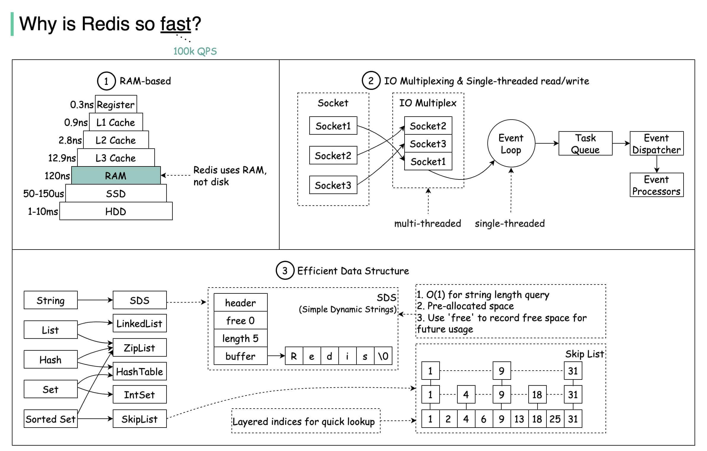
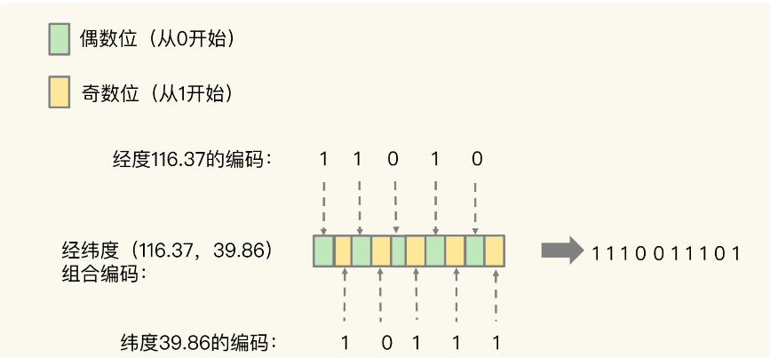

# 1. Redis Interview 面经

<!-- @import "[TOC]" {cmd="toc" depthFrom=1 depthTo=6 orderedList=false} -->

<!-- code_chunk_output -->

- [1. Redis Interview 面经](#1-redis-interview-面经)
  - [1.1. Progress](#11-progress)
  - [1.2. 面试](#12-面试)
  - [1.3. 弱项](#13-弱项)
  - [1.4. basic](#14-basic)
    - [1.4.1. 组件之 Redis 线程模型（为什么这么快）](#141-组件之-redis-线程模型为什么这么快)
      - [1.4.1.1. 避免单线程带来的阻塞](#1411-避免单线程带来的阻塞)
      - [1.4.1.2. Redis 一般都有哪些使用场景？](#1412-redis-一般都有哪些使用场景)
      - [1.4.1.3. Redis 有哪些常见的功能？](#1413-redis-有哪些常见的功能)
      - [1.4.1.4. Redis 为什么这么快？](#1414-redis-为什么这么快)
  - [1.5. 支持的数据结构及其使用场景](#15-支持的数据结构及其使用场景)
      - [1.5.0.1. Redis 支持的数据类型有哪些？](#1501-redis-支持的数据类型有哪些)
      - [1.5.0.2. redis 数据结构？ zset 怎么实现](#1502-redis-数据结构-zset-怎么实现)
      - [1.5.0.3. sorted set 和 set 的区别](#1503-sorted-set-和-set-的区别)
      - [1.5.0.4. 关键数据结构](#1504-关键数据结构)
      - [1.5.0.5. 利用 Redis 实现延时队列](#1505-利用-redis-实现延时队列)
      - [1.5.0.6. 利用 redis 实现消息队列](#1506-利用-redis-实现消息队列)
      - [1.5.0.7. 什么是分布式锁？为什么用分布式锁？](#1507-什么是分布式锁为什么用分布式锁)
      - [1.5.0.8. 常见的分布式锁有哪些解决方案？](#1508-常见的分布式锁有哪些解决方案)
      - [1.5.0.9. 基于多个 Redis 节点实现高可靠的分布式锁 (redlock)](#1509-基于多个-redis-节点实现高可靠的分布式锁-redlock)
  - [1.6. 缓存实战](#16-缓存实战)
      - [1.6.0.1. 布隆过滤器](#1601-布隆过滤器)
      - [1.6.0.2. 什么是缓存击穿、穿透、雪崩](#1602-什么是缓存击穿穿透雪崩)
      - [1.6.0.3. 怎么保证缓存和数据库数据的一致性？](#1603-怎么保证缓存和数据库数据的一致性)
      - [1.6.0.4. Redis 内存淘汰策略有哪些？](#1604-redis-内存淘汰策略有哪些)
      - [1.6.0.5. key 到期了怎么删除过期策略通常有以下三种：](#1605-key-到期了怎么删除过期策略通常有以下三种)
      - [1.6.0.6. 如何解决 Redis 的并发竞争 Key 问题](#1606-如何解决-redis-的并发竞争-key-问题)
      - [1.6.0.7. 分布式 Redis 是前期做还是后期规模上来了再做好？为什么？](#1607-分布式-redis-是前期做还是后期规模上来了再做好为什么)
  - [1.7. 持久化](#17-持久化)
      - [1.7.0.1. 持久化](#1701-持久化)
      - [1.7.0.2. 持久化 RDB 和 AOF 优缺点](#1702-持久化-rdb-和-aof-优缺点)
  - [1.8. redis 设计](#18-redis-设计)
      - [1.8.0.1. Redis 6.0 多线程模型](#1801-redis-60-多线程模型)
      - [1.8.0.2. Redis 是单线程的，如何提高多核 CPU 的利用率？](#1802-redis-是单线程的如何提高多核-cpu-的利用率)
  - [1.9. Scaling](#19-scaling)
  - [1.10. 高可用/高并发](#110-高可用高并发)
      - [1.10.0.1. 分片 Redis cluster 中是如何实现数据分布的？这种方式有什么优点？](#11001-分片-redis-cluster-中是如何实现数据分布的这种方式有什么优点)
    - [1.10.1. 主从结构及其同步机制](#1101-主从结构及其同步机制)
    - [1.10.2. 哨兵机制（管理集群）](#1102-哨兵机制管理集群)
      - [1.10.2.1. 脑裂现象](#11021-脑裂现象)
      - [1.10.2.2. 无锁原子操作](#11022-无锁原子操作)
      - [1.10.2.3. Scailibility（伸缩性）](#11023-scailibility 伸缩性)
      - [1.10.2.4. 负载均衡 scaling](#11024-负载均衡-scaling)
      - [1.10.2.5. 应对数据倾斜](#11025-应对数据倾斜)
      - [1.10.2.6. 你知道有哪些 Redis 分区实现方案？](#11026-你知道有哪些-redis-分区实现方案)
      - [1.10.2.7. Redis 分区有什么缺点？](#11027-redis-分区有什么缺点)
      - [1.10.2.8. Redis 主从模型](#11028-redis-主从模型)
      - [1.10.2.9. 哨兵机制](#11029-哨兵机制)
  - [1.11. redis 应用场景](#111-redis-应用场景)
      - [1.11.0.1. Redis 可以做消息队列么 Redis 5.0 新增加的一个数据结构 Stream 可以用来做消息队列，Stream 支持：](#11101-redis-可以做消息队列么-redis-50-新增加的一个数据结构-stream-可以用来做消息队列 stream-支持)
  - [1.13. 性能调优及问题解决](#113-性能调优及问题解决)
      - [1.13.0.1. CPU 结构也会影响 Redis 的性能？](#11301-cpu-结构也会影响-redis-的性能)
      - [1.13.0.2. Redis 常见性能问题和解决方案？](#11302-redis-常见性能问题和解决方案)
      - [1.13.0.3. 波动的响应延迟](#11303-波动的响应延迟)
      - [1.13.0.4. 删除数据后，为什么内存占用率还是很高？](#11304-删除数据后为什么内存占用率还是很高)
      - [1.13.0.5. 为什么 CPU 结构也会影响 Redis 的性能？.html](#11305-为什么-cpu-结构也会影响-redis-的性能 html)
      - [1.13.0.6. 渐进式哈希](#11306-渐进式哈希)
      - [1.13.0.7. Redis 性能优化](#11307-redis-性能优化)

<!-- /code_chunk_output -->

结合实际的例子，落地：
1. 如果你能举出实际的例子，或者是直接说自己开发过程的问题和收获会给面试官的印象分会加很多

参考来源：
1. [java guide][java-guide-redis]
2. Redis 教程 - Redis 知识体系详解♥: https://pdai.tech/md/db/nosql-redis/db-redis-overview.html
3. 玩转 Redis: https://my.oschina.net/zxiaofan?tab=newest&catalogId=6650484

[java-guide-redis]: https://javaguide.cn/database/redis/redis-questions-01.html#%E7%BC%93%E5%AD%98%E7%A9%BF%E9%80%8F

## 1.1. Progress

- [x] basic
- [x] 支持的数据结构及其使用场景
- [ ] 缓存实战
- [ ] 性能调优
- [ ] 持久化
- [ ] redis 设计
- [ ] 高可用/高并发
- [x] redis 应用场
- [ ] 景
- [ ] Redis Internal

start at 2022-09-28 09:47:58, end at 

start at 2022-10-01 09:15:12, end at 

start at 23:09

- [ ] 1. Redis Interview 面经
  - [ ] 1.1. Progress
  - [ ] 1.2. 面试
  - [ ] 1.3. 弱项
  - [ ] 1.4. basic
    - [x] 1.4.1. 组件之 Redis 线程模型（为什么这么快）
      - [ ] 1.4.1.1. 避免单线程带来的阻塞
      - [ ] 1.4.1.2. Redis 一般都有哪些使用场景？
      - [ ] 1.4.1.3. Redis 有哪些常见的功能？
      - [ ] 1.4.1.4. Redis 为什么这么快？
  - [ ] 1.5. 支持的数据结构及其使用场景
      - [ ] 1.5.0.1. Redis 支持的数据类型有哪些？
      - [ ] 1.5.0.2. redis 数据结构？ zset 怎么实现
      - [ ] 1.5.0.3. sorted set 和 set 的区别
      - [ ] 1.5.0.4. 关键数据结构
      - [ ] 1.5.0.5. 利用 Redis 实现延时队列
      - [ ] 1.5.0.6. 利用 redis 实现消息队列
      - [ ] 1.5.0.7. 什么是分布式锁？为什么用分布式锁？
      - [ ] 1.5.0.8. 常见的分布式锁有哪些解决方案？
      - [ ] 1.5.0.9. 基于多个 Redis 节点实现高可靠的分布式锁 
  - [ ] 1.6. 缓存实战
      - [x] 1.6.0.1. 布隆过滤器
      - [x] 1.6.0.2. 什么是缓存击穿、穿透、雪崩
      - [x] 1.6.0.3. 怎么保证缓存和数据库数据的一致性？
      - [x] 1.6.0.4. Redis 内存淘汰策略有哪些？
      - [x] 1.6.0.5. key 到期了怎么删除过期策略通常有以下三种：
      - [ ] 1.6.0.6. 如何解决 Redis 的并发竞争 Key 问题
      - [ ] 1.6.0.7. 分布式 Redis 是前期做还是后期规模上来了再做好？为什么？
  - [x] 1.7. 持久化
      - [ ] 1.7.0.1. 持久化
      - [ ] 1.7.0.2. 持久化 RDB 和 AOF 优缺点
  - [x] 1.8. redis 设计
      - [ ] 1.8.0.1. Redis 6.0 多线程模型
      - [ ] 1.8.0.2. Redis 是单线程的，如何提高多核 CPU 的利用率？
  - [ ] 1.9. Scaling
  - [ ] 1.10. 高可用/高并发
      - [ ] 1.10.0.1. 分片 Redis cluster 中是如何实现数据分布的？这种方式有什么优点？
    - [ ] 1.10.1. 主从结构及其同步机制
    - [ ] 1.10.2. 哨兵机制（管理集群）
      - [x] 1.10.2.1. 脑裂现象
      - [x] 1.10.2.2. 无锁原子操作
      - [ ] 1.10.2.3. Scailibility（伸缩性）
      - [ ] 1.10.2.4. 负载均衡 scaling
      - [ ] 1.10.2.5. 应对数据倾斜
      - [x] 1.10.2.6. 你知道有哪些 Redis 分区实现方案？
      - [ ] 1.10.2.7. Redis 分区有什么缺点？
      - [ ] 1.10.2.8. Redis 主从模型
      - [ ] 1.10.2.9. 哨兵机制
  - [ ] 1.11. redis 应用场景
      - [ ] 1.11.0.1. Redis 可以做消息队列么 Redis 5.0 新增加的一个数据结构 Stream 可以用来做消息队列，Stream 支持：
  - [ ] 1.12. Redis Internal
  - [x] 1.13. 性能调优及问题解决
      - [x] 1.13.0.1. CPU 结构也会影响 Redis 的性能？
      - [x] 1.13.0.2. Redis 常见性能问题和解决方案？
      - [ ] 1.13.0.3. 波动的响应延迟
      - [ ] 1.13.0.4. 删除数据后，为什么内存占用率还是很高？
      - [ ] 1.13.0.5. 为什么 CPU 结构也会影响 Redis 的性能？.html
      - [x] 1.13.0.6. 渐进式哈希
      - [x] 1.13.0.7. Redis 性能优化

## 1.2. 面试

redis 篇
- [ ] redis 数据类型 （必问）
   - redis 常用数据类型，以及使用场景等等。各数据类型的底层数据结构是什么？比如
     zset 底层实现是跳跃表 (skiplist)，讲讲 skiplist 为什么这么快。
- [ ] redis 的架构 （必问）
   - 这个一般问的是 redis 为什么这么快，除了基于内存操作，还有什么其他原因。
     redis 是单线程还是多线程？那部分是单线程，那部分是多线程？redis 的线程模型
     （这个问题贼爱问）。
- [ ] redis 内存持久化
   - 为什么要持久化？持久化机制、持久化方式是什么，各有什么优缺点。怎么选择合适
     的持久化方式，有没有了解过混合持久化？
- [ ] redis 内存淘汰策略
   - 这个看面试官吧，我只碰到过一次。
- [ ] redis 事务和管道
   - 这个大概说说就行了，区别不太大，一个是在客户端打包，一个是在服务端打包而已。
- [ ] redis 的集群方案 （高频面试点）
   - 这个最爱问了，主从，哨兵，分片（分为客户端和服务端分片）。
- [ ] 缓存异常解决
   - 缓存穿透、缓存击穿、缓存雪崩解决方式。
- [ ] 缓存一致性
   - 怎么保证 redis 和 mysql 的数据一致性，这个各抒己见吧，可以看看 B 站的毛剑有
     次的分享，专门讲了怎么解决缓存一致性的问题。
- [ ] 杂项
   - 因为我之前做过一个高并发项目，所以一般爱问分布式锁的实现，还有 redis 的队列
     和专业的 mq 区别，有没有了解 redis 的 red lock 以及 redis 的 stream 能不能
     作为专业的 mq，为什么？大批量的删除 redis 中的 key，会有什么问题，怎么解决？
     redis 怎么实现延时队列，怎么实现异步队列。布隆过滤器了解过吗？

## 1.3. 弱项

- 两大维度：系统维度和应用维度
- 三大主线：指高性能、高可靠和高可扩展

知识分类
- 高性能主线，包括线程模型、数据结构、持久化、网络框架：
- 高可靠主线，包括主从复制、哨兵机制：
- 高可扩展主线，包括数据分片、负载均衡。


## 1.4. basic

(1) 数据模型：首先从数据模型，ADT 着手探讨 redis 是啥，redis 如下

- data model: KV 对，多种 Value（数据结构）
- ADT: PUT/GET/DELETE/SCAN 是一个键值数据库的基本操作集合。

(2) 组件结构

SimpleKV 和 Redis 的组件构成如下
- 访问框架，如果是 SimpleKV 的话，本地简单，采用一个动态库；Redis 采用网络访问框架。


1. 组件（访问框架）

通过网络框架提供键值存储服务，一方面扩大了键值数据库的受用面，但另一方面，也给键
值数据库的性能、运行模型提供了不同的设计选择，带来了一些潜在的问题。

其中关键问题是 网络 I/O 模型的设计，简单来说，需要考虑如下事情
- 网络连接的处理、网络请求的解析，以及数据存取的处理，是用一个线程、多个线程，还
  是多个进程来交互处理呢？
- 该如何进行设计和取舍呢？

2. 读：组件索引模块

大 hash 表 => 不同数据结构的子结构

3. 写：存储模块（内存管理）

4. 重启后快速提供服务：持久化

(3) 数据结构

大哈希 => 子结构
- 哈希读变慢了：链式结构解决冲突（还有开放寻址）, 
- **链式变多了，rehash**（哈希表 1，哈希表 2，当$ratio= 哈希槽/所有元素$ 到达一定地
  步，则 复制到 哈希表 2） **大量拷贝操作，线程阻塞，无法提供服务**
- **渐进式 rehash**: 简单来说就是在第二步拷贝数据时，Redis 仍然正常处理客户端请求，每
  处理一个请求时，**从哈希表 1 中的第一个索引位置开始，顺带着将这个索引位置上的所有
  entries 拷贝到哈希表 2 中**；等处理下一个请求时，再顺带拷贝哈希表 1 中的下一个索引位
  置的 entries。如下图所示：

|  |
| :------------------------------------: |
|               *数据类型*               |

|  |
| :------------------------------------: |
|              *全局哈希表*              |

时间复杂度，如下表所示，通常而言，不同操作的效率如下
- 单元素操作是基础；
- 范围操作非常耗时：
- 统计操作通常高效；
- 例外情况只有几个。
- 压缩列表是链表

|  |
| :------------------------------------: |
|             *时间复杂度表*             |

### 1.4.1. 组件之 Redis 线程模型（为什么这么快）

**单线程并非完全单线程**

1. 所谓的**单线程**实际指的是 **网络 IO 和 对 KV 的读写**，其他功能，比如**持久化、异步删
   除、集群数据同步等，其实是由额外的线程执行的**。
2. 关键在于：**单线程设计机制和多路复用机制**

**多线程的缺点在哪**
1. 并发控制使变慢（锁争用）；多线程模型以及并发原语的使用使代码难以理解。

因此 Redis 采用单线程获得**快，高性能来源**
1. 内存操作、全局哈希表、高级数据结构
2. Redis 采用了多路复用机制，使其在网络 IO 操作中能并发处理大量的客户端请求，实
   现高吞吐率。
3. 其他诸如异步删除、持久化、集群数据同步 类似的操作，并不在客户端读写的路径上，
   所以采用子进程或者多线程的方式来进行，避免引起单线程阻塞 影响对外提供的 kv 读
   写服务。

基本 IO 模型与阻塞点

1. 建立连接的 accept(); 接收数据的 recv()

|  |
| :------------------------------------: |
|          *Redis 基本 IO 模型*          |

要达到目标的效果：非阻塞、多路复用，要做到
1. **套接字的非阻塞模式**，就是未能收到数据或者接受连接，可以暂时放一下，干其他的

   |  |
   | :------------------------------------: |
   |       *Redis 套接字与非阻塞设置*       |

2. **epoll（红黑树与链表） 多路复用机制监听这些非阻塞套接字**：该机制允许内核中，
   **同时存在多个监听套接字和已连接套接字**。内核会一直监听这些套接字上的**连接请
   求或数据请求**。

   |  |
   | :------------------------------------: |
   |               *caption*                |

3. **事件驱动模型**：为了在请求到达时能通知到 Redis 线程，select/epoll 提供了基于事件的
   回调机制，即针对不同事件的发生，调用相应的处理函数。
   
#### 1.4.1.1. 避免单线程带来的阻塞

Redis 实例在运行时，要和许多对象进行交互，这些不同的交互就会涉及不同的操作，下面
我们来看看和 Redis 实例交互的对象，以及交互时会发生的操作。
- 客户端：网络 IO, 键值对增删改查操作，数据库操作；
  1. 第一个阻塞点：集合全量查询和聚合操作。
  2. bigkey 删除操作就是 Redis 的第二个阻塞点。
  3. Redis 的第三个阻塞点：清空数据库，例如备库收到 RDB 文件后会清空数据库。
- 磁盘：生成 RDB 快照，记录 AOF 日志，AOF 日志重写；

  4. AOF 日志重写
- 主从节点：主库生成、传输 RDB 文件，从库接收 RDB 文件、清空数据库、加载 RDB 文
  件：

  5. 从库加载 RDB 文件
- 切片集群实例：向其他实例传输哈希槽信息，数据迁移。


阻塞点分析：分析是否在关键路径上：
1. 读操作一定在关键路径上，因为假如读的过程中，有某个位置阻塞，客户端也会等读到的结果
   
2. 对于 Redis 的五大阻塞点来说，除了“集合全量查询和聚合操作”和“从库加载 RDB 文
件”，其他三个阻塞点涉及的操作都不在关键路径上，所以，我们可以使用 Redis 的异步子线
程机制来实现 bigkey 删除，清空数据库，以及 AOF 日志同步写。

 

#### 1.4.1.2. Redis 一般都有哪些使用场景？

- **缓存**：减轻 MySQL 的查询压力，提升系统性能；
- **计数器/限速器**：利用 Redis 中**原子性的自增操作**，我们可以统计类似用户**点
  赞数、用户访问数**等。这类操作如果用 **MySQL，频繁的读写会带来相当大的压力**；
  限速器比较典型的使用场景是限制某个用户访问某个 API 的频率，常用的有抢购时，防
  止用户疯狂点击带来不必要的压力；
- **好友关系**：利用**集合**的一些命令，比如求**交集、并集、差集**等。可以方便解
  决一些共同好友、共同爱好之类的功能；
- **消息队列**：**除了 Redis 自身的发布/订阅模式**，我们也可以利用 **List 来实现
  一个队列机制，比如：到货通知、邮件发送之类的需求，不需要高可靠，但是会带来非常
  大的 DB 压力，完全可以用 List 来完成异步解耦**；
- **Session 共享**：Session 是保存在服务器的文件中，如果是集群服务，同一个用户过
  来可能落在不同机器上，这就会导致用户频繁登陆；采用 **Redis 保存 Session 后，无
  论用户落在那台机器上都能够获取到对应的 Session 信息**。
- **限时业务的运用** redis 中可以**使用 expire 命令设置一个键的生存时间，到时
  间后 redis 会删除它**。利用这一特性可以运用在限时的**优惠活动信息、手机验证码等业
  务场景**。 
- **分布式锁** 这个主要利用 redis 的 setnx 命令进行，setnx："set if not exists"
  就是如果不存在则成功设置缓存同时返回 1，否则返回 0 ，这个特性在很多后台中都有
  所运用，因为我们服务器是集群的，定时任务可能在两台机器上都会运行，所以在定时任
  务中首先 通过 setnx 设置一个 lock，如果成功设置则执行，如果没有成功设置，则表
  明该定时任务已执行。 当然结合具体业务，我们可以给这个 lock 加一个过期时间，比
  如说 30 分钟执行一次的定时任务，那么这个过期时间设置为小于 30 分钟的一个时间就
  可以，这个与定时任务的周期以及定时任务执行消耗时间相关。 在分布式锁的场景中，
  主要用在比如秒杀系统等。 
- **延时操作** 比如在订单生产后我们占用了库存，10 分钟后去检验用户是否真正购买，
  如果没有购买将该单据设置无效，同时还原库存。 由于 redis 自 2.8.0 之后版本提供
  Keyspace Notifications 功能，允许客户订阅 Pub/Sub 频道，以便以某种方式接收影响
  Redis 数据集的事件。 所以我们对于上面的需求就可以用以下解决方案，**我们在订单生
  产时，设置一个 key，同时设置 10 分钟后过期， 我们在后台实现一个监听器，监听
  key 的实效，监听到 key 失效时将后续逻辑加上。 当然我们也可以利用 rabbitmq、
  activemq 等消息中间件的延迟队列服务实现该需求**。 
- **排行榜相关问题** 关系型数据库在排行榜方面查询速度普遍偏慢，所以可以借助
  redis 的 SortedSet 进行热点数据的排序。 比如点赞排行榜，做一个 SortedSet, 然后
  以用户的 openid 作为上面的 username, 以用户的点赞数作为上面的 score, 然后针对
  每个用户做一个 hash, 通过 zrangebyscore 就可以按照点赞数获取排行榜，然后再根据
  username 获取用户的 hash 信息，这个当时在实际运用中性能体验也蛮不错的。 
- **集合操作/点赞、好友等相互关系的存储 Redis 利用集合的一些命令，比如求交集、并
  集、差集等**。在微博应用中，每个用户关注的人存在一个集合中，就很容易实现求两个
  人的共同好友功能。 简单队列 由于 Redis 有 list push 和 list pop 这样的命令，所
  以能够很方便的执行队列操作。 参考文章

**Redis 不适合的场景**
- 数据量太大、数据访问频率非常低的业务都不适合使用 Redis，数据太大会增加成本，访
  问频率太低，保存在内存中纯属浪费资源。

#### 1.4.1.3. Redis 有哪些常见的功能？

- 数据缓存功能
- 分布式锁的功能
- 支持数据持久化
- 支持事务
- 支持消息队列

#### 1.4.1.4. Redis 为什么这么快？

Redis 内部做了非常多的性能优化，比较重要的主要有下面 3 点：
- Redis 基于内存，内存的访问速度是磁盘的上千倍；
- Redis 基于 Reactor 模式设计开发了一套高效的事件处理模型，主要是单线程事件循环
  和 IO 多路复用（Redis 线程模式后面会详细介绍到）；
- Redis 内置了多种优化过后的数据结构实现，性能非常高。

|  |
| :------------------------------------: |
|        *why is redis so fast *         |

## 1.5. 支持的数据结构及其使用场景

#### 1.5.0.1. Redis 支持的数据类型有哪些？

1. **String 字符串**
   1. 实战场景 **缓存**：**二进制安全，可以包含任何数据** 经典使用场景，把常用信
      息，**字符串，图片或者视频**等信息放到 redis 中，redis 作为缓存层，mysql
      做持久化层，降低 mysql 的读写压力。 
   2. **计数器**：redis 是单线程模型，一个命令执行完才会执行下一个，同时数据可以
      一步落地到其他的数据源。 
   3. session：常见方案 spring session + redis 实现 session 共享，
2. **List 列表**
   1. **微博 TimeLine**: 顺序的数据集合，有人发布微博，用 lpush 加入时间轴，展示新的列表信息。
   2. 消息队列
   3. 使用列表的技巧
      - lpush+lpop=Stack（**栈**）
      - lpush+rpop=Queue（**队列**）
      - lpush+ltrim=Capped Collection（有限集合）
      - lpush+brpop=Message Queue（**消息队列**）

3. **Set 集合**
   - **兴趣标签（取交集）**：标签（tag）,
     给用户添加标签，或者用户给消息添加标签，这样有同一标签或者类似标签的可以给推荐关注的事或者关注的人。
   - **集合去重，交并补**：点赞，或点踩，收藏等，可以放到 set 中实现 ing 更节省

4. **Hash 散列**
   - **缓存**： 能直观，相比 string 更节省空间的维护缓存信息，**配置信息，用户信
     息，视频信息等一系列 kv 对**。

5. **Zset 有序集合**
   - **排行榜：有序集合经典使用场景**。例如小说视频等网站需要对用户上传的小说视
     频做排行榜，榜单可以按照用户关注数，更新时间，字数等打分，做排行
   - 延时队列。

中高阶数据机构：
1. **HyperLogLogs**
   1. **原理**：[参考维基百科][hyperloglogs-wiki] 和 [掘金博文]
      [hyperloglogs-juejin]
   2. **特点**：
      1. 能够使用**极少的内存来统计巨量的数据**，在 Redis 中实现的 HyperLogLog，
         只需要 **12K 内存就能统计 2^64 个数据**。
      2. **存在一定的误差标准误差为 0.81%**.
      2. 误差可以被设置辅助计算因子进行降低。
      
   3. 用法：
      1. ` PFADD ip_20190301 "192.168.0.1" "192.168.0.2" "192.168.0.3"` https:
         //zhuanlan.zhihu.com/p/58358264
   4. **使用场景**：基数统计用来解决什么问题？这个结构可以**非常省内存的去统计各
      种计数**，比如**注册 IP 数、每日访问 IP 数、页面实时 UV、在线用户数**，共
      同好友数等。允许统计在巨量数据面前的误差率在可接受的范围内，1000 万浏览量
      允许最终统计出少了一两万这样子，

[hyperloglogs-wiki]: https://en.wikipedia.org/wiki/HyperLogLog
[hyperloglogs-juejin]: https://juejin.cn/post/6844903785744056333

2. **Bitmap （位存储）** 
   1. **Bitmap** 即位图数据结构，都是操作二进制位来进行记录，只有 0 和 1 两个状
      态，**。
   2. **使用场景**：统计用户信息，活跃，不活跃！ 登录，未登录！ 打卡，不打卡！两
      个状态的，都可以使用 Bitmaps！
3. Redis BloomFilter:
   1. **作用**：在数据量非常大的情况下，检查一个元素是否在集成中， 例如用于避免
      缓存穿透
   2. 原理：
      1. **直觉理解**：**多个 hash function 对对象哈希**，得到一个 **位置向量**
         (1,3,9, 10)，插入对象到布隆过滤器时候，在向量中对应位置置 1. **如果有任
         意一个位置或者以上不是 1**，那肯对**对象不存在**。**判断存在**：如果哈
         希函数好，能做到绝大多数对象的**位置向量**在**哈希空间上分布均匀**，**
         距离相对远，相互“干扰”小，那么位置向量全部是 1 的可能性就小**。
   3. **优缺点**：
      1. 检查结果分为 2 种：一定不在集合中（真阴性）、可能在集合中（假阳性）；
      2. 布隆过滤器支持添加元素、检查元素，但是不支持删除元素；
      3. 相比 set、Bitmaps **非常节省空间：因为只存储了指纹信息，没有存储元素本
         身；**
      4. 添加的元素超过预设容量越多，误报的可能性越大。
      5. BF.RESERVE（创建命令中）: error_rate：期望的错误率（False Positive
         Rate），该值必须介于 0 和 1 之间。该值越小，BloomFilter 的内存占用量越
         大，CPU 使用率越高。
   4. **使用场景：去重**: 
      1. **缓存击穿**；当黑客访问不存在的缓存时迅速返回避免缓存及 DB 挂掉；
      2. **判重**：不存在在布隆过滤器中的，则直接扔掉 URL . 去重，避免爬取相同的
         URL 地址；
      3. 白名单模式，拦截 黑访问。

4. Redis 中的计数器统计。

如果存储一年的打卡状态需要多少内存呢？ 365 天 = 365 bit 1 字节 = 8bit 46 个字节左右！

   1. geohash(LBS)(google S2): 不断递归地去二分纬度或者经度区间 (-180, 180), 最
      后形成一颗二叉树，每个节点的左分支 如 (-180, 0) 用 0 表示，右分支，如 (0,
      180) 用 1 表示，那么最终的一个数值，对应二叉树上从根节点到叶子结点的一条路
      径，编码为其中的 01 序列。当得到纬度和经度的 二进制 序列后，再结合到一起，
      如下图，此时二维的坐标表示成一维的数值，数值的相邻值则表示二维地图上的相邻区域，但是也存在
      

      |  |
      |:--:|
      | *经纬度* |

      **缺点**：有的编码值虽然在大小上接近，但实际对应的方格却距离比较远，如下图
      所示。

      
      
      - GEOADD 命令：用于把一组经纬度信息和相对应的一个 ID 记录到 GEO 类型集合中：
      - GEORADIUS 命令：会根据输入的经纬度位置，查找以这个经纬度为中心的一定范围
        内的其他元素。当然，我们可以自己定义这个范围。

#### 1.5.0.2. redis 数据结构？ zset 怎么实现

|  |
| :------------------------------------: |
| *底层数据类型和底层数据机构的对应关系* |

[redis-skip-list]: https://zhuanlan.zhihu.com/p/109946103

[跳跃表][redis-skip-list] 如下图所示，每个节点在某层，是否再可以增一层的概率是，
`p`, 假如 `p=1/2`，那么 level 2 的概率是 `1/2`, 即有一半的交点有两层，如此类推，
有 1/4 有 3 层，有 1/8 有 4 层，所以就构建了一个类似二叉树的层次结构，查找时候就
可以做到 $O(logN)$, p = 1/2 的话，则是二分查找

|  |
| :------------------------------------: |
|                *跳跃表*                |

zset 实现：跳表。跳表与其他数据结构，如平衡树的比较。
1. **zset 需求：实现简单，查找快速；支持范围查（顺序查找）**
2. 优点：
   1. **实现**：**实现比红黑树简单，一些 增删改查的 操作 只需要交换一下相关的节
      点值即可**，不需要涉及 树的再平衡 比较复杂的操作。
   2. **功能**：**范围查找**比较简单，平衡树需要中序比那里。
   3. **并发**：**并发**环境下，平衡树更新时需要**再平衡，用锁就多，性能会有所下
      降**，而跳表没有这方面的考虑。
3. **缺点：** 空间复杂度（）：假设 `p=1/2`, 则节点数是 $2N(2N=N+N/2+N/4 + \dots
   + 1)$, `p=1/4`的话，节点数$= N+N/4+N/16 + \dots + 1 = 4/3N$, **用空间换时间和
     便利性**
   
#### 1.5.0.3. sorted set 和 set 的区别

1. **能否有重复元素**：存的是 string 字符串类型的数据， 都不允许重复。
2. **元素的区别**：sorted set 会关联 double 类型的分数 score, 用于排序。
3. **set 底层实现**主要用到了两种数据结构 **hashtable 和 inset（整数集合）；**
   **sorted set 则使用 压缩列表和跳表**
4. **跳表加哈希表的组合方式也是很巧妙的**，跳表用来进行范围的查询，通过哈希表来实现
   单个元素权重值的查询，组合的方式提高了查询的效率。
   
#### 1.5.0.4. 关键数据结构

1. 万金油 String 不合适案例：
   - String 用于 存储 long 类型整数，小 string, 大 string
   - 案例中数据模型为{K: 图片 ID, V: 图片存储对象 ID}. 
   - 两个 ID 用 string 存储，采用 int 编码方案，每个 ID 分别占 16 字节，
   - 全局哈希表每个 entry 的内存布局使用 24=>32B，
   - 一个 图片 花销 64 B, 16B 的实际使用，有 48 B 的 overhead.
   - 改良：使用压缩表实现的 哈希表，采用二级编码方案：图片 ID 前几位用作 压缩列
     表 这个 Value 的 Key, 后几位用作压缩列表 进一步索引 entry 的 index, 两者加
     起来是 图片对象存储的 Key{ID}。

     不过该方案中，每个压缩列表中的元素个数不能太多，元素的大小不能太大，否则会
     自动转化为 底层为哈希表的 hset. (hash-max-ziplist-entries: 表示用压缩列表保
     存时哈希集合中的最大元素个数。hash-max-ziplist-value: 表示用压缩列表保存时
     哈希集合中单个元素的最大长度。)

     |  |
     | :------------------------------------: |
     |     *string 可以存储多种数据类型*      |

     |                      |
     | :--------------------------------------------------------: |
     | *全局哈希表中每个 dictEntry 的内存布局：24B => 对齐成 32B* |
     
     ```SQL
     1 127.0.0,1:6379>inf0 memory
     2 Memory
     3 used_memory:1039120
     4 127.0.0.1:6379>hset11010000603302000080
     5 (integer)1
     6 127.0,0,1:6379>1 nfo memory
     7 Memory
     8 used_memory:1039136
     ```

2. 数据 statistics
   - **聚合统计**：set 集合。set 的差集、并集和交集的计算复杂度较高，在数据量较
     大的情况下，会导致 Redis 实例阻塞。建议：你可以从主从集群中选择一个从库，让
     它专门负责聚合计算，或者是把数据读取到客户端，在客户端来完成聚合统计，这样
     就可以规避阻塞主库实例和其他从库实例的风险了。
   - **排序统计**：sorted set, zset 最新列表、排行榜等场景时，如果数据更新频繁或者需
     要分页显示，
   - **二值状态统计**：bitmap（例如商品有没有、用户在不在等、签到）
   - **基数统计**：UV 去重。 set, hyperloglog（当集合元素数量非常多时，它计算基数所
     需的空间总是固定的，而且还很小。)

3. geohash(LBS)(google S2)

   - GEOADD 命令：用于把一组经纬度信息和相对应的一个 ID 记录到 GEO 类型集合中：
   - GEORADIUS 命令：会根据输入的经纬度位置，查找以这个经纬度为中心的一定范围内的其
     他元素。当然，我们可以自己定义这个范围。

   |  |
   | :------------------------------------: |
   |               *caption*                |

#### 1.5.0.5. 利用 Redis 实现延时队列

- 事件驱动模型中，通常是个链表来存储相应的事件，然后定期轮询。
- 链表这个数据结构也可以改成最小堆，key 为 时间戳，取头部的元素，就是离当前最近
  的元素。
- 在使用 ZSET 做延时队列的时候，一般会用任务 ID 作为 key，任务详情作为
  value，任务执行时间作为 score，这样所有的待执行任务，在 ZSET
  中，就会按任务执行时间 score 有序排列。

有点像红黑树那样：
1. 使用 sortedset，拿时间戳作为 score，消息内容作为 key 调用 zadd 来生产消息，消
   费者定期用 zrangebyscore 指令获取 N 秒之前的数据轮询进行处理。

1. **优点**：与实现消息队列一致，有着 **在内存操作快，可以 持久化 (RDB,
   AOF)，集群保证高可用 等 优点**；

2. 但是也有不如专门消息队列的**缺点**：**如可靠传输（无
   ACK、重试机制、数据持久化重
   新消费、集群主从模式架构必然遇到数据丢失的问题和数据一致性的问题）**

#### 1.5.0.6. 利用 redis 实现消息队列

自己说一下，一条消息从一端到另外一端的话，需要什么样的需求
1. 一个程序从 A 端到 B 端

**(1) 消息队列的需求**: 因为网络和机器各种故障，需要持久化、可靠传达
- **持久化**：保存，
- **容量**：消息大
- **幂等性**：重复消息处理
- **exactly once 语义**
- **可靠性**：不丢数据
- 因为很多机制保证可靠性，但是中间也成为了单点故障，**中间件本身也需要高可用**，
  伸缩 scaling

**(2) 基于 List**

针对需求的解决方法：
- **功能性需求**：阻塞式读写命令 `BRPOP`, 避免无限循环；
- **非功能性的需求**：**持久化**：借助 Redis 的持久化；作为分布式中间件提供高可
  用；基于内存的操作高性能；可靠性：**exactly once 语义**: 至少一次（重试，就是生产者发送消息后崩溃，重新再发送），最多一次（幂等，只能由应用代码层面负责）

还是存在的问题：
- **功能性的需求**：**没有主题、分区等功能**，不支持主题订阅等方式。
- **非功能性的需求**：消息传递的可靠性（重传、幂等、持久化、分布式一致性算法保证不丢
  数据）；生产者消费者处理性能不一致；中间件自身的高可用。

**(3) Redis Stream**
- 解决了：可靠性（内部 backup List）; 阻塞式读；消费组消费，负载均衡；唯一 ID
  (fencing token， exactly once 语义）
- 未解决：持久化

|      |
| :----------------------------------------: |
| *基于 redis List 和 Stream 的消息队列对比* |

Kafka 和 Redis Stream 的对比

- **部署运维差别**：**Redis 轻量，Kafka 重量**。部署一个 Redis 实例就是启动一个
  进程，部署 Redis 集群，也就是部署多个 Redis 实例。而 Kafka、RabbitMQ 部署时，
  涉及额外的组件，例如 Kafka 的运行就需要再部署 **ZooKeeper**。
- **业务 scaling, 对性能、可靠性、可扩展性的需求**：**kafka 针对 scaling 后的几
  个高有很好的保证（高性能、数据一致性、高可用、可靠性）**。如果分布式系统中的组
  件消息**通信量不大**，那么，Redis 只需要使用有限的内存空间就能满足消息存储的需
  求，而且，Redis 的高性能特性能支持快速的消息读写，不失为消息队列的一个好的解决
  方案。

#### 1.5.0.7. 什么是分布式锁？为什么用分布式锁？

参考
- 左耳朵耗子的《左耳听风》
- 极客时间《redis 核心技术与实战》
- 极客时间 《etcd》

一般来说，分布式锁需要满足的特性有这么几点：

- **安全性（Safety）**：在任意时刻，只有一个客户端可以获得锁（**排他性**）; **独
  占性**：只能锁的持有者去解锁
- **活性 (liveness)**: 避免死锁，客户端最终一定可以获得锁，即使锁住某个资源的客
  户端在释放锁之前崩溃或者网络不可达；获得锁的进程最终应该释放锁，让其他进程可以
  再次尝试获取
- **高可用/容错性**：高可用，只要锁服务集群中的大部分节点存活，Client 就可以进行加锁解
  锁操作。
- **高性能**: 大并发环境下

Redis 实现的语句，及解锁脚本：
- SET NX 命令只会在 key 不存在的时候给 key 赋值，PX 命令通知 Redis 保存这个 key
  30000ms, **满足简单的排他性**
- my_random_value 必须是全局唯一的值。这个随机数在**释放锁时保证释放锁操作的安全
  性**, 满足**独占性**。

```log
SET resource_name my_random_value NX PX 30000
```

```lua
if redis.call("get",KEYS[1]) == ARGV[1] then 
    return redis.call("del",KEYS[1]) 
else 
    return 0 
end
```

实践中遇到的问题
1. Client A 获得了一个锁。
2. 当尝试释放锁的请求发送给 Redis 时被阻塞，没有及时到达 Redis。
3. 锁定时间超时，Redis 认为锁的租约到期，释放了这个锁。
4. Client B 重新申请到了这个锁。
5. Client A 的解锁请求到达，将 Client B 锁定的 key 解锁。
6. Client C 也获得了锁。
7. Client B 和 Client C 同时特有锁。

以上案例有两个要点
1. 因为**锁的超时机制，锁换了主人**，**新老主人**在进行一些 **并发操作** 时，没
   有**再检验自己是否持有锁（可能因为时间长或者崩溃或者说让代理人执行任务）**，导
   致多个 client 以为自己持有锁，从而引起**并发不安全**，例如**并发写**数据。
2. 因为**缺乏锁的 持有者身份验证，违反了独占性**。

解决方法：
1. **进行并发操作**的时候，如 “解锁”，“利用锁去操作临界区数据”, **需要检验自己是
   否还持有锁，例如锁可以通过附上版本号**。
2. **进行解锁时，需要校验锁是不是自己的**，例如锁附上标签 “时间戳+客户端 ID”作为
   fencing token, 例如 `my_random_value ` 是全局唯一的。
3. 不过 版本号感觉也能证明是锁的 owner.

还有一些场景：
1. **如何续约锁**
   1. **场景题**：client 就想长时间地持有锁，直到任务结束，时间长可能是因为网络
      IO 等原因。
   2. **解决思路**：通过 续约 的方式，即**定期更新锁（删除老锁，创建新锁？）**给 Redis.
2. **通过网路调用来修改临界区的数据**
   1. client A 和 client B 并发修改某个数据，但是这个数据只能通过某个 client C
      修改，因此 client C 执行修改数据的命令时，要校验 client A 或者 client B 持
      有锁的合法性，也可以通过版本号来校验。
      
      
      

优化实现：
1. 除了 `set resource_name val nx px` 外，再使用一个 `set resource_name_version
   1` 存储版本号，每次需要通过 lua 脚本来原子更新。

Redis 实现分布式锁仍然有一些**严重的问题**
1. Redis 单机则会导致 **单点故障**，无法满足高并发场景下的**高可用和高性能需求**
2. **集群部署时**，**主从结构会导致数据的弱一致性** (master 给予锁给 client A 后
   崩溃，没有来得及将数据同步给 follower, follower 成为 leader 之后接受别人
   client 的获锁清秋），没有法定人数机制的领导选举机制会导致**脑裂**情形出现（两
   个 master 对外服务），**两个最终都会导致两个 client 获取到锁**。
3. **RedLock 算法** 它是基于多个独立的 Redis Master 节点的一种实现（一般为 5）。
   但也有**安全缺陷就是依赖系统时钟**。

基于 etcd 实现健壮的 分布式锁
1. **事务与锁的安全性**：原子操作，且 value 是全局唯一的；
2. **Lease 与锁的活性**
3. **Watch 与锁的可用性**：当一个持有锁的 client crash 故障后，其他 client 如何快速
   感知到此锁失效了，快速获得锁呢，最大程度降低锁的不可用时间呢？

#### 1.5.0.8. 常见的分布式锁有哪些解决方案？

常见的分布式锁有哪些解决方案？

实现分布式锁目前有三种流行方案，即基于关系型数据库、Redis、ZooKeeper 的方案

1. 基于关系型数据库，如 MySQL
   - 基于关系型数据库实现分布式锁，是依赖数据库的唯一性来实现资源锁定，比如**主键
     和唯一索引**等。
   - 缺点：
      1. 这把锁强依赖数据库的可用性，数据库是一个**单点故障**，一旦数据库挂掉，会导致业
      务系统不可用。
      1. 这把锁**没有失效时间**，一旦解锁操作失败，就会导致锁记录一直在数据库中，其
      他线程无法再获得到锁。
      1. 这把锁只能是**非阻塞的**，因为数据的 insert 操作，一旦插入失败就会直接报错。
      没有获得锁的线程并不会进入排队队列，要想再次获得锁就要再次触发获得锁操作。
      1. 这把锁是**非重入**的，同一个线程在没有释放锁之前无法再次获得该锁。因为数据
      中数据已经存在了。

2. **基于 Redis 实现**
   - **优点**：**Redis 锁实现简单，理解逻辑简单，性能好，可以支撑高并发的获取。
     释放锁操作**。
   - 缺点：
     1. Redis **容易单点故障**，**集群部署，并不是强一致性的，锁的不够健壮**；
     1. key 的过期时间设置多少不明确，只能根据实际情况调整；
     1. **需要自己不断去尝试获取锁，比较消耗性能**。
     2. 通过 lua 脚本原子续约吗

3. 基于 zookeeper
   - 优点：zookeeper 天生设计定位就是分布式协调，强一致性，锁很健壮。如果获取不
     到锁，只需要添加一个监听器就可以了，不用一直轮询，性能消耗较小。
   - 缺点：在高请求高并发下，系统疯狂的加锁释放锁，最后 zk 承受不住这么大的压力
     可能会存在宕机的风险。
4. 基于 etcd 实现：见 [etcd](../distributed%20system/etcd.md) 中的分布式锁。

#### 1.5.0.9. 基于多个 Redis 节点实现高可靠的分布式锁 (redlock)

Key: **在锁超时之前，至少对 n/2+1 个锁成功执行了相关的操作。**

步骤
1. 客户端获取当前时间。
1. 客户端按顺序依次向 N 个 Redis 实例执行加锁操作。
1. 一旦客户端完成了和所有 Reds 实例的加锁操作，客户端就要计算整个加锁过程的总耗时。

客户端只有在满足下面的这两个条件时，才能认为是加锁成功。
1. 客户端从超过半数（大于等于 N/2+1) 的 Redis 实例上成功获取到了锁；
1. 客户端获取锁的总耗时没有超过锁的有效时间。

当然，如果客户端在和所有实例执行完加锁操作后，没能同时满足这两个条件，那么，客户端
向所有 Redis 节点发起释放锁的操作。

## 1.6. 缓存实战

#### 1.6.0.1. 布隆过滤器

Redis 插件

参考：https://www.cnblogs.com/shoshana-kong/p/14759439.html

#### 1.6.0.2. 什么是缓存击穿、穿透、雪崩

[cache-problems]: https://zhuanlan.zhihu.com/p/346651831

[参考知乎][cache-problems]

1. **缓存雪崩**：
   1. **定义**：当某一个时刻出现**大规模的缓存失效或者 Redis 故障宕机**的情况，
      那么就会导致**大量的请求直接打在数据库上面**，导致数据库压力巨大，**如果在
      高并发的情况下，可能瞬间就会导致数据库宕机**。这时候如果运维马上又重启数据
      库，马上又会有新的流量把数据库打死。这就是缓存雪崩。
   2. **成因**：造成缓存雪崩的关键在于在同一时间大规模的 key 失效。为什么会出现
      这个问题呢，有几种可能，**第一种可能是 Redis 宕机，第二种可能是采用了相同
      的过期时间**。
   3. **解决方案**：
      1. 兜底救火
         1. **限流熔断（兜底，救火）**。
         2. **并发度控制（救火）：加锁排队**，在缓存失效后，通过加锁或者队列来控
            制读数据库写缓存的线程数量，（针对某个 key )
      2. 预防
         1. **错峰配置缓存失效时间（预防）**：为不同的 key 随机配置 1~5 分钟内。
            - 联想：指数避让；raft 协议选举超时时间 随机，避免 live lock.
         2. **分片技术，负载均衡（预防），避免某个 Redis 发生故障影响全部的缓存**
         3. **高可用集群的架构**，避免 Redis 发生单点故障。

2. **缓存击穿**：
    1. **定义**：热点 key 失效，高流量打到 DB 中。
    2. **解决方案**：
       1. 预防：
          1. 从缓存配置角度：热点 key 配置永不过时。
          2. **二级分片**，负载均衡
       2. 兜底：
          1. **兜底策略，限流熔断**。
          2. **并发度控制：加锁/排队**：让请求拿到互斥锁才能进来，让请求排队。
3. **缓存穿透**
   1. 定义：查询数据时，查询缓存和数据库根本不存在的 key, 
   2. 成因：有人攻击，查询 `id=-1`; 百度网盘普通用户查询自己是否是企业用户时，企
      业用户量少，普通用户量大，全到数据库中查询，会打垮数据库。
   3. 解决方案：
      1. **接口层增加校验**，如用户鉴权校验，id 做基础校验，id<=0 的直接拦截；
      2. **空值缓存（将 `<key, null>` 存进缓存中 ) + 短过期时间**：适合防攻击，百度
         网盘普通用户查询自己是否是企业用户的例子不合适（普通用户量实在是太大，
         而且这空值没有实际意义）。
      3. **使用布隆过滤器/哈希表缓存 key 全集**。true negative, 白名单查询。
4. **缓存抖动**：
   1. 定义：可以看做是一种比“雪崩”更轻微的故障，但是也会在一段时间内对系统造成冲
      击和性能影响。
   2. 分析：一般是由于缓存节点故障导致。
   3. 解决方案：**业内推荐的做法是通过一致性 Hash 算法来解决**。
5. 这三个问题在使用 Redis 的时候是肯定会遇到的，而且是非常致命性的问题，所以在日
   常开发中一定要注意，每次使用 Redis 时，都要对其保持严谨的态度。还有一个需要注
   意的是要做好熔断，一旦出现缓存雪崩，击穿，穿透这种情况，至少还有熔断机制保护
   数据库不会被打死。


主从同步与故障切换：


#### 1.6.0.3. 怎么保证缓存和数据库数据的一致性？

缓存和数据库的数据一致性问题，实际上是分布式系统中多个数据副本的共识问题，一致性
问题主要来源于**在网络超时、消息传递乱序、服务宕机等不可靠的分布式系统环境下，并
发写写 和 并发读写能够达到的一致性效果**

目标：
1. 最终一致性。

解决思路有
1. **双写**：**没有共识算法/或者分布式事务等技术的保障，必然会出现数据不一致的问
   题，不可避免**. 客户端负责修改缓存和数据库（先 DB 后 cache， 或反之）, 但是由
   于网络延时、重试策略的影响，假设客户端 C1 和 C2 分别发了 W(x=1) 和 W(x=2) 两个命令，缓存和数
   据库两个数据副本可能分别收到的命令顺序可能是相反的，或者说两个数据副本不一定
   都能够成功地写两个命令（网络超时，redis 重试机制）
2. **双写+分布式事务**：复杂、低性能 
3. **双写+共识协调**：共识算法复杂
4. 单写：
   1. **写数据库，然后删除缓存**：
      1. 潜在缺点：
         1. 小概率不一致 case, 并发读写 case, R(x=1, clock=1) => W(x=2, clock=2)
            => WriteOp 删除缓存 => ReadOp 将老数据 x=1 放到缓存中。但是实际上写
            操作由于 锁表等并发控制的原因会很慢，因此要发生 **“读操作必需在写操
            作前进入数据库操作，而又要晚于写操作更新缓存” 概率很低**。
         2. 两个命令不能保证都成功。
         3. 缓解措施：缓存有个有效期，会中失效，提供最终一致性。
   
   2. **先删缓存，在写数据库**: 两个命令不能保证都成功。
   3. **写缓存，然后删数据库**：不可能。
   4. **写任意一个数据副本，由该数据副本去解决 另外一个数据副本的同步问题**：
      1. 先写缓存，让缓存写库：意思是要缓存侧实现一些逻辑，MySQL 变成 缓存的备库，
         这需要解决主从同步的一系列问题，和 缓存的易失性问题。
      2. 先写库，再让库写缓存：删缓存的命令，使用消息队列来保证+fencing token 来
         保证 exactly once 语义
         1. 队列 + 重试机制：造成业务代码的大量侵入
         
         |  |
         | :------------------------------------: |
         |            *队列+重试机制*             |
         
         1. 异步更新缓存（基于订阅 binlog 的同步机制）
         
         |        |
         | :------------------------------------------: |
         | *异步更新缓存（基于订阅 binlog 的同步机制）* |
         

#### 1.6.0.4. Redis 内存淘汰策略有哪些？

缓存污染/缓存满了（缓存污染问题说的是缓存中一些只会被访问一次或者几次的的数据，
被访问完后，再也不会被访问到，但这部分数据依然留存在缓存中，消耗缓存空间。)

内存淘汰策略：数据满的时候淘汰谁？

Redis 共支持八种淘汰策略，分别是 noeviction、volatile-random、volatile-ttl、volatile-lru、volatile-lfu、allkeys-lru、allkeys-random 和 allkeys-lfu 策略。

1. 不淘汰
- **noeviction**, 该策略是 Redis 的默认策略。在这种策略下，一旦缓存被写满了，再有写
  请求来时，**Redis 不再提供服务，而是直接返回错误**。
  

2. 按照一定策略淘汰，直到腾出足够的空间为止。  
   1. **对设置了过期时间的数据中进行淘汰 (expire 字段设置为 TRUE) volatile-random/lfu/lru** 
      - **随机**： 随机淘汰。
      - **ttl**： 先淘汰最小的。
      - **lru**：最久使用淘汰。
      - **lfu**：淘汰最低频。

   2. **全部数据进行淘汰 (allkeys-random/lru/lfu)** : **随机**/ **lru**/ **lfu**：

3. volatile-xxx 策略只会针对带过期时间的 key 进行淘汰，allkeys-xxx
   策略会对所有的 key 进行淘汰。如果你**只是拿 Redis 做缓存，那应该使用
   allkeys-xxx，客户端写缓存时 不必携带过期时间**。**如果你还想同时使用 Redis
   的持久化功能，那就使用 volatile-xxx 策略**，这样可以保留没有设置过期时间的
   key，**它们是永久的 key 不会被 LRU 算法淘 汰。**

#### 1.6.0.5. key 到期了怎么删除过期策略通常有以下三种：

- **马上删除**：每个设置过期时间的 key 都需要创建一个定时器，到过期时间就会立即
  清除。该策略可以立即清除过期的数据，**对内存很友好**；但是会**占用大量的 CPU 资源去**
  处理过期的数据，从而**影响缓存的响应时间和吞吐量**。
- **惰性过期**：**只有当访问一个 key 时，才会判断该 key 是否已过期，过期则清除**。该
  策略**可以最大化地节省 CPU 资源，却对内存非常不友好**。极端情况可能出现大量的过期
  key 没有再次被访问，从而不会被清除，占用大量内存。
- **定期清除**：**每隔一定的时间，会扫描一定数量的数据库的 expires 字典中一定数量
  的 key，并清除其中已过期的 key**。该策略是前两者的一个折中方案。通过调整定时扫描
  的时间间隔和每次扫描的限定耗时，可以在不同情况下使得 CPU 和内存资源达到最优的
  平衡效果。(expires 字典会保存所有设置了过期时间的 key 的过期时间数据，其中，
  key 是指向键空间中的某个键的指针，value 是该键的毫秒精度的 UNIX 时间戳表示的过
  期时间。键空间是指该 Redis 集群中保存的所有键。)

#### 1.6.0.6. 如何解决 Redis 的并发竞争 Key 问题

令牌桶限流，FaceBook 的方法

#### 1.6.0.7. 分布式 Redis 是前期做还是后期规模上来了再做好？为什么？

前期做，一开始分好区，例如 32/64 个实例放在同一个机器上，后期再迁移出去。

13. 如何选择合适的持久化方式
14. Redis key 的过期时间和永久有效分别怎么设置？
15. 双写一致性方案一：先删除缓存，后更新数据库
16. 双写一致性方案二：先更新数据库，后删除缓存
17. 什么是缓存预热？
18. 什么是缓存降级？
19. 如何实现数据尽可能少丢失又能兼顾性能呢？
20. 哈希槽又是如何映射到 Redis 实例上呢？

## 1.7. 持久化

#### 1.7.0.1. 持久化

这个是为了避免数据丢失。

1. AOF(Append Only File), 备份日志在主进程进行
   - **后写日志**，并非 WAL(write ahead log)
   - **优点**
     1. 文本形式记录命令
     2. 先执行后记录，不用校验命令是否正确，因为已经执行成功
     3. 避免阻塞当前操作
   - **缺点**，来源于持久化的时机（即写回策略）
     1. 机器宕机造成数据丢失。
     2. 阻塞下一个操作。AOF 日志也是在主线程中执行的，如果在把日志文件写入磁盘时，
     磁盘写压力大，就会导致写盘很慢，进而导致后续的操作也无法执行了。

   - 平衡数据丢失和性能的三种写回策略
     
     |  |
     | :------------------------------------: |
     |               *写回策略*               |

AOF 中的命令过于 low level, 则需要合并，AOF 重写：
1. merge 命令，降低文件大小。

AOF 重写阻塞吗？一个拷贝，两处日志，有可能阻塞
1. 一个拷贝：主线进程 fork 出 bgrewriteaof 用来执行 AOF 重写任务， 子进程会拷贝
   主线程的内存数据库，子进程将这些数据记入重写日志。
2. 两处日志：当前的 AOF 日志；针对增量命令的新的 AOF 重写日志（图没完全看懂，不用管了）
3. 风险：fork 子进程这个过程会阻塞，假如 AOF 日志很大的话， fork 的时候涉及到大内存的拷贝。


2. RDB

我们还要考虑两个关键问题：
- 对哪些数据做快照？这关系到快照的执丸行效率问题：
- 做快照时，数据还能被增删改吗？这关系到 Redis 是否被阻塞，能否同时正常处理请求。

Redis 提供了两个命令来生成 RDB 文件，分别是 save 和 bgsave。
- save: 在主线程中执行，会导致阻塞；
- bgsave: 创建一个子进程，专门用于写入 RDB 文件，避免了主线程的阻塞，这也是
  Redis RDB 文件生成的默认配置。

#### 1.7.0.2. 持久化 RDB 和 AOF 优缺点

**触发方式**：
- **save**: 当前进程负责 持久化，Stop The World
- **bgsave**: fork 子进程，并发

状态机
- 快照备份；
- 追加命令；

工程上的优化细节

**RDB(Redis Database)) 优缺点**
1. **是什么**：快照备份。
   1. **优化 1**： fork 子进程来搞，避免 Stop The World.
   2. **优化 2**：**避免持久化阻塞客户端写 这个并发操作临界区的数据**：在持久化
      时，fork 出的子进程和客户端读命令所使用的数据副本是同一个；当客户端来了写
      (W y=5) 命令时，则 使用 copy-on-write 技术，复制一份 y 的副本出来，父进程
      继续接收写命令，子进程继续持久化。
   3. **压缩文件**：体积小
2. **优点**：
   - **RDB 文件是某个时间节点的快照**，默认使用 LZF 算法进行压缩，**压缩后的文件
     体积远远小于内存大小，适用于备份、全量复制等场景**；
   - Redis 加载 RDB 文件恢复数据要远远快于 AOF 方式；
3. **缺点**:
   - **慢**：RDB 方式**实时性不够，无法做到秒级的持久化**, 会丢失数据；
   - **fork 子进程并复制，操作资源开销较大**： 每次调用 bgsave 都需要 fork 子进
     程，`fork 子进程`属于重量级操作，频繁执行成本较高，`fork`这个操作会阻塞主进
     程；
   - RDB 文件是二进制的，没有可读性，AOF 文件在了解其结构的情况下可以手动修改或
     者补全；
   - 版本兼容 RDB 文件问题；
   - 针对 RDB 不适合实时持久化的问题，Redis 提供了 AOF 持久化方式来解决

4. **使用场景**
   1. 备份、全量复制。
   

**AOF**  日志 append-only 形式，

- 主进程进行追加日志
- 性能改进：先到缓冲区，再到硬盘（策略可以是即时，间隔，平衡性能与数据丢失）；定期重写 (SnapShot)

AOF 重写：
1. 主线程 fork 出子进程重写 aof 日志
2. 子进程重写日志完成后，主线程追加 aof 日志缓冲
3. 替换日志文件

AOF 的优点缺点
- **频繁，丢失数据少**
- 对于相同的数据集来说，**AOF 文件的体积通常要大于 RDB 文件的体积**。根据所使用的
  fsync 策略，AOF 的速度可能会慢于 RDB。 

两者合一

|  |
| :------------------------------------: |
|         *同时使用 RDB 和 AOF*          |

RDB 和 AOF 的区别：
- AOF 文件比 RDB 更新频率高，优先使用 AOF 还原数据；
- AOF 比 RDB 更安全也更大；
- RDB 性能比 AOF 好；
- 如果两个都配了优先加载 AOF。

## 1.8. redis 设计

19. Redis 如何做内存优化？
20. Redis 线程模型

Redis 是基于 reactor 模式开发了网络事件处理器，这个处理器叫做文件事件处理器
（file event handler）。由于这个文件事件处理器是单线程的，所以 Redis 才叫做单线
程的模型。采用 IO 多路复用机制同时监听多个 Socket，根据 socket 上的事件来选择对
应的事件处理器来处理这个事件。

>IO 多路复用是 IO 模型的一种，有时也称为异步阻塞 IO，是基于经典的 Reactor 设计模
>式设计的。多路指的是多个 Socket 连接，复用指的是复用一个线程。多路复用主要有三
>种技术：Select，Poll，Epoll。

>Epoll 是最新的也是目前最好的多路复用技术。

|  |
| :------------------------------------: |
|               *caption*                |

#### 1.8.0.1. Redis 6.0 多线程模型

Redis6.0 引入多线程主要是利用多核提高网络 IO 读写性能，因为这个算是 Redis 中的一
个性能瓶颈（Redis 的瓶颈主要受限于内存和网络）。

虽然，Redis6.0 引入了多线程，但是 Redis 的多线程只是在网络数据的读写这类耗时操作
上使用了，执行命令仍然是单线程顺序执行。因此，你也不需要担心线程安全问题。

#### 1.8.0.2. Redis 是单线程的，如何提高多核 CPU 的利用率？
分片

## 1.9. Scaling

Gossip 协议的工作原理可以概括成两点。
1. 每个实例之间会按照一定的频率，从集群中随机挑选一些实例，把 PING 消息发送给挑
   选出来的实例，用来检测这些实例是否在线，并交换彼此的状态信息。PNG 消息中封装
   了发送消息的实例自身的状态信息、部分其它实例的状态信息，以及 Sot 映射表。
2. 一个实例在接收到 PING 消息后，会给发送 PING 消息的实例，发送一个 PONG 消息。
   PONG 消息包含的内容和 PING 消息一样。
   


Redis Cluster 规模受限于两点：
1. 通信消息大小（交换信息，心跳）
2. 通信频率

## 1.10. 高可用/高并发

#### 1.10.0.1. 分片 Redis cluster 中是如何实现数据分布的？这种方式有什么优点？

参考：
1. 分片详解：https://www.cnblogs.com/lemon-flm/p/15190528.html
2. 分片优缺点：https://z.itpub.net/article/detail/373B436BC8DD5DA600ECCB9158F852B5
3. 实践案例 FaceBook

三个方案
1. **服务端分片 (Redis 虚拟槽分区的）**：分片来伸缩，每个节点（一个节点含多个片）
   采用主从结构保证高可用。Redis Cluser 采用**虚拟槽分区**，所有的键根据哈希函数
   映射到 0~16383 整数槽内，计算公式：slot=CRC16（key）&16383。**每一个节点负责
   维护一部分槽以及槽所映射的键值数据**。
   1. **优点**：
      1. **解耦**数据和节点之间的关系，**无状态节点**（不需要和特定数据进行绑定），
         **方便扩容和缩容**。
      2. **客户端不需要管：节点自身维护槽的映射关系、路由等信息**，不需要客户端
         或者代理服务维护槽分区元数据
   2. **缺点**：**不好根据业务特性来进行负载均有**。
2. **客户端分片**：客户端一致性哈希算法分片，减少 redis 集群成员变化时造成的
   rehash
   1. **一致性哈希**：
      1. **一致性哈希的优化**：一致性哈希存在不平衡问题，通过增加虚拟节点
         (hash(ip#1)%mod)，原有节点在 hash 环上分布的就相对均匀了。某个节点宕机
         之后，存储及流量压力并没有全部转移到某台机器上，而是分散到了多台节点上。
         解决了节点宕机可能存在的雪崩问题。

      |  |
      |:--:|
      | *一致性哈希的不平衡问题* |
 
      |  |
      |:--:|
      | *解决一致性哈希的不平衡问题：使用虚拟节点* |

   2. **优点**：
      1. 客户端 sharding 技术使用 hash 一致性算法分片的好处是**所有的逻辑都是可
         控的，不依赖于第三方分布式中间件**。
      2. **解耦了数据和节点的关系，节点和数据不绑定，可以看做无状态服务器，扩容
         和缩容简单**
      3. 开发人员清楚怎么实现分片、路由的规则，不用担心踩坑
   3. **缺点**：
      1. **客户端需要知晓服务端的拓扑结构**，客户端和服务端耦合，服务端 Redis 实
         例群拓扑结构有变化时，每个客户端都需要更新调整；
      2. **正正因为客户端与服务端耦合，运维成本高**：集群数据出了问题要运维人员
         和开发人员一起合作，减缓解决速度，增加了跨部门沟通成本。
3. 兼具两者的优点的分片方案：代理分片
   1. **优点**：
      1. 客户端像连接 Redis 实例一样连接 Twemproxy，不需要改任何的代码逻辑。
      2. 支持 Redis 实例的自动删除。
      3. Twemproxy 与 Redis 实例保持连接，减少了客户端与 Redis 实例的连接数。
   2. **缺点**：
      1. Twemproxy 大的痛点在于，**无法平滑地扩容/缩容 Redis**。对于运维人员来说，
         当因为业务需要增加 Redis 实例时工作量非常大；
      2. **性能减损**；
      3. 没有友好的监控管理后台界面，不利于运维监控。

### 1.10.1. 主从结构及其同步机制

- 全量复制
- 增量复制

|  |
| :------------------------------------: |
|               *caption*                |

全量复制
1. **第一阶段是主从库间建立连接、协商同步的过程，主要是为全量复制做准备**。在这
   一步，从库和主库建立起连接，并告诉主库即将进行同步，主库确认回复后，主从库间
   就可以开始同步了。
2. **在第二阶段，主库将所有数据同步给从库。从库收到数据后，删除本地数据，在本
   地完成数据加载。这个过程依赖于内存快照生成的 RDB 文件。**
3. **保证主从库的数据一致性，主库会在内存中用专门的 replication buffer, 记录 RDB
   文件生成后收到的所有写操作**。最后，也就是第三个阶段，主库会把第二阶段执行过
   程中新收到的写命令，再发送给从库。具体的操作是，当主库完成 RDB 文件发送后，就
   会把此时 replication buffer 中的修改操作发给从库，从库再重新执行这些操作。这
   样一来，主从库就实现同步了

- 基于长连接的命令传播

|  |
| :------------------------------------: |
| *主从级联模式分担全量复制时的主库压力* |

主从库网络断开后怎么办
1. 当主从库断连后，主库会把断连期间收到的写操作命令，写入 replication buffer, 同
   时也会把这些操作命令也写入 repl_backlog_buffer 这个缓冲区。
2. repl backlog buffer 是一个环形缓冲区，主库会记录自己写到的位置，从库则会记录自
   己已经读到的位置。
3. offset
   
   |  |
   | :------------------------------------: |
   |   *redis replication buffer 的使用*    |

replication buffer 与 repl_backlog_buffer 的区别
1. 前者用于记录在全量复制过程中，缓存新写命令
2. 后者用于记录在全量复制过程中发生网络断开后，缓存命令。
3. repl backlog buffer 是个环形缓冲区，所以在缓冲区写满后，主库会继续写入，此时，
   就会覆盖掉之前写入的操作。如果从库的读取速度比较慢，就有可能导致从库还未读取
   的操作被主库新写的操作覆盖了，这会导致主从库间的数据不一致。

### 1.10.2. 哨兵机制（管理集群）

1. **为什么需要哨兵机制**：redis 基于主从结构 来实现 高可用，基于分片技术来实现
   负载均衡、伸缩性，因此对于这样一个 redis 集群，需要有额外的分布式协调服务来管
   理。
2. **哨兵的工作内容**：**主从切换、监控健康状况**等。
3. **哨兵本身是个关键组件也需要高可用**：既然哨兵负责保障集群的高可用这样关键的
   事情，**那哨兵也要避免单点故障**，从而需要一个哨兵的集群（也需要高可用的一套
   方法）
4. **Redis 实例主从库高可用保障的流程**：通过 Info 命令得到从库的 IP:Port, 并建
   立连接，定期发送心跳监控健康情况，从库下线直接标记，主库下线则需要进行两步骤
   确认：主观下线，客观下线。其中客观下线是向其他的哨兵咨询下线情况，并得到超过
   1/2 的答复后 标记主库下线，并执行主从切换。从库晋升为主库的要依据他的数据最新
   的程度、优先级等。
5. **哨兵机制高可用保障的流程**：哨兵之间通过 pub/sub 来互相发现并建立连接，接着
   类似于 Raft 算法。

不如就是 哨兵本身通过 类似于 Raft 算法的机制来实现高可用，接着哨兵来监控集群的健
康，标记上下线，执行主从切换。
负责监控集群的健康状况、主从切换、通知客户端

1. 哨兵 通过 主库的 pub/sub 机制 进行服务发现，就是知道彼此的“ip:port”, 来建立连接。

   |  |
   | :------------------------------------: |
   |           *哨兵间的服务发现*           |

2. 哨兵通过 INFO 命令 来 主库 发现 从库

   |  |
   | :------------------------------------: |
   |            *从库的服务发现*            |

3. 哨兵 定时向 主库和从库 发送心跳 来监控 主库和从库的健康状况
4. 标记从库下线
5. 探测主库下线，及 选主
   1. 探测主库下线：主观下线；客观下线 (n/2+1 个投票）
      
      |  |
      | :------------------------------------: |
      |               *caption*                |
      
   2. 选主规则： 打分（标准：分别是从库优先级、从库复制进度以及从库 ID
      号）只要在某一轮中，有从
      库得分最高，那么它就是主库了，选主过程到此结束。如果没有出现得分最高的从库，
      那么就继续进行下一轮。
      
      |  |
      | :------------------------------------: |
      |               *caption*                |

6. 哨兵 自身的高可用：集群
7. 执行主从切换的哨兵：哨兵的 leader election
   1. 哨兵当发现了 “主观下线”，就会请求共识判断 “客观下线”
   2. 接着哨兵 请求选举，感觉跟 raft 差不多。
   3. 在投票过程中，任何一个想成为 Leader 的哨兵，要满足两个条件：第一，拿到半数以
      上的赞成票；第二，拿到的票数同时还需要大于等于哨兵配置文件中的 quorum 值。以
      3 个哨兵为例，假设此时的 quorum 设置为 2，那么，任何一个想成为 Leader 的哨兵只要
      拿到 2 张赞成票，就可以了。

#### 1.10.2.1. 脑裂现象

原主库由于高负载 导致被判为 假故障，并执行 主从切换，但是切换后，原主库负载降下
来后，将会出现两个 主库同时接受客户端的写命令，而哨兵会令老主库新写入的命令，并
同步新主库的命令，因此出现数据丢失

解决方法：**同步时搞个法定人数**，min-slaves-to-write 和 min-slaves-max-lag。
- min-slaves-to-write: 这个配置项设置了主库能进行数据同步的最少从库数量；
- min-slaves-max-lag: 这个配置项设置了主从库间进行数据复制时，从库给主库发送 ACK
  消息的最大延迟（以秒为单位）。

主库接受写命令的前提是，**仍然是合法 leader**: **主库连接的从库中至少有
min-slaves-to-write 个从库**，和**主库进行数据复制时的 ACK 消息延迟不能超过
min-slaves-max-lag 秒**，否则，主库就不会再接收客户端的请求了。

#### 1.10.2.2. 无锁原子操作

Redis 的两种原子操作方法
为了实现并发控制要求的临界区代码互斥执行，Redis 的原子操作采用了两种方法：
1. 把多个操作在 Redis 中实现成一个操作，也就是单命令操作；
2. 把多个操作写到一个 Lua 脚本中，以原子性方式执行单个 Lua 脚本。

#### 1.10.2.3. Scailibility（伸缩性）

分片技术
- 客户端决定分区去向
- 代理分区：代理服务器决定分区去向
- 客户端 请求任意一个 redis 节点， redis 好像 302 redirect 一样，客户端再去。


#### 1.10.2.4. 负载均衡 scaling

#### 1.10.2.5. 应对数据倾斜

成因：
1. big key，一个 key 对应一个集合，数据量大
2. hot key
3. slot 分配不均
4. hash(key)%mod，分配不均

#### 1.10.2.6. 你知道有哪些 Redis 分区实现方案？

基于 pub/sub 机制的客户端事件通知
- 从本质上说，哨兵就是一个运行在特定模式下的 Redis 实例，只不过它并不服务请求操作，
  只是完成监控、选主和通知的任务。所以，每个哨兵实例也提供 pub/sub 机制，客户端
  可以从哨兵订阅消息。哨兵提供的消息订阅频道有很多，不同频道包含了主从库切换过程
  中的不同关键事件。

#### 1.10.2.7. Redis 分区有什么缺点？

联 key 操作

#### 1.10.2.8. Redis 主从模型

主从复制的作用主要包括：

- 数据冗余：
- 故障恢复：
- 负载均衡：
- 高可用基石：

- 全量（同步）复制：比如第一次同步时
- 增量（同步）复制：只会把主从库网络断连期间主库收到的命令，同步给从库

主从结构的设计与相关问题：
1. 

1.  介绍下 Redis 单副本
2.  介绍下 Redis 多副本（主从）
3.  介绍下 Redis Sentinel（哨兵）
4.  介绍下 Redis Cluster
5.  介绍下 Redis 自研
6.  Redis 高可用方案具体怎么实施？
7.  了解主从复制的原理吗？
8.  由于主从延迟导致读取到过期数据怎么处理？
9.  主从复制的过程中如果因为网络原因停止复制了会怎么样？
10. Redis 主从架构数据会丢失吗，为什么？
11. 如何解决主从架构数据丢失的问题？
13. 故障转移时会从剩下的 slave 选举一个新的 master，被选举为 master 的标准是什么？
14. 同步配置的时候其他哨兵根据什么更新自己的配置呢？
15. 为什么 Redis 哨兵集群只有 2 个节点无法正常工作？
57. Redis cluster 中是如何实现数据分布的？这种方式有什么优点？
58. Redis cluster 节点间通信是什么机制？
59. RedLock 的原理

#### 1.10.2.9. 哨兵机制

## 1.11. redis 应用场景

Redis 除了做缓存，还能做什么？
1. 分布式锁 ： 通过 Redis 来做分布式锁是一种比较常见的方式。通常情况下，我们都是基于 Redisson 来实现分布式锁。相关阅读：《分布式锁中的王者方案 - Redisson》。
1. 限流 ：一般是通过 Redis + Lua 脚本的方式来实现限流。相关阅读：《我司用了 6 年的 Redis 分布式限流器，可以说是非常厉害了！》。
1. 消息队列 ：Redis 自带的 list 数据结构可以作为一个简单的队列使用。Redis 5.0 中增加的 Stream 类型的数据结构更加适合用来做消息队列。它比较类似于 Kafka，有主题和消费组的概念，支持消息持久化以及 ACK 机制。
1. 复杂业务场景 ：通过 Redis 以及 Redis 扩展（比如 Redisson）提供的数据结构，我们可以很方便地完成很多复杂的业务场景比如通过 bitmap 统计活跃用户、通过 sorted set 维护排行榜。

#### 1.11.0.1. Redis 可以做消息队列么 Redis 5.0 新增加的一个数据结构 Stream 可以用来做消息队列，Stream 支持：

发布 / 订阅模式
按照消费者组进行消费
消息持久化（ RDB 和 AOF）
不过，和专业的消息队列相比，还是有很多欠缺的地方比如消息丢失和堆积问题不好解决。因此，我们通常建议是不使用 Redis 来做消息队列的，你完全可以选择市面上比较成熟的一些消息队列比如 RocketMQ、Kafka。

相关文章推荐：Redis 消息队列的三种方案（List、Streams、Pub/Sub）？

## 1.13. 性能调优及问题解决

#### 1.13.0.1. CPU 结构也会影响 Redis 的性能？

1. 在多核 CPU 中，有可能 redis 实例被绑定到不同的 CPU 上， 则发生 context switch
   一些请求就会受到运行时信息、指令和数据重新加载过程的影响，这就会导致某些请求
   的延迟明显高于其他请求。

   
   
2. 不仅要绑定 CPU 核，还要绑定 网卡
   
   |  |
   | :------------------------------------: |
   |           *从网络上读取数据*           |
   
   |  |
   | :------------------------------------: |
   |        *跨 CPU socket 传输数据*        |
   

#### 1.13.0.2. Redis 常见性能问题和解决方案？

- Master 最好不要做任何持久化工作，如 RDB 内存快照和 AOF 日志文件。如果数据比较重要，某个 Slave 开启 AOF 备份数据，策略设置为每秒同步一次；
- 为了主从复制的速度和连接的稳定性， Master 和 Slave 最好在同一个局域网内；
- 主从复制不要用图状结构，用单向链表结构更为稳定，即：Master <- Slave1 <- Slave2 <- Slave3…

#### 1.13.0.3. 波动的响应延迟

#### 1.13.0.4. 删除数据后，为什么内存占用率还是很高？

处理内存碎片

#### 1.13.0.5. 为什么 CPU 结构也会影响 Redis 的性能？.html

#### 1.13.0.6. 渐进式哈希

以下是哈希表渐进式 rehash 的详细步骤：

1. 为 ht[1] 分配空间， 让字典**同时持有 ht[0] 和 ht[1] 两个哈希表**。
1. 在字典中**维持一个索引计数器变量 rehashidx**， 并将它的值设置为 0 ， 表示
   rehash 工作正式开始。
1. 在 rehash 进行期间， 每次对字典执行**添加、删除、查找**或者更新操作时， 程序
   **除了** 执行指定的操作以外， **还会顺带将 ht[0] 哈希表在 rehashidx 索引上的
   所有键值对 rehash 到 ht[1]**， 当 **rehash 工作完成之后， 程序将 rehashidx 属
   性的值增一**。
1. 随着字典操作的不断执行， 最终在某个时间点上， ht[0] 的所有键值对都会被 rehash
   至 ht[1] ， 这时程序将 rehashidx 属性的值设为 -1 ， 表示 rehash 操作已完成。

#### 1.13.0.7. Redis 性能优化

也可以参考：
1. https://www.modb.pro/db/77201
2. 本文来源于 https://pdai.tech/

答出来就够了：优化读写、fork 子进程、CPU 绑定

1. **Redis 真的变慢了吗？**
   1. 根据链路跟踪 (Redis 部分的耗时）和基准测试（与线上机器相同配置的机器）来确定
   是否是真的 Redis 变慢了。

1. **慢日志查询 发现慢的读命令**：使用复杂度过高的命令。通过查看慢查询日志找出
   1. `SLOWLOG get 5`命令得到以下结
      
      ```log
      127.0.0.1:6379> SLOWLOG get 5
      1) 1) (integer) 32693       # 慢日志 ID
         1) (integer) 1593763337  # 执行时间戳
         2) (integer) 5299        # 执行耗时（微秒）
         3) 1) "LRANGE"           # 具体执行的命令和参数
            1) "user_list:2000"
            2) "0"
            3) "-1"
      2) 1) (integer) 32692
         1) (integer) 1593763337
         2) (integer) 5044
         3) 1) "GET"
            1) "user_info:1000"
      ```

   1. **慢的原因分析**：
      1. 经常使用 O(N) 以上复杂度的命令，例如 **set
         集合的交并补等时间复杂度过高**， 要花费更多的 CPU 资源。
      2. **聚合类命令使用 O(N) 复杂度的命令**，但 N
         的值非常大，**一次需要返回给
         客户端的数据过多**，**更多时间花费在数据协议的组装和网络传输过程中**。
   2. **解决思路**：
      - **优化数据量的访问**: N 比较少的情况下可以使用 $O(N)$（推荐 N <=
        300）， 否则尽量少使用 $O(N)$
        复杂度过高的命令，**对于数据的聚合操作，放在客户端 做**
2. **慢日志查询，发现写命令，一般是操作 bigkey**：如果一个 key 写入的 **value
非 常大**，
   1. **慢的场景分析**：big key
   的创建销毁，因为内存大，耗时；分片集群中的数据迁 移；数据过期和淘汰。bigkey
   在很多场景下，依旧会产生性能问题。
   2. **解决思路**：
      1. 业务应用尽量**避免写入 bigkey**
      2. 拆分大对象。缩减大对象数据或把大对象拆分为多个小对象，防止
      一次命令操作过多的数据。大对象拆分过程需要视具体的业务决定，如用户
      好友集合存储在 Redis 中，有些热点用户会关注大量好友，这时可以按时间
      或其他维度拆分到多个集合中。
      3. **后台线程负责惰性删除**: 如果你使用的 Redis 是 4.0 以上版本，用
      UNLINK 命令替代 DEL，此命令可以 把释放 key
      内存的操作，放到后台线程中去执行，从而降低对 Redis 的影响
      4. 如果你使用的 Redis 是 6.0 以上版本，可以开启 **lazy-free 机制**
      （lazyfree-lazy-user-del = yes），在执行 DEL 命令时，释放内存也会放到后
      台线程中执行

1. CPU 饱和： Redis 把单核 CPU 使用率跑到接近 100% (`redis-cli --stat`),
   负载过高 (6w qps), 通过伸缩进行负载均衡，如果是 几百或几千的 qps 导致 cpu
   饱和则有可能使用了高算法复杂度的命令
2. 集中过期
   1. 原因分析：这个主动过期 key 的定时任务，是在 Redis
      主线程中执行的。也就是说
      如果在执行主动过期的过程中，出现了需要大量删除过期 key 的情况，那么此时应
      用程序在访问 Redis 时，必须要等待这个过期任务执行结束，Redis 才可以服务这
      个客户端请求。
   2. 排查思路：
   3. **解决思路**：集中过期 key 增加一个随机过期时间，把集中过期的时间打散，降
      低 Redis 清理过期 key 的压力如果你使用的 Redis 是 4.0 以上版本，可以开启
      lazy-free 机制，当删除过期 key 时，把释放内存的操作放到后台线程中执行，避
      免阻塞主线程

3. **fork 耗时严重**：通过 `INFO` 命令，查看 `latest_fork_usec` 项，单位微秒。
   1. 问题：**RDB/AOF 持久化 fork
      子进程时间太长（父进程需要拷贝内存页表给子进程，
      如果整个实例内存占用很大，那么需要拷贝的内存页表会比较耗）**.
      这个时间就是 主进程在 fork
      子进程期间，整个实例**阻塞无法处理客户端请求的时间**。如果你
      发现这个耗时很久，就要警惕起来了，这意味在这期间，你的整个 Redis 实例都处
      于不可用的状态。
   2. 解决方案：
      1. **控制 Redis 实例的内存**：**尽量在 10G 以下**，执行 fork 的耗时与实例
         大小有关，实例越大，耗时越久
      2. **合理配置数据持久化策略**：在 slave 节点执行 RDB 备份，**推荐在低峰期
         执行**，而对于丢失数据不敏感的业务（例如把 Redis
         当做纯缓存使用），可以 关闭 AOF 和 AOF rewrite
      3. Redis 实例不要部署在虚拟机上：**fork
         的耗时也与系统也有关，虚拟机比物理 机耗时更久**
      4. **降低 fork 操作的频率，如适度放宽 AOF 自动触发时机，避免不必要
         的全量复制等。**
      5. **降低主从库全量同步的概率**：适当调大 repl-backlog-size
         参数，避免主从 全量同步
      6. 开启内存大页
4. 绑定 CPU. 
   1. 如果你把 Redis 进程只绑定了一个 CPU 逻辑核心上，那么当 Redis 在进行数据持
      久化时，**fork 出的子进程会继承父进程的 CPU 使用偏好**。由于 **CPU 争用**
      而带来的**上下文切换开销影响到主进程服务客户端请求，访问延迟变大**（子进程重写时对单核
      CPU 使用率通常在 90% 以上，父进程与子进程将产生激烈 CPU 竞争，极大影响
      Redis 稳定性。因此 对于开启了持久化或参与复制的主节点不建议绑定 CPU。)
   2. 解决思路：一般现代的服务器会有多个 CPU，而每个 CPU 又包含多个物理核心，每
      个物理核心又分为多个逻辑核心，每个物理核下的逻辑核共用 L1/L2 Cache;
      **以让 主线程、子进程、后台线程，分别绑定在固定的 CPU
      核心上**，不让它们来回切换， 这样一来，他们各自使用的 CPU 资源互不影响。
      Redis 6.0

5.  使用 Swap: 内存换页。
   1. 解决思路：避免 swap, 监控 swap. 增加机器的内存，让 Redis 有足够的内存可以
      使用；整理内存空间，释放出足够的内存供 Redis 使用，然后释放 Redis 的 Swap，
      让 Redis 重新使用内存
6.  碎片整理
7.  网络带宽过载
8.  其他原因