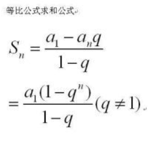
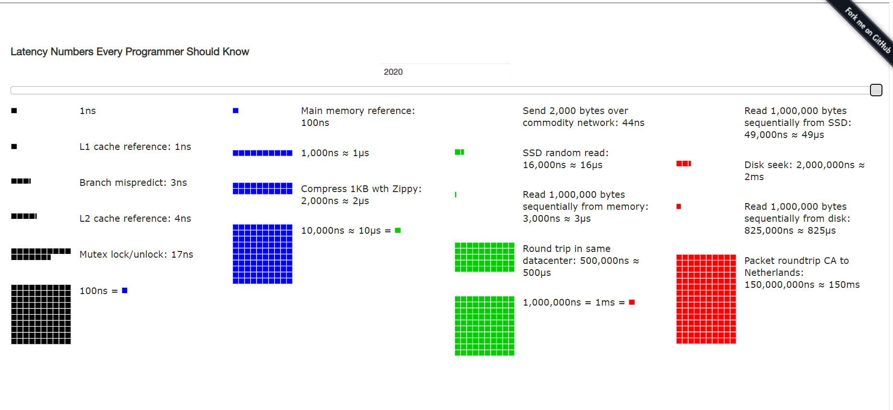
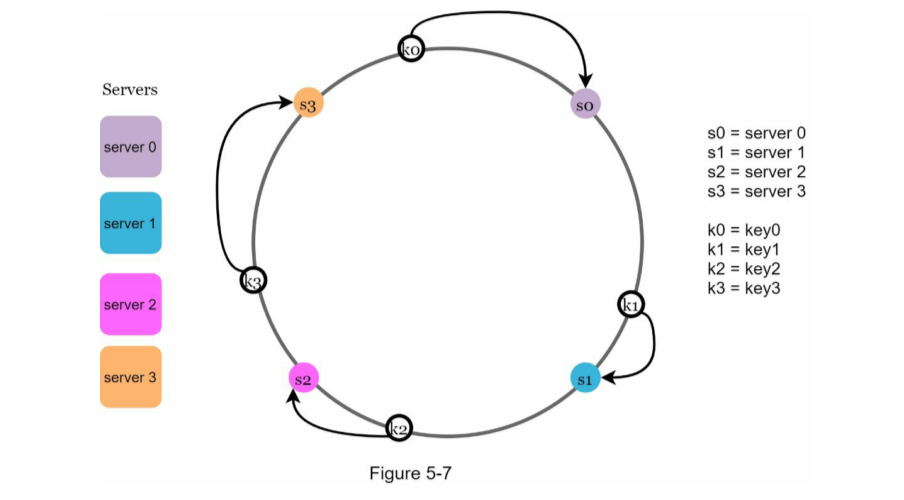
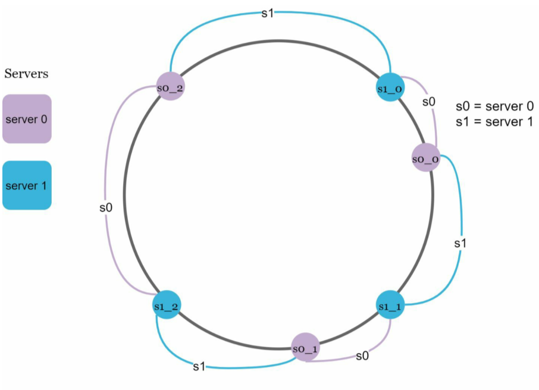
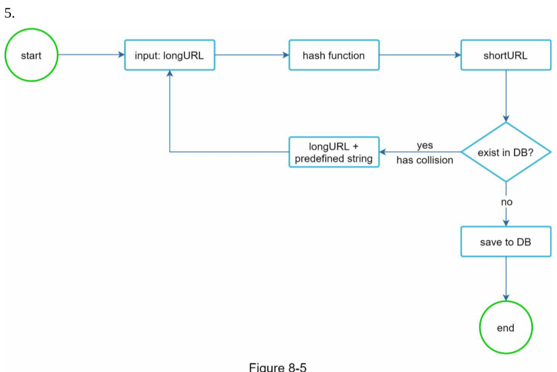
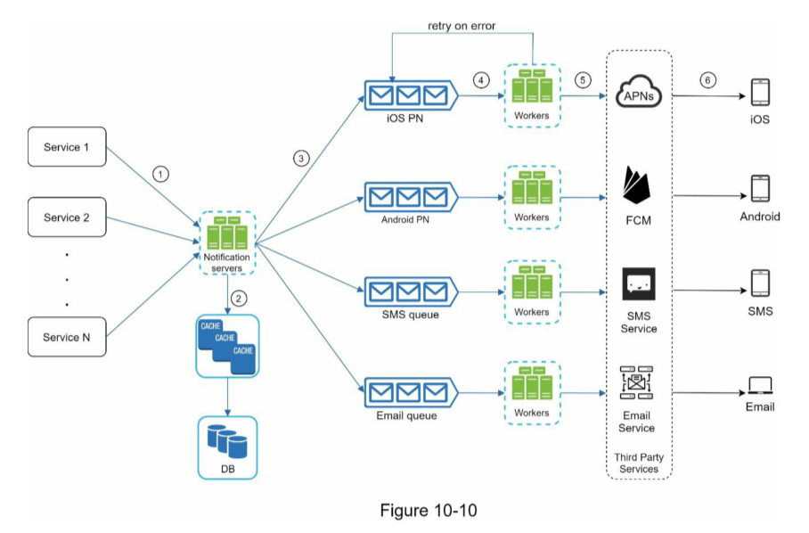
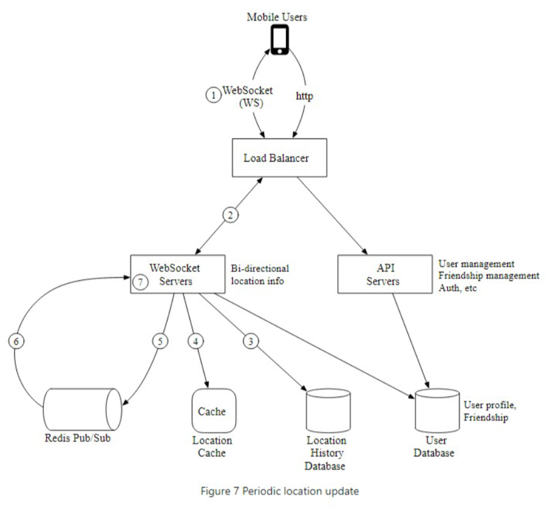
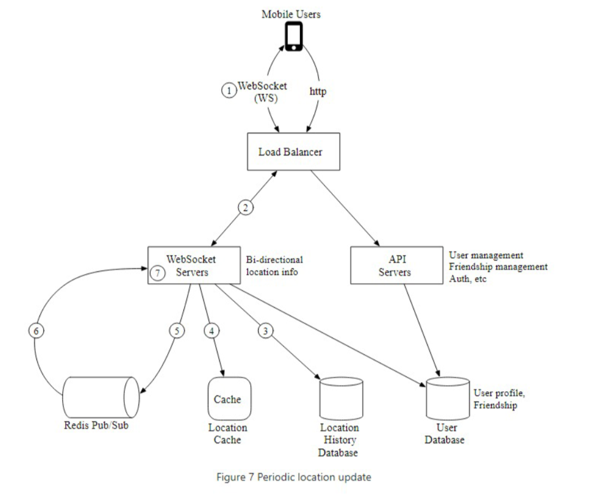
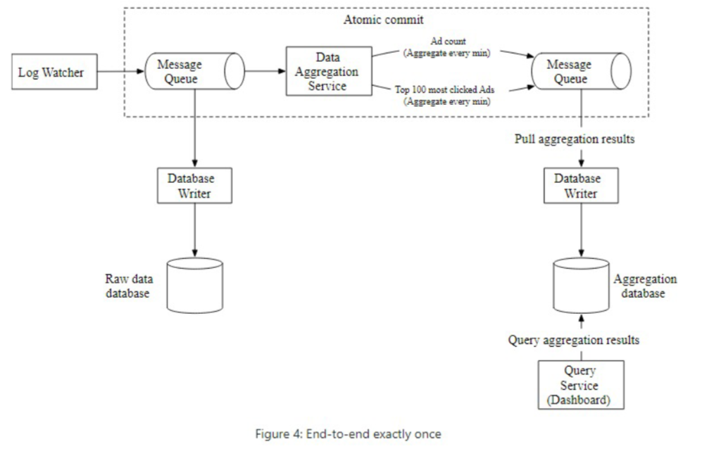

<!-- @import "[TOC]" {cmd="toc" depthFrom=1 depthTo=6 orderedList=false} -->

<!-- code_chunk_output -->

- [1. Abstract And Review](#1-abstract-and-review)
  - [1.1. Progress](#11-progress)
- [3. System Design Interview  Volume 2](#3-system-design-interview--volume-2)
  - [3.1. 安全](#31-安全)
- [4. Next](#4-next)
  - [4.1. 心得体会](#41-心得体会)
  - [4.2. 安全 (Secure)/Other Details](#42-安全-secureother-details)
  - [4.3. 定量分析/定性分析/goal/benchmark](#43-定量分析定性分析 goalbenchmark)
    - [4.3.1. 数学公式](#431-数学公式)
  - [4.4. System Design Framework](#44-system-design-framework)
    - [4.4.1. goal](#441-goal)
  - [4.5. chapter 1: scale from zero to millions of users](#45-chapter-1-scale-from-zero-to-millions-of-users)
    - [4.5.1. case study](#451-case-study)
  - [4.6. chapter 2: back-of-the-envelope estimation](#46-chapter-2-back-of-the-envelope-estimation)
    - [4.6.1. 框架的性能上下界](#461-框架的性能上下界)
    - [4.6.2. case study](#462-case-study)
  - [4.7. chapter 3: a framework for system design interviews](#47-chapter-3-a-framework-for-system-design-interviews)
  - [4.8. chapter 4: design a rate limiter（限流器）](#48-chapter-4-design-a-rate-limiter 限流器)
  - [4.9. chapter 5: design consistent hashing](#49-chapter-5-design-consistent-hashing)
  - [4.10. chapter 6: design a key-value store（暂时跳过，需要复习一下 ddia 相关概念）](#410-chapter-6-design-a-key-value-store 暂时跳过需要复习一下-ddia-相关概念)
  - [4.11. chapter 7: design a unique id generator in distributed systems](#411-chapter-7-design-a-unique-id-generator-in-distributed-systems)
  - [4.12. chapter 8: design a url shortener](#412-chapter-8-design-a-url-shortener)
  - [4.13. chapter 9: design a web crawler](#413-chapter-9-design-a-web-crawler)
  - [4.14. chapter 10: design a notification system](#414-chapter-10-design-a-notification-system)
  - [4.15. chapter 11: design a news feed system](#415-chapter-11-design-a-news-feed-system)
  - [4.16. chapter 12: design a chat system](#416-chapter-12-design-a-chat-system)
  - [4.17. chapter 13: design a search autocomplete system](#417-chapter-13-design-a-search-autocomplete-system)
  - [4.18. chapter 14: design youtube](#418-chapter-14-design-youtube)
  - [4.19. chapter 15: design google drive](#419-chapter-15-design-google-drive)
  - [4.20. chapter 16: the learning continues](#420-chapter-16-the-learning-continues)
- [5. volume 1.5](#5-volume-15)
- [6. volume 2](#6-volume-2)
  - [6.1. Progress](#61-progress)
  - [6.2. Chapter 1: Proximity Service](#62-chapter-1-proximity-service)
  - [6.3. Chapter 2: Nearby Friends](#63-chapter-2-nearby-friends)
    - [6.3.1. My Design](#631-my-design)
    - [6.3.2. DESIGN REVIEW](#632-design-review)
    - [6.3.3. High Level Design](#633-high-level-design)
    - [6.3.4. Deep Dive](#634-deep-dive)
    - [6.3.5. Design Pattern Review(abstract, modeling, seperation of concern, reduce complexity)](#635-design-pattern-reviewabstract-modeling-seperation-of-concern-reduce-complexity)
  - [6.4. Chapter 3: Google Maps](#64-chapter-3-google-maps)
    - [6.4.1. My Design (SPEC)](#641-my-design-spec)
    - [6.4.2. My Design Review](#642-my-design-review)
    - [6.4.3. Map 101(Map basics)](#643-map-101map-basics)
    - [6.4.4. High Level Design](#644-high-level-design)
    - [6.4.5. Deep Dive](#645-deep-dive)
  - [6.5. Chapter 4: Distributed Message Queue](#65-chapter-4-distributed-message-queue)
    - [6.5.1.](#651)
  - [6.6. Chapter 5: Metrics Monitoring](#66-chapter-5-metrics-monitoring)
  - [6.7. Chapter 6: Ad Click Event Aggregation](#67-chapter-6-ad-click-event-aggregation)
  - [6.8. Chapter 7: Hotel Reservation](#68-chapter-7-hotel-reservation)
  - [6.9. Chapter 8: Distributed Email Service](#69-chapter-8-distributed-email-service)
    - [6.9.1. Deep Dive](#691-deep-dive)
  - [6.10. Chapter 9: S3-like Object Storage](#610-chapter-9-s3-like-object-storage)
  - [6.11. Chapter 10: Real-time Gaming Leaderboard](#611-chapter-10-real-time-gaming-leaderboard)
  - [6.12. Chapter 11: Payment System](#612-chapter-11-payment-system)
    - [6.12.1. SPEC](#6121-spec)
  - [6.13. chapter 14: design youtube](#613-chapter-14-design-youtube)
  - [6.14. Chapter 12: Digital Wallet](#614-chapter-12-digital-wallet)
    - [6.14.1. Some Benchmark](#6141-some-benchmark)
  - [6.15. Chapter 13: Stock Exchange](#615-chapter-13-stock-exchange)
- [7. Volume 3: 九章算法的系统设计面试题](#7-volume-3-九章算法的系统设计面试题)
  - [7.1. Progress](#71-progress)
  - [7.2. 牛刀小试](#72-牛刀小试)
  - [7.3. New Words](#73-new-words)
- [8. The learning Continues](#8-the-learning-continues)

<!-- /code_chunk_output -->

# 1. Abstract And Review

[back-end-interview-experience]: https://www.v2ex.com/t/689755

[顺利上岸，分享一些面试经验][back-end-interview-experience]

@sulinehk @litp 谢谢，能帮助到大家就好。后续我准备用思维导图把后端架构中涉及到的
知识点梳理一遍，以方便大家参考。@yoke123 并不是大厂。 多数是细分领域排名比较靠前
的独角兽和创业公司。因为以往项目中有架构相关的设计经历，面试官会非常关注这类项目。

正像我上面说的，架构问题是面试中提纲挈领的点。从这个点展开既能聊常用的组件、常用
方案，又能从组件和方案继续深层次、多角度地问下去，一直问到底层原理和实现。同时结
合实际业务场景，还能考察候选人对业务的理解。

大家在准备面试时，常常从网上的面经开始，看数据库相关的面试题、看网络相关的面试题
等等。但是这样准备面试往往“知其然不知所以然”，因为没有架构背景、没有业务场景。
面经上的那些性能优化、底层原理，常常是针对特定架构、特定问题或业务场景的。 脱离
开这些谈性能优化、底层原理常常陷入死记硬背的形式主义，所以还是推荐大家在准备面试
时，对架构有一定了解，对自己的知识体系有一个宏观认知，这样准备起来效率更高一些。

对于两年经验的后端开发，算法、基础知识、数据库已经不足以衡量候选人的能力。面试中
大部分的时间是在讨论项目经验和对架构的理解。所以要好好整理和反思自己做过的项目
（参考 STAR 原则），多看些技术博客。反复研究和提炼以往项目中的架构设计思路。高并
发架构可能涉及到的知识点包括：微服务、消息队列、分布式锁、缓存、分布式数据一致性、
负载均衡、海量存储等。 从每个话题可以多角度切入到不同的领域，全面了解候选人对常
用组件、常用方案的理解程度。比如从缓存切入到 redis 、缓存替换策略、缓存雪崩、
redis 集群等问题。从微服务切入会问到 grpc 框架、socket 、非阻塞 IO 等。从负载均
衡、服务治理可以切入到 k8s 的服务监控、负载均衡机制、流量控制等，从 k8s 展开问
docker 、linux 内核虚拟化的原理等。从消息队列切入到消息分发机制、kafka 等。从海
量存储切入到数据库的索引、读写分离策略、数据库性能优化、NoSql 存储、分层索引等。
正因为架构问题在面试中起到提纲挈领的作用，所以常常被面试官问到。 准备面试时，应
提前按照上面的层级拓扑结构把自己的知识梳理一遍。

计算机法宝：抽象、关注点分离、建模

科学方法：大胆假设、小心论证

## 1.1. Progress

以 系统设计、ddia、微服务设计模式为抓手去复习， 分布式系统下的几个设计模式

***主动式复习***

- system design interview volume 1 and volume 2(30 chapters)
  - 看过的花 4 点时间，没看过的花 8 点时间，看过但是有少部分知识需要补充的花 6
    点时间以上。
  - start at 
- system design primer；九章算法系统设计补充。
- ddia(part1: data system basic; part2: distributed data; part3: derived data);
  6.824 review
  - (part1,chapter1 start at 2022-09-03 19:55:51, end at 22:00, chapter2 start at 22:00, end at 12:00, chapter3 start end at 2022-09-04 20:23:30, chapter 4 star tat 2022-09-04 20:23:30, end at 2022-09-04 21:10:51)
  - part 3start at 2022-09-06 16:05:31, end at 2022-09-06 22:23:58
- mainstream frame work, 中间件
  - [ ] coordination service: etcd, nginx
    - TIME POINTS:
  - [ ] communication: grpc, message queue
    - TIME POINTS:
  - [ ] devops: docker&k8s 技术，环境的自动化运维技术；
    - TIME POINTS:
  - [ ] 分布式协作中间件：etcd, 分布式锁 from advancecd go programming; kafka
    - TIME POINTS:
  - [ ] 存储：MySQL, redis, NoSQL(mongoDB, redis, ....); cloud DB(TiDB Aurora);
    Hadoop
    - TIME POINTS:
  - [ ] Golang 及相应框架环境：*go programming language*, *effective go*, *go TIME POINTS:
  - [ ] concurrency*, ***advanced go programming***, *go internals*
    - TIME POINTS:
  - [ ] 通信：rpc(grpc), 消息队列 (kafka)
    - TIME POINTS:
  - 这个先不复习了 [ ] 大数据/流批处理/分布式计算：hadoop, spark, kafka
    - TIME POINTS:

1. basic: 四个课程
   1. hot 100
   2. 口述算法
   3. 网络
   4. 系统
2. 数据库及关键中间件：mysql,nosql(redis,mongodb), kafka
3. 数据密集型系统设计要点
   1. 工具：devops: docker, k8s; 分布式协调：etcd; 通信：grpc, kafka;
   4. 高并发：缓存/负载均衡/限流；高可用：降级熔断
   5. 理论支撑：共识算法。
   6. 通用分布式设计组件：分布式缓存、分布式锁、全局唯一 ID、分布式事务、分布式存储系统
   7. 系统设计案例

用 golang 实现一些限流器之类的

看了什么书：
1. 编程语言： 
   - Go 语言并发之道，
   - Go 语言高级编程，
   - Go 程序设计语言，
   - Effective Go, 
   - Go 的编程模式（左耳听风），
   - under the hood
2. 软件工程：
   - 领域驱动设计作者原版（DDD-eric-evans)
   -  领域驱动设计模式、原理和实践 (DDD-ppp)
   -  敏捷开发 模式、原理和实践 (agile-development.ppp)
   -  代码整洁之道 (clean code)
   -  架构整洁之道 (clean architecture)
   -  高效地与遗留系统打交道（修改代码的艺术
      working-effectively-with-legacy-code)
   -  重构 (refactoring)
3. 数据库（关系型和 NoSQL)
   1. MySQL: 《高性能 MySQL》, 《MySQL 技术内幕》, 《极客时间，MySQL 45 讲，》,
   《ddia》, [浅入浅出 MySQL,《数据库系统概念》, MySQL 索引原理及慢查询优化-美团
   技术团队，最全 MySQL 优化方法，从此优化不再难，高性能 MySQL 的总结
   2. Redis: 《Redis 设计与实现》，《极客时间 Redis 核心技术》
   3. MongoDB: 《MongoDB 权威指南》，MongoDB WiwerTiger 引擎
4. 中间件：
   1. 通信中间件：Kafka: 《深入理解 Kafka：核心设计与实践原理》, 《极客时间：
   Kafka 核心技术与实战》
   2. 分布式协调（强一致性分布式 kv 存储）：etcd: 《极客时间，etcd 实战课》
   3. devops: docker, k8s: 《第一本 docker 书》，《左耳听风上关于 虚拟化的几个点
   隔离知识点》《kubernetes in action》
4. 数据密集型分布式系统设计：《ddia》， 《演进式架构》，《分布式系统应用设计》，
《系统设计面试》, 一些架构设计（分布式锁，全局 ID）
6. 大数据：spark, hadoop
7. 总结过去

# 3. System Design Interview  Volume 2

## 3.1. 安全

TLS， 服务器，客户端，根证书

# 4. Next

- 《左耳朵耗子》的分布式系统的文章、golang 文章
- 《golang》高级编程

## 4.1. 心得体会

1. 我不知道我不知道什么
2. 我不知道我知道什么
3. 我知道我不知道什么
4. 我不知道怎么去做我知道的东西

how to quickly recap/refresh our memo about the knowledge learned before.
do an index.

不要照着 DDD 来搞，直接画结合了需求的技术图，照着 DDD 来搞，再转一转，时间不够。

在有时候从 spec(requirement) 到 high level design and get buy-in, 再到 deep dive
再到 wrap，这个过程中，有可能遇到此路不通，即了解完基本需求后，无法继续深入，或
者需求了解阶段不太对，这时候是三边法。
1. 例如 设计 google map 的时候， map 101 不懂的话感觉没法往下设计，最终设计的方
   案是错的
2. 设计 metric system 的时候更有点懵逼，不知道往哪个方向提问。

- 光看书，有时候给人一种错觉：all is known unknown, 没啥难的，只是时间问题。
- 但是深入一线体会问题之后，发现书本很多东西没说

## 4.2. 安全 (Secure)/Other Details

## 4.3. 定量分析/定性分析/goal/benchmark

[性能测试应该怎么做？][how-to-profile]

[how-to-profile]: https://coolshell.cn/articles/17381.html

复杂的系统通过什么的口径来度量系统：见 back-of-the-envolope-estimation

经验公式

计算 redis 
计算 mysql
计算 ttl

动手性能测试。

Case Study

多少的 qps 流量 对应什么样的规模的系统

cpu, IO, bandwidth, storage.

MySQL 的 throughput

### 4.3.1. 数学公式

|  |
|:--:|
| *等比数列求和公式* |

## 4.4. System Design Framework

### 4.4.1. goal

fault tolerant 
high performance, high reliability, high 

## 4.5. chapter 1: scale from zero to millions of users   

1. 一开始为单一服务器的配置
1. 加更多的马力，web server, 分离数据库为单独的数据层
   1. 垂直/水平 scaling: scaling discussion
2. 有更多的机器充当 web servers：负载均衡
3. state-free web server 不再是瓶颈，数据库流量成为了瓶颈，所以采用数据库
   replication: 主从结构应对 failover 等问题：master/slave failover causing
   missing data; 
4. 提高 load/response 时间： 缓存层；CDN
   1. Cache: 
      1. Decide when to use cache: data access pattern;
      2. Expiration policy
      3. Consistency
      4. Mitigating failures: 
      5. Eviction Policy: LRU, LFU, FIFO
   2. CDN（动静分离）: servers cache static content like images, videos, CSS,
      JavaScript files
5. 无状态 Stateless/Stateful web tier: 例如 session data/user authentication,
   NoSQL
   1. 对 load balancer 提出新问题：sticky sessions in most load balancers[^1]
6. 多数据中心 Multi data centers to achieve several purpose
7. Partition Bounded Context => tool to integrate bounded context: communication
   middle ware, like message queue.
   1. Message Queue: code decoupling; chronological order decoupling
8. Logging, metrics, automation
9. Database scaling: Replication; Sharding
   1. sharding key choice =>  evenly distributed data.
   2. Drawback of sharding: (a) Resharding data; (b) Celebrity problem; (c) Join
      and denormalization(Denormalization 指遵循设计范式之后再破坏特定的规则，引
      入一定冗余等，提高 `join` 的性能）

Summary:our system to support millions of users: 
- Keep web tier stateless 
- Build redundancy at every tier 
- Cache data as much as you can 
- Support multiple data centers 
- Host static assets in CDN 
- Scale your data tier by sharding 
- Split tiers into individual services
- Monitor your system and use automation tools

数据解耦以带来分别的 scaling
   
[^1]: Configure Sticky Sessions for Your Classic Load Balancer: https://docs.aws.amazon.com/elasticloadbalancing/latest/classic/elb-sticky-sessions.html

### 4.5.1. case study

## 4.6. chapter 2: back-of-the-envelope estimation   

1. 时间/空间

[Use Back-Of-The-Envelope Calculations To Evaluate Different Designs][roughly-estimation]
- L1 cache reference 0.5 ns
- Branch mispredict 5 ns
- L2 cache reference 7 ns
- Mutex lock/unlock 100 ns
- Main memory reference 100 ns
- Compress 1K bytes with Zippy 10,000 ns
- Send 2K bytes over 1 Gbps network 20,000 ns
- Read 1 MB sequentially from memory 250,000 ns
- Round trip within same datacenter 500,000 ns
- Disk seek 10,000,000 ns
- Read 1 MB sequentially from network 10,000,000 ns
- Read 1 MB sequentially from disk 30,000,000 ns
- Send packet CA->Netherlands->CA 150,000,000 ns 

|  |
|:--:|
| *[Visualization of roughly estimation number based on computer computation power in 2020][roughly-estimation-figure]* |

### 4.6.1. 框架的性能上下界

### 4.6.2. case study

[roughly-estimation-figure]: https://colin-scott.github.io/personal_website/research/interactive_latency.html
[roughly-estimation]: http://highscalability.com/blog/2011/1/26/google-pro-tip-use-back-of-the-envelope-calculations-to-choo.html

## 4.7. chapter 3: a framework for system design interviews   

- technical design skills. 
- the ability 
  - to collaborate, 
  - to work under pressure, 
  - to resolve ambiguity constructively. 
  - to ask good questions is also an essential skill.

red flags:
- **over-engineering** is a real disease of many engineers as they delight in design
  purity and ignore tradeoffs. They are often unaware of the compounding costs
  of over-engineered systems, and many companies pay a high price for that
  ignorance. You certainly do not want to demonstrate this tendency in a system
  design interview. 
- narrow mindedness, 
- stubbornness, etc.

A 4-step process for effective system design interview
1. Step 1 - Understand the problem and establish design scope 
2. Step 2 - Propose high-level design and get buy-in
3. Step 3 - Design deep dive
4. Step 4 - Wrap up

Dos 
- Always ask for clarification. Do not assume your assumption is correct. 
- Understand the requirements of the problem. 
- There is neither the right answer nor the best answer. A solution designed to
  solve the problems of a young startup is different from that of an established
  company with millions of users. Make sure you understand the requirements. 
- Let the interviewer know what you are thinking. Communicate with your
  interview. 
- Suggest multiple approaches if possible. 
- Once you agree with your interviewer on the blueprint, go into details on each
  component. Design the most critical components first. 
- Bounce ideas off the interviewer. A good interviewer works with you as a
  teammate. 
- Never give up.

Don’ts 
- Don't be unprepared for typical interview questions. 
- Don’t jump into a solution without clarifying the requirements and
  assumptions. 
- Don’t go into too much detail on a single component in the beginning. Give the
  highlevel design first then drills down. 
- If you get stuck, don't hesitate to ask for hints. 
- Again, communicate. Don't think in silence. 
- Don’t think your interview is done once you give the design. You are not done
  until your interviewer says you are done. Ask for feedback early and often.

## 4.8. chapter 4: design a rate limiter（限流器）

领域模型：
- use cases（变更）: 作弊用户 (based on ip, phone number, account); 搞活动（促销
  等、抢红包）; 保护核心系统不垮掉；
- 提炼 specification, core domain knowledge.（时间太短，挑最重要的）
- 着手设计：提炼领域模型（无技术术语，高层设计）：流量模型+限流策略 (from domain
  perspective)；限流后给用户的反馈 (from user experience perspective)。
- 领域模型到技术的映射（高层设计不完全包含更多细节）：略
- 领域模型到技术的映射（包含一些技术细节，因为是面向技术官）：功能性要求；非功能
  性要求
- deep dive into detail: distributed environment problem(consistency model?, [redis][rate-limiter-with-redis]),
  performance(tech view: sla), monitor(domain view: algorithm effective?).
- wrap up.

如同设计 rate limiter 算法 实际并不是设计算法，而应该设计流量模型和限流策略
- 约束：系统内部负载；时间/空间 性能
- 流量参数：Request Count/Time Unit
- 系统负载的流量：$R/U$ 指的是在任意一个跨度为 $U$ 的时间窗口内，系统最高能处理 $R$ 个请求

限流器的流量模型应该在性能约束下，准确反映 $r/t$ 该参数。

常见的限流算法（流量模型）如下 ([1][common-rate-limiting-algorithm], [2][zuoerduo-rate-limiting-algorithms])
1. 固定窗口计数器 (Fixed window counter)
2. 滑动窗口计数器 (Sliding window counter)
3. 滑动窗口日志 (Sliding window log)
4. 漏桶 (Leaky bucket)
5. 令牌桶 (Token bucket)

**固定窗口模型**  
将时间划分为 $[t1, t2), [t2, t3), \dots, [t_{n-1}, t_n)$, $U = t_n - t_{n-1}$, 
只要在任意区间内满足 $r < R$ 即可。但是假设两个流量脉冲数量为$R-1$，出现在 $t2$ 的左边和右边，
且 $interval(pulse_1,pulse_2) < U$, 但是此时真实的流量为 $f = 2R-2 > R$，超出系统负载。

**滑动窗口日志**  
能准确描绘真实流量，但是实现上占用内存大

**滑动窗口计数器 (Sliding window counter)**  
能准确描绘真实流量，实现上内存高效

真实业务场景中，在流量脉冲出现时，有时并不希望限流器直接扔掉请求（窗口类的流量模
型的限流算法会直接扔掉），而是需要一个缓冲器，此时漏桶和令牌桶则更合适

流量模型和限流开关分开能否？

实现细节：
1. 

[common-rate-limiting-algorithm]: https://aaron-ai.com/docs/rate_limiting_algorithms/
[zuoerduo-rate-limiting-algorithms]: https://time.geekbang.org/column/article/1609?utm_term=zeusVMMDC&utm_source=web&utm_medium=kuke&utm_content=ziwojieshao
[rate-limiter-with-redis]: https://engineering.classdojo.com/blog/2015/02/06/rolling-rate-limiter/

:question:Questions
1. rate limiter
2. consistency model

FootNotes:
1.  API gateway is a fully managed service that supports rate limiting, SSL
    termination, authentication, IP whitelisting, servicing static content,
    etc. For now, we only need to know that the API gateway is a middleware that
    supports rate limiting.

## 4.9. chapter 5: design consistent hashing   

**Definition**: Quoted from Wikipedia: "Consistent hashing is a special kind of
hashing such that when a hash table is re-sized and consistent hashing is used,
only k/n keys need to be remapped on average, where k is the number of keys, and
n is the number of slots. In contrast, in most traditional hash tables, a change
in the number of array slots causes nearly all keys to be remapped [1]”.

|  |
|:--:|
| *basic consistent hashing* |

he outcome of an experiment carried out by online [research][consistent-hashing-vn-outcome] shows that with
one or two hundred virtual nodes, the standard deviation is between 5% (200
virtual nodes) and 10% (100 virtual nodes) of the mean. 

|  |
|:--:|
| *consitent hash with virtual node* |

[consistent-hashing-vn-outcome]: https://tom-e-white.com/2007/11/consistent-hashing.html

## 4.10. chapter 6: design a key-value store（暂时跳过，需要复习一下 ddia 相关概念）

:question:Questions:
1. CAP theorem wrong, some problem, refering to _ddia: 网络故障不可避免，所以可
   用性和一致性二选一，但是单机的可用性和网络故障不存在问题，但是由于还会存在一
   致性的问题，例如编译器优化， 某个变量存在于内存中已经更新，但是 cache 已经还
   没有发生变化。所以这里的 tradeoff 是性能和 consistency model. 意思是 CAP 不完
   全对
2. consitency resolution not using consensus algorithm: versioning vecton，等待
   ddia 一起看

## 4.11. chapter 7: design a unique id generator in distributed systems   

multimaster replication
- UUID
- ticket server
- and Twitter snowflake-like unique ID generator. 

We settle on snowflake as it supports all our use cases and is scalable in a distributed environment.

:question:Questions
1. Clock synchronization. Network time protocol: https://en.wikipedia.org/wiki/Network_Time_Protocol

## 4.12. chapter 8: design a url shortener   

:question:Questions:
1. bloom filters 
2. what predefined string should be?

  |  |
  |:--:|
  | *short url generator* |
  
Design A URL Shortener
In this chapter,we will tackle an interesting and classic system design interview question:designing a URL
shortening service like tinyurl.
Step 1-Understand the problem and establish design
scope
System design interview questions are intentionally left open-ended.To design a well-crafted system,it is critical to
ask clarification questions.

**Candidate**:Can you give an example of how a URL shortener work?  
**Interviewer**:Assume URL https://www.systeminterview.com/q=chatsystem&c=loggedin&v=v3&1=long is  
the original URL.Your service creates an alias with shorter length:https://tinyurl.com/y7keocwj.If you click  
the alias,it redirects you to the original URL.  
**Candidate**:What is the traffic volume?  
**Interviewer**:100 million URLs are generated per day.  
**Candidate**:How long is the shortened URL?  
**Interviewer**:As short as possible.  
**Candidate**:What characters are allowed in the shortened URL?  
**Interviewer**:Shortened URL can be a combination of numbers(0-9)and characters (a-z,A-Z).  
**Candidate**:Can shortened URLs be deleted or updated?  
**Interviewer**:For simplicity,let us assume shortened URLs cannot be deleted or updated.  

## 4.13. chapter 9: design a web crawler   

:question:Questions:
1. experimental formular for peak QPS 
2. use hash value of web pages to unique
3. bloom filter and hash table to unique
4. We prioritize URLs based on usefulness, which can be measured by PageRank
   [10], website traffic, update frequency, etc. “Prioritizer” is the component
   that handles URL prioritization. Refer to the reference materials [5] [10]
   for in-depth information about this concept.[5] By Christopher Olston, Marc
       Najork: Web Crawling. http:
       //infolab.stanford.edu/~olston/publications/crawling_survey.pdf[10]
       L. Page, S. Brin, R. Motwani, and T. Winograd, “The PageRank citation
       ranking: Bringing order to the web,” Technical Report, Stanford
       University, 1998.

## 4.14. chapter 10: design a notification system   

iOS, Android, SMS, Email: Users receive notifications on their devices. Three
problems are identified in this design: 
- Single point of failure (SPOF): A single notification server means SPOF. 
- Hard to scale: The notification system handles everything related to push
  notifications in one server. It is challenging to scale databases, caches, and
  different notification processing components independently. 
- Performance bottleneck: **Processing and sending notifications can be resource
  intensive**. For example, constructing HTML pages and **waiting for
  responses** from third party services could take time. **Handling everything
  in one system can result in the system overload, especially during peak
  hours**.
  

:question:Questions:
1. Add more notification servers and **set up automatic horizontal scaling**.
2. 作者将 horizontal scaling 应用于 sender worker 上，我的最初设计时两这个应用在
   整个 notificationSrv 上。

   roughly estimation: avg qps 120, peek qps: 5*120=600

   |  |
   |:--:|
   | *作者的设计* |
   
   |  |
   |:--:|
   | *my design* |
   
3. Monitor: Retry mechanism When a third-party service fails to send a
   notification, the notification will be added to the message queue for
   retrying. If the problem persists, an alert will be sent out to developers. 
4. Security: in push notifications For iOS or Android apps, appKey and appSecret
   are used to secure push notification APIs [6]. Only authenticated or verified
   clients are allowed to send push notifications using our APIs. Interested
   users should refer to the reference material [6].
5. push/pull 的通信模式是什么 poll?

## 4.15. chapter 11: design a news feed system   

reliability

值得细究
1. hotkey problem

## 4.16. chapter 12: design a chat system   

要点：
1. 应用层协议：[websocket 协议][web-socket-wikipedia]/http 协议/[MMTLS 协议]
   [mmtls-proto] /[TLS 协议][tls-wikipedia]
2. 通信协议，资源占用估算：例如一个连接 10k， 1m 个用户连接，10GB. 以前都没怎么
   想过这些问题
2. stateful/stateless server.
3. service discovery: apache zookeeper
4. presence servers: what happen what one side of chat pair is offline?
5. push notification 的通信模式是什么 poll ?
6. data layer: read/write pattern
   - The amount of data is enormous for chat systems. A previous study [2]
     reveals that Facebook messenger and Whatsapp process 60 billion messages a
     day. 
   - Only recent chats are accessed frequently. Users do not usually look up for
     old chats. 
   - Although very recent chat history is viewed in most cases, users might use
     features that require random access of data, such as search, view your
     mentions, jump to specific messages, etc. These cases should be supported
     by the data access layer.
   - The read to write ratio is about 1:1 for 1 on 1 chat apps.
7. data storage : kv storage or relational database
8. data model: 1-to-1 chat message model; group chat message model 8. 
9. realtime server failover. zookeeper will handle it .
10. End-to-end encryption. 

[web-socket-wikipedia]: https://zh.m.wikipedia.org/zh-hans/WebSocket#:~:text=WebSocket%E6%98%AF%E4%B8%80%E7%A7%8D%E7%BD%91%E7%BB%9C,WebSocket%20API%E7%94%B1W3C%E6%A0%87%E5%87%86%E5%8C%96%E3%80%82
[mmtls-proto]: https://github.com/WeMobileDev/article/blob/master/%E5%9F%BA%E4%BA%8ETLS1.3%E7%9A%84%E5%BE%AE%E4%BF%A1%E5%AE%89%E5%85%A8%E9%80%9A%E4%BF%A1%E5%8D%8F%E8%AE%AEmmtls%E4%BB%8B%E7%BB%8D.md
[tls-wikipedia]: https://zh.wikipedia.org/wiki/%E5%82%B3%E8%BC%B8%E5%B1%A4%E5%AE%89%E5%85%A8%E6%80%A7%E5%8D%94%E5%AE%9A

:question:Questions:
1. Relational databases do not handle long tail [3] of data well? 不懂啥意思
2. automatic horizontal scaling.
3. error 

## 4.17. chapter 13: design a search autocomplete system   

data gathering service:

page: 20; exp: 20; res: (start at 2022-07-10 17:29:10, end at )

:question:Questions:
1. trie cache miss

## 4.18. chapter 14: design youtube   

page: 24; exp: res: (start at , end at 2022-07-10 20:52:35)

要点：
1. streaming protocol:
2. blob, binary large object.

## 4.19. chapter 15: design google drive   

page: 20; exp: res:(start at 2022-07-10 20:52:56, end at )

要点：
1. 

:question:Questions:
1. 协同编辑云文档

草草地看了一下

感觉自己重新设计一下，根据 hdfs 设计个大概的方案，画一下图

## 4.20. chapter 16: the learning continues  

# 5. volume 1.5

分布式延时系统
 
Chapter14: BEEGO

业务配置

在一些偏 OLAP 或者离线的数据平台中，经过长期的迭代开发，整个系统的功能模块已经渐渐稳定。可变动的项只出现在数据层，而数据层的变动大多可以认为是 SQL 的变动，架构师们自然而然地会想着把这些变动项抽离到系统外部。比如本节所述的配置管理系统。

当业务提出了新的需求时，我们的需求是将新的 SQL 录入到系统内部，或者简单修改一下老的 SQL。不对系统进行上线，就可以直接完成这些修改。

6.6.1.2 业务配置
大公司的平台部门服务众多业务线，在平台内为各业务线分配唯一 id。平台本身也由多个模块构成，这些模块需要共享相同的业务线定义（要不然就乱套了）。当公司新开产品线时，需要能够在短时间内打通所有平台系统的流程。这时候每个系统都走上线流程肯定是来不及的。另外需要对这种公共配置进行统一管理，同时对其增减逻辑也做统一管理。这些信息变更时，需要自动通知到业务方的系统，而不需要人力介入（或者只需要很简单的介入，比如点击审核通过）。

除业务线管理之外，很多互联网公司会按照城市来铺展自己的业务。在某个城市未开城之前，理论上所有模块都应该认为带有该城市 id 的数据是脏数据并自动过滤掉。而如果业务开城，在系统中就应该自己把这个新的城市 id 自动加入到白名单中。这样业务流程便可以自动运转。

再举个例子，互联网公司的运营系统中会有各种类型的运营活动，有些运营活动推出后可能出现了超出预期的事件（比如公关危机），需要紧急将系统下线。这时候会用到一些开关来快速关闭相应的功能。或者快速将想要剔除的活动 id 从白名单中剔除。在 Web 章节中的 AB 测试一节中，我们也提到，有时需要有这样的系统来告诉我们当前需要放多少流量到相应的功能代码上。我们可以像那一节中，使用远程 RPC 来获知这些信息，但同时，也可以结合分布式配置系统，主动地拉取到这些信息。

# 6. volume 2

## 6.1. Progress

- [ ] Chapter 1: Proximity Service(location based service)
  - page: exp: res (start at , resume at 2022-08-20 2022-08-20 15:24:22, end at )
- [ ] Chapter 2: Nearby Friends (location based service)
  - resume at Deep Dive at 2022-08-22 09:56:23, 
- [ ] Chapter 3: Google Maps (location based and route planning)
  - start at 2022-08-22 14:46:28, end at 
- [ ] Chapter 4: Distributed Message Queue 
  - start at 2022-08-23 09:39:22, end at 
- [ ] Chapter 5: Metrics Monitoring（粗浅看，了解一下即可）
  - start at 2022-08-24 14:17:49, resume at 2022-08-24 19:59:47, end at 
- [ ] Chapter 6: Ad Click Event Aggregation(streaming system)
  - start at 2022-08-24 22:36:09, end at 24:00, resume at 2022-08-25 11:05:03, resume at 2022-08-25 14:11:36, end at 2022-08-25 17:50:06)
- [ ] Chapter 7: Hotel Reservation(booking system, r/w pattern)
  - start 2022-08-25 20:08:29, end at 2022-08-26 00:23:58
- [ ] Chapter 8: Distributed Email Service()
  - start at 2022-08-26 00:24:07, resume at 2022-08-26 11:14:16, resume at 2022-08-26 14:49:50, resume at 2022-08-26 15:56:23,  end at 2022-08-26 18:26:55)
- [ ] Chapter 9: S3-like Object Storage（对象存储）
  - start at 2022-08-26 21:25:15, resume at 2022-08-27 10:46:01, end at 
- [ ] Chapter 10: Real-time Gaming Leaderboard()
  - start at 2022-08-27 21:31:46, resume at 2022-08-28 09:46:59, end at 
- [ ] Chapter 11: Payment System(complex business rule and performance requirement)
  - start at 2022-08-28 11:40:23, end at 2022-08-29 16:23:45
- [ ] Chapter 12: Digital Wallet()
  - start at 2022-08-29 19:37:13, resume at 2022-08-30 09:53:34, 
- [ ] Chapter 13: Stock Exchange(complex trade rule and real time) 看不懂，不看了
  - start at 2022-08-29 16:53:36, end at 

## 6.2. Chapter 1: Proximity Service

**Spec**
1. functional requirement
   1. query(location, radius)
   2. view a detail pages
   3. protect location privacy
2. non functional requirements
   1. performance: low latency
   2. reliability: peak hour in dense area
   3. scalibility: peak hour in dense area
   4. Thoughput

**Design Points:**
1. API Design(pagination)
2. DDD perspective design without technical detail => add technical detail to
   form a technical view.
3. data model
4. location related algorithm: query using MySQL / evenly divided grid /
   GeoHash / quadtree / [google S2][googles2] / R-tree
   1. multi-dimensional range tree: segment tree, balanced BST with link, x-dim balanced BST augmented with y-dim balanced BST on each node.

[googles2]: https://halfrost.com/go_spatial_search/

**data structure, quardtree size estimation**
- Each grid can store a maximal of 100 businesses
- Number of leaf nodes =~200 million 100 =~2 million
- Number of internal nodes 2 million 1/3 =~0.67 million.If you do not know why the number of internal
- Number of internal nodes 2 million 1/3 =~0.67 million.If you do not know why
  the number of internal
- Total memory requirement 2 million 832 bytes 0.67 million 64 bytes =~1.71 GB.Even if we add some
- Total memory requirement 2 million 832 bytes 0.67 million 64 bytes =~1.71
  GB.Even if we add some

**real world problem while using quardtree**
1. in-memory solution.
2. build a quardtree with 200m businesses could cost few miniutes. server during
   building quardtree cannot provide service. Solution: Roll out, incrementallly
   add few servers.
3. 蓝绿测试部署可以使用，但是会对 business DB 造成较大压力，即一个集群 server 建树，读 DB
4. quardtree update caused by business added or deleted or modified. 
   1. incrementally: stale data
   2. nightly update: 可能缓存雪崩
   3. online update: complicated, 例如 quardtree 被多线程访问时，会有并发设计的考量

**Design Deep Dive**

- Scale the database
- Caching
- Region and availability zones
- Filter results by time or business type
- Final architecture diagram

Scale The Database
1. Geospatial table, Business Table: table design, replication, sharding
2. Caching: read/write pattern, storage size, CPU/IO/bandwith cost,
   benchmarking/cost analysis, what key and what data to cache, cache replicas
   and sharding
3. use replica to improve spatial locality and tackle the problem of
   privace(data sovereignty 数据主权）

扩展点：
1. geohash in redis.
2. quardtree, number of internal nodes 

:question:Questions:
1. quardtree building time: $O(N/100) lg(N/100)$ 为什么。server start-up
   time(few minitues, 增量 build, 突然之间多个服务器来 build 对下游 DB 造成过大
   压力）, update quardtree（夜间更新）, cache invalidation

## 6.3. Chapter 2: Nearby Friends

### 6.3.1. My Design

***USE CASES***  
1. open nearby friends, see a list of nearby friends
2. people move, then nearby friends list get updated in real time
3. people comes and goes, then nearby friends list get updated in real time 
4. Thumbs

***SPEC***  

Func Requ
1. query(location, radius)
2. dynamic nearby friends service: active 2Hz update frequency; inactive dead.
3. radius: 30km, same city

Non Func
1. Performance: low latency
2. reliability/scailibility: holiday, population density cause access pressure
3. privacy
4. read/write pattern: high read/high write

Rough Estim
1. DAU: 1B users, 10% use this function, then 100m
2. Flow:
   1. avg QPS
   2. peak QPS
3. Storage: 
   1. Geo Data

***High Level Design***  

API
1. app/v1/nearby?location=
   1. parameters:
   2. response:
2. app/v1/friends?uid=
   1. parameters:
   2. response

Nearby Friends Bounded Ctx(simplified graph)
1. 

Data Model
1. Location: 
   1. fields: lagitude, longitude
2. Friends
   1. Thumbs fields: uid, name, location, gender, distance, 
   2. Detail fields: 

DB/data structure to provide geo query function
- Spec
  1. C: 
  2. R: $O(1)$ => $O(lgN)$
  3. U: $O(1)$ => $O(lgN)$
  4. D
- Cands
  1. [x] quardtree
  2. [ ] google S2
  3. [ ] evenly divided grid
  1. [ ] GeoHash
  
### 6.3.2. DESIGN REVIEW

Functional Requirement
1. nearby means what distance?
2. nearby friends display nearby strangers or people on your contact list.

NonFunctional Requirement:
1. what is the freq of update nearby friends? based on what? （实时性要求，例子
   有军事行动，实时人流监控）
2. what is the freq of location report? 
3. what is the protocol? broadcast to all people? or just update the data
   structure

API：
1. API 设计：漏了上报位置

R/W pattern：
1. high read, high write
2. eventual consistency

Rough Estimation:
1. DAU: 1B, 0.1 的用户使用 nearby function，再 0.1 的并发用户
2. location report qps, nearby friends query qps

### 6.3.3. High Level Design

|  |
|:--:|
| *nearby friends high level design* |

Components
1. **Load Balancer**.
2. **Communication Protocol** for long-running connection: WebSockets and its servers
3. **Restful API servers**: 
4. **Storage**: redis location cache, 如同一个语音聊天室，不需要将人进进出出聊天音频记录下来
5. **Routing Layer, Notification machanism**: Redis pub/sub server, lightweight
6. **User DB**

How it works?
1. Periodic Location Update

   |  |
   |:--:|
   | *caption* |

2. API Design
   1. Periodic Location Update
   2. Client Receives Location Updates
   3. WebSocket initialization
   4. Subscribe to new friend 
   5. Unsubscribe a friend
3. Data Model: Location History Databse(schema: user_id|latitue|longitude|timestamp)
4. Location History Database

扩展
1. websockets 用法，程序设计
2. cassandra
3. redis pub/sub server: lightweight to create channel: when a channel is
   created, Redis uses a small amount of memory to maintain a hash table and a
   linked list to track the subscribers.

### 6.3.4. Deep Dive

***How well does each component scale***
1. API Servers, stateless auto scale based on CPU usage, load, or I/O. 
2. Stateful WebSocket servers auto-scaling based on usage. 
   1. 移除 stateful 节点和基于 websocket 新部署一个应用需要 仔细关注 对服务是否
      有损。（例如移除时，先将 server 标记为 draining, 停止接受流量，即 load
      balancer 不会转发流量到该节点，待 server 上的连接全部关闭之后再真正移除该
      节点 u
    2. effective auto-scaling is the job of good load balancer.
3. client initialization.
4. User Database
5. location cache
6. Redis pub/sub server
   1. redis pub/sub: it's lightweight to create a channel.
   1. tradeoff: provide every user a pub channel, earn simple architecture by
      sacrifising little memory. 2. 
   2. distribution based on bottlekneck: 
      1. Stateful: authough messages don't need to be persistent, but the
         subscription relationship between websocket server and redis pub/sub
         server make redis server stateful.
      2. Rough Estimation: storage = 100m * 20bytes(pointers in the internal
         hash table linked list of redis pub/sub server) * 100 friends / 10^9 =
         200GB; CPU = 14m update per second; 1 Gb network could handle 100k
         messages push(given how small our location update is, this number is
         conservative). 
      3. Conclusion: A modern redis server can hold 200GB data, so CPU/Network
         is the bottleknecka and we should distribute redis pub/sub server.
      4. Method: 
         1. sharding key: channel(user_id), because channel is independent.
         2. management: consistent hash and service discovery.
         3. Risk/Notes: membership management of redis pub/sub server cluster
            would cause rehashing of channel, which means websocket server have
            to resubscribe to a specific friend's channel on a new redis pub/sub
            server.

***More Discussion of some design point and detail***

Stateful Websocket Server Scaling

Stateful Redis Pub/Sub Server Scaling

***What if we want to show nearby strangers***

基于上述附近好友的架构改动一小点：将 channel 的粒度从 "用户 对 好友 的订阅" 改成
"用户对某一地理区域的订阅", `key` 为 `geohash` 不过还是有边界问题

More Discussion

### 6.3.5. Design Pattern Review(abstract, modeling, seperation of concern, reduce complexity)

1. estimation
2. communication
3. storage
4. protocol

## 6.4. Chapter 3: Google Maps

### 6.4.1. My Design (SPEC)

### 6.4.2. My Design Review

what point should we focus while learn about requirement?
1. Use Cases
2. Functional Ruirement, Non Functional Ruirement
   1. Functional Reuq
   2. Non Functional Requirement
      1. Performance: what kind of index(such as low latency => smooth map
         reding)
      2. General Reliability and Scailibility.
      3. 移动出行相关需求：use as little data and battery as possible, very
         important for mobile phones.
3. Rough Estimation

what perspective should we use while thinking about the points above
1. suppose i am a user of this app, focus on user experience of the key feature.

### 6.4.3. Map 101(Map basics)

### 6.4.4. High Level Design

### 6.4.5. Deep Dive 

扩展：
1. amazon s3
2. cassandra
3. Communication Protocol: mobile push notification / long polling / websocket / SSE

## 6.5. Chapter 4: Distributed Message Queue

分析的时候有没有一套类似于 算法理论 的工具框架呢

### 6.5.1. 

## 6.6. Chapter 5: Metrics Monitoring

## 6.7. Chapter 6: Ad Click Event Aggregation

When it comes to choosing the right database,we need to evaluate the following:

- What does the data look like?Is the data relational?Is it a document or a blob?
- Is the workflow read-heavy,write-heavy,or both?
- Is transaction support needed?
- Do the queries rely on many online analytical processing (OLAP)functions [3]like SUM,COUNT?

As shown in the back of the envelope estimation,the average write QPS is 10,000,
and the peak QPS can be **50,000**. so the system is **write-heavy**.On the read
side, raw data is used as backup and a source for recalculation,so in theory,the
read volume is low.

:question:Questions:
1. 50,000 peak qps, 10,000 avg qps 这样叫做 write heavy 了吗？
2. 怎么利用其 exactly once 特性
   |  |
   |:--:|
   | *high level design* |
3. kappa, lambda architecture 两者的介绍区别 ([kappa][kappa-architecture], [lambda][lambda-architecture])

[kappa-architecture]: https://hazelcast.com/glossary/kappa-architecture/#:~:text=What%20Is%20the%20Kappa%20Architecture,with%20a%20single%20technology%20stack.
[lambda-architecture]: https://hazelcast.com/glossary/lambda-architecture/

## 6.8. Chapter 7: Hotel Reservation

:question:Questions:
1. why ? 体现在哪
   >make reservations.NoSQL databases are generally optimized for writes and the
   relational database works well enough for read-heavy workflow.

## 6.9. Chapter 8: Distributed Email Service

### 6.9.1. Deep Dive

deep dive direction
1. metadata database
2. search 
3. deliverability
4. scalibility

**metadata database**  

email metadata r/w props:
- haracteristics of email metadata
- Email headers are usually small and frequently accessed.
- Email body sizes can range from small to big but are infrequently accessed.You
  normally only read an email once.
- Most of the mail operations,such as fetching mails,marking an email as read,
  and searching are isolated to an individual user.In other words,mails owned by
  a user are only accessible by that user and all the mail operations are
  performed by the same user.
- Data recency impacts data usage.Users usually only read the most recent
  emails.82%of read queries are for data younger than 16 days [15].
- Data has high-reliability requirements.Data loss is not acceptable.

- A single column can be a single-digit of MB.
- Strong data consistency.
- Designed to reduce disk l/O.
- It should be highly available and fault-tolerant.
- It should be easy to create incremental backups.

:question:Questions:
1. metadata database:
2. log structured merge tree

## 6.10. Chapter 9: S3-like Object Storage

SATA interface, 7200 rpm

耐用性计算： https://www.backblaze.com/blog/cloud-storage-durability/

Erasure-Code（纠删码） 最佳实践：  
- 在当前机房网络能力越来越强的情况下（如（Flat DataCenter Storage 说明），数据的
  locality 总体来说在大多数大数据场景下越来越不重要了，存储计算分离是大趋势。比
  如 S3（对象存储）、EBS 等，可以考虑使用 RS + Stripe PlaceMent 结合合理的
  Stripe Unit 的方案作为底层的纠删码方案，在架构选择层面可以参考之前的 2 篇博文

## 6.11. Chapter 10: Real-time Gaming Leaderboard

hot partition, how to solve this problem

## 6.12. Chapter 11: Payment System

### 6.12.1. SPEC

Non Func Requi
1. Throughput: 
   1. 1m Txs per day
   2. TPS: $10^6/10^5=10$, relatively low.

## 6.13. chapter 14: design youtube   

## 6.14. Chapter 12: Digital Wallet

CQRS

https://zhuanlan.zhihu.com/p/115685384

6.824 https://www.zhihu.com/column/c_1467134601042358272

### 6.14.1. Some Benchmark

When we talk about TPS,we imply a transactional database will be used.Today,a
relational database running on a typical data center node can support a few
thousand transactions per second.For example,reference [2]contains the
performance benchmark of some of the popular transactional database
servers.Let's assume a database node can support 1,000 TPS. In order to reach 1
million TPS, we need 1,000 database nodes.

distributed transaction

## 6.15. Chapter 13: Stock Exchange

# 7. Volume 3: 九章算法的系统设计面试题

v2ex：

要求设计一个这样的系统：
1. 能够支撑一百亿订单 id，一亿个用户 id，每天增量更新
2. 提供查询“用户 id-订单 id”pair 是否 valid 的服务
3. 一次查询最多一千万对数据，响应时间越低越好

假设微信朋友圈的
读 QPS 100w  
写 QPS 10w  
每个用户最多 400 个朋友，  
发朋友圈和刷朋友圈该怎么设计？  
数据怎么存储？  
求大佬解答。  
第 1 条附言  ·  2021-04-23 22:34:28 +08:00  
抖音技术 leader 。  
写扩散，400 * 10w = 4000w 被否决  
读扩散的话 100w qps，redis 扛不住为由否决。  
除了 redis，还有什么高并发解决方案呢？  

## 7.1. Progress

第一章【直播】系统设计面试揭秘+解题套路讲解  
9 月 2 日 09:30 - 11:30                      
免费试听                                     
1. 面试官想考察的东西是什么                  
2. 可能踩的坑有哪些                          
3. 需要具备的知识以及面试技巧                
4. 4S 分析法设计秒杀系统                     
第二章【互动】走进系统设计 & 新鲜事系统      
免费试听                                     
- 什么是系统设计 What is System Design       
- 系统设计中常见的问题是什么 How we ask Sys  tem Design in Interview
- 怎样回答系统设计问题 How to answer System   Design Question
- 系统设计的 4S 分析法 4S in System Design   
- 系统设计的知识点构成 Basic Knowledge of S  ystem Design
- 设计推特 Design a Twitter                  
第三章【直播】秒杀系统与订票系统设计         
9 月 18 日 09:00 - 11:00                     
免费试听                                     
高并发场景下引发的常见问题                   
了解数据一致性                               
什么是动静分离                               
读写分离如何实现                             
如何防止超卖                                 
第四章【视频】秒杀系统与订票系统设计（南帝老  师主讲）
9 月 18 日 11:00 - 10 月 2 日 11:00          
高并发场景下引发的常见问题                   
了解数据一致性                               
什么是动静分离                               
读写分离如何实现                             
如何防止超卖                                 
第五章【互动】从用户系统设计中学习数据库与缓  存
9 月 18 日 11:00 - 10 月 2 日 11:00          
通过设计用户系统了解：                       
用户系统的特点是什么？                       
什么是会话 Session?                          
什么是数据库，什么是缓存，他们之间如何配合？  
什么是 Cache Through 什么是 Cache Aside      
NoSQL 与 SQL 数据库的优劣比较与选取标准      
第六章【互动】网站系统，API 设计与短网址     
9 月 18 日 11:00 - 10 月 2 日 11:00          
网站系统的基本构成                           
API 设计问题                                 
什么是 RestAPI                               
实战真题                                     
What happend if you visit www.google.com?    
How to design tiny url?                      
如何设计 News Feed API                       
如何设计 mention 功能                        
如何做翻页 Pagination                        
关键词：Web, Consistent Hashing, Memcached,   Tiny url.
第七章【直播】优惠券系统设计                 
10 月 1 日 09:00 - 11:00                     
了解优惠券的种类                             
介绍优惠券的核心流程                         
分析优惠券系统的难点                         
如何解决使用优惠券时会出现的分布式问题       
如何解决优惠券系统的高并发问题               
表单结构设计，数据库优化                     
优化：快过期券提醒与发券接口限流保护         
第八章【视频】优惠券系统设计（南帝老师主讲）  
10 月 1 日 11:00 - 10 月 15 日 11:00         
了解优惠券的种类                             
介绍优惠券的核心流程                         
分析优惠券系统的难点                         
如何解决使用优惠券时会出现的分布式问题       
如何解决优惠券系统的高并发问题               
表单结构设计，数据库优化                     
优化：快过期券提醒与发券接口限流保护         
第九章【互动】数据库拓展与一致性哈希算法     
10 月 1 日 11:00 - 10 月 15 日 11:00         
什么是数据库拆分                             
横向拆分 vs 纵向拆分 Horizontal Sharding vs   Vertical Sharding
一致性哈希算法的两个版本                     
实战真题：如何设计限流器 Rate Limiter        
实战真题：如何设计实时数据系统 Data Dog      
第十章【互动】分布式文件系统 GFS             
10 月 1 日 11:00 - 10 月 15 日 11:00         
 以 GFS 为例系统学习分布式文件系统，了解如下  内容：
Master Slave 的设计模式                      
分布式文件系统的读写流程                     
怎么处理分布式系统中的 failure 和 recovery   的问题。
如何做 replica, check sum 检查               
了解 consistent hash 和 sharding 的实际应用  
第十一章【直播】文档协同编辑系统设计         
10 月 8 日 09:00 - 11:00                     
websocket 在协同编辑中的应用                 
了解什么是协同编辑                           
协同编辑的几种实现方案                       
如何解决编辑冲突问题                         
了解 OT（ Operational Transformation）原理   
第十二章【视频】文档协同编辑系统设计（南帝老  师主讲）
10 月 8 日 11:00 - 10 月 22 日 11:00         
websocket 在协同编辑中的应用                 
了解什么是协同编辑                           
协同编辑的几种实现方案                       
如何解决编辑冲突问题                         
了解 OT（ Operational Transformation）原理   
第十三章【互动】分布式数据库 Big Table       
10 月 8 日 11:00 - 10 月 22 日 11:00         
通过设计分布式数据库系统 Bigtable 了解如下内  容：
Big Table 的原理与实现                       
了解 NoSQL Database 如何进行读写操作的，以及  相应的优化
了解如何建立 index                           
学习 Bloom Filter 的实现原理                 
Master Slave 的设计模式                      
第十四章【互动】聊天系统 IM System           
10 月 8 日 11:00 - 10 月 22 日 11:00         
聊天系统中的 Pull vs Push                    
讲解一种特殊的 Service - Realtime Service    
用 channel 优化群聊                          
如何限制多机登录                             
用户在线状态的获取与查询 Online Status       
第十五章【直播】视频流系统设计               
10 月 15 日 09:00 - 11:00                    
视频切分和断点续传如何实现                   
如何在架构设计中节省带宽                     
小文件存储之视频切片与缩略图存储             
了解视频预加载                               
了解 CDN 的基本原理                          
第十六章【视频】视频流系统设计（南帝老师主讲  ）
10 月 15 日 11:00 - 10 月 29 日 11:00        
视频切分和断点续传如何实现                   
如何在架构设计中节省带宽                     
小文件存储之视频切片与缩略图存储             
了解视频预加载                               
了解 CDN 的基本原理                          
第十七章【互动】基于地理位置的信息系统       
10 月 15 日 11:00 - 10 月 29 日 11:00        
系统学习 LBS 相关系统设计的核心要点：        
地理位置信息存储与查询常用算法之 Geohash     
如何设计 Uber                                
关键点：学会设计 Uber 以后可以轻松解决设计   Facebook Nearby 和 Yelp
第十八章【互动】分布式计算 Map Reduce        
10 月 15 日 11:00 - 10 月 29 日 11:00        
学习 Map Reduce 的应用与原理                 
了解如何多台机器并行解决算法问题             
掌握 Map 和 Reduce 的原理                    
通过三个题目掌握 MapReduce 算法实现：        
WordCount                                    
InvertedIndex                                
Anagram                                      
第十九章【直播】推特搜索系统设计 Twitter Se  arch
10 月 22 日 09:00 - 11:00                    
推特的海量推文数据如何存储                   
如何快速搜索                                 
对搜索结果进行排名                           
搜索系统容错能力                             
第二十章【视频】推特搜索系统设计 Twitter Se  arch（南帝老师主讲）
10 月 22 日 11:00 - 11 月 5 日 11:00         
推特的海量推文数据如何存储                   
如何快速搜索                                 
对搜索结果进行排名                           
搜索系统容错能力                             
第二十一章【互动】爬虫系统与搜索建议系统     
10 月 22 日 11:00 - 11 月 5 日 11:00         
通过对爬虫系统设计 (Web Crawler) 与 搜索建议  系统设计 (Google Suggestion) 了解如下内容：
多线程                                       
生产者消费者模型                             
爬虫系统的演化：单线程，多线程，分布式       
Trie 结构的原理及应用                        
如何在系统设计中使用 Trie                    
第二十二章【互动】系统设计的核心必考知识点：  数据库索引与事务（增）
10 月 22 日 11:00 - 11 月 5 日 11:00         
Mysql 索引的原理                             
索引的分类                                   
索引的基本使用原则                           
事务的概念和原理                             
事务的应用场景                               
第二十三章【直播】评论系统设计 Comment syst  em
10 月 29 日 09:00 - 11:00                    
如何设计评论区 API                           
评论全文搜索功能                             
异步任务                                     
动态缓存                                     
如何实现评论赞数和踩数                       
第二十四章【视频】评论系统设计 Comment syst  em（西毒老师主讲）
10 月 29 日 11:00 - 11 月 12 日 11:00        
如何设计评论区 API                           
评论全文搜索功能                             
异步任务                                     
动态缓存                                     

- [ ] 第一章【直播】系统设计面试揭秘+解题套路讲解
- [ ] 第二章【互动】走进系统设计 & 新鲜事系统
- [ ] 第三章【直播】秒杀系统与订票系统设计
- [ ] 第四章【视频】秒杀系统与订票系统设计（南帝老师主讲）
- [ ] 第五章【互动】从用户系统设计中学习数据库与缓存
- [ ] 第六章【互动】网站系统，API 设计与短网址
- [ ] 第七章【直播】优惠券系统设计
- [ ] 第八章【视频】优惠券系统设计（南帝老师主讲）
- [ ] 第九章【互动】数据库拓展与一致性哈希算法
- [ ] 第十章【互动】分布式文件系统 GFS
- [ ] 第十一章【直播】文档协同编辑系统设计
- [ ] 第十二章【视频】文档协同编辑系统设计（南帝老师主讲）
- [ ] 第十三章【互动】分布式数据库 Big Table
- [ ] 第十四章【互动】聊天系统 IM System
- [ ] 第十五章【直播】视频流系统设计
- [ ] 第十六章【视频】视频流系统设计（南帝老师主讲）
- [ ] 第十七章【互动】基于地理位置的信息系统
- [ ] 第十八章【互动】分布式计算 Map Reduce
- [ ] 第十九章【直播】推特搜索系统设计 Twitter Search
- [ ] 第二十章【视频】推特搜索系统设计 Twitter Search（南帝老师主讲）
- [ ] 第二十一章【互动】爬虫系统与搜索建议系统
- [ ] 第二十二章【互动】系统设计的核心必考知识点：数据库索引与事务（增）
- [ ] 第二十三章【直播】评论系统设计 Comment system
- [ ] 第二十四章【视频】评论系统设计 Comment system（西毒老师主讲）

## 7.2. 牛刀小试

## 7.3. New Words

1. **back-of-the-envelope**: $\mathbb{D}.$ done to provide a rough idea of
   something 粗略估算的 $\mathbb{E}.$ I can't tell you the exact amount, but my
   back-of-the-envelope [=rough] calculation indicates a cost of about $300,000.
   我无法告知你确切的金额，但我粗略估算的费用在 30 万美元左右
1. **bartering**: $\mathbb{D}.$ 物物交换，以物易物

1.
**word**:
$\mathbb{D}.$
$\mathbb{E}.$
1.
**word**:
$\mathbb{D}.$
$\mathbb{E}.$
1.
**word**:
$\mathbb{D}.$
$\mathbb{E}.$
1.
**word**:
$\mathbb{D}.$
$\mathbb{E}.$

# 8. The learning Continues

- Facebook Timeline:Brought To You By The Power Of Denormalization:https://goo.gl/FCNrbm
- Scale at Facebook:https://goo.gl/NGTdCs
- Building Timeline:Scaling up to hold your life story:https://goo.gl/8p5wDV
- Erlang at Facebook (Facebook chat):https://goo.gl/zSLHrj
- Facebook Chat:https://goo.gl/qzSiWC
- Finding a needle in Haystack:Facebook's photo storage:https://goo.gl/edj4FL
- Serving Facebook Multifeed:Efficiency,performance gains through redesign:https://goo.gl/adFVMQ
- Scaling Memcache at Facebook:https://goo.gl/rZiAhX
- TAO:Facebook's Distributed Data Store for the Social Graph:https://goo.gl/Tk1DyH
- Amazon Architecture:https://goo.gl/k4feoW
- Dynamo:Amazon's Highly Available Key-value Store:https://goo.gl/C7zxDL
- A 360 Degree View Of The Entire Netflix Stack:https://goo.gl/rYSDTz
- It's All A/Bout Testing:The Netflix Experimentation Platform:https://goo.gl/agbA4K
- Netflix Recommendations:Beyond the 5 stars(Part 1):https://goo.gl/A4FkYi
- Netflix Recommendations:Beyond the 5 stars (Part 2):https://goo.gl/XNPMXm
- Google Architecture:https://goo.gl/dvkDiY
- The Google File System (Google Docs):https://goo.gl/xj5n9R
- Differential Synchronization (Google Docs):https://goo.gl/9zqG7x
- YouTube Architecture:https://goo.gl/mCPRUF
- Seattle Conference on Scalability:YouTube Scalability:https://goo.gl/dH3zYg
- Bigtable:A Distributed Storage System for Structured Data:https://goo,gl/6NaZca
- Instagram Architecture:14 Million Users,Terabytes Of Photos,100s Of Instances,Dozens Of Technologies:https://g
- oo.gl/s1VcW5
- The Architecture Twitter Uses To Deal With 150M Active Users:https://goo.gl/EwvfRd
- Scaling Twitter:Making Twitter 10000 Percent Faster:https://goo.gl/nYGC1k
- Announcing Snowflake (Snowflake is a network service for generating unique ID numbers at high scale with some
- simple guarantees):https://goo.gl/GzVWYm
- Timelines at Scale:https://goo.gl/8KbgTy
- How Uber Scales Their Real-Time Market Platform:https://goo.gl/kGZuVy
- Scaling Pinterest:https://goo.gl/KtmjW3
- Pinterest Architecture Update:https://goo.gl/w6rRsf
- A Brief History of Scaling LinkedIn:https://goo.gl/8A1Pi8
- Flickr Architecture:https://goo.gl/dWtgYa
- How We've Scaled Dropbox:https://goo.gl/NjBDtC
- The WhatsApp Architecture Facebook Bought For $19 Billion:https://bit.ly/2AHJnFn

**Company engineering blogs**
If you are going to interview with a company,it is a great idea to read their engineering blogs and get familiar with
technologies and systems adopted and implemented there.Besides,engineering blogs provide invaluable insights
about certain fields.Reading them regularly could help us become better engineers.
Here is a list of engineering blogs of well-known large companies and startups.

- Airbnb:https://medium.com/airbnb-engineering
- Amazon:https://developer.amazon.com/blogs
- Asana:https://blog.asana.com/category/eng
- Atlassian:https://developer.atlassian.com/blog
- Bittorrent:http://engineering.bittorrent.com
- Cloudera:https://blog.cloudera.com
- Docker:https://blog.docker.com
- Dropbox:https://blogs.dropbox.com/tech
- eBay:http://www.ebaytechblog.com
- Facebook:https://code.facebook.com/posts
- GitHub:https://githubengineering.com
- Google:https://developers.googleblog.com
- Groupon:https://engineering.groupon.com
- Highscalability:http://highscalability.com
- Instacart:https://tech.instacart.com
- Instagram:https://engineering.instagram.com
- Linkedin:https://engineering.linkedin.com/blog
- Mixpanel:https://mixpanel.com/blog
- Netflix:https://medium.com/netflix-techblog
- Nextdoor:https://engblog.nextdoor.com
- PayPal:https://www.pay.pal-engineering.com
- Pinterest:https://engineering.pinterest.com
- Quora:https://engineering.quora.com
- Reddit:https://redditblog.com
- Salesforce:https://developer.salesforce.com/blogs/engineering
- Shopify:https://engineering.shopify.com
- Slack:https://slack.engineering
- Soundcloud:https://developers.soundcloud.com/blog
- Spotify:https://labs.spotify.com
- Stripe:https://stripe.com/blog/engineering
- System design primer:https://github.com/donnemartin/system-design-primer
ys Twitter:https://blog.twitter.com/engineering/en us.html
- Thumbtack:https://www.thumbtack.com/engineering
- STUTF
- Visit-TutFlix.ORG For More
- Uber:http://eng.uber.com
- Yahoo:https://yahooeng.tumblr.com
- Yelp:https://engineeringblog.yelp.com
- Zoom:https://medium.com/zoom-developer-blog